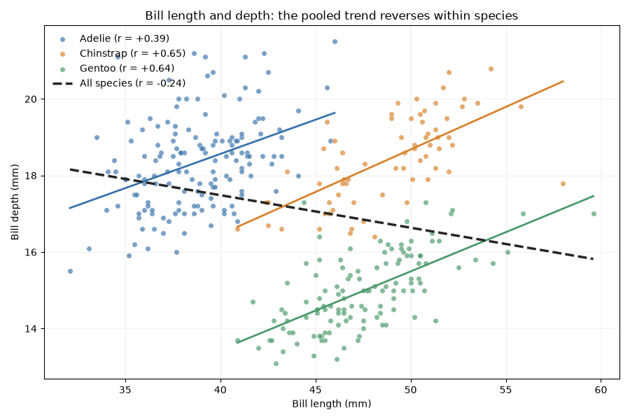

```{r}
#| label: render-setup
#| eval: true
#| include: false
source("examples/render-helpers.R", local = knitr::knit_global())
```

## MCP Console {#interactive-work .deck-slide .short-talk .hero .story-slide}
::: {.kicker}

Why Console exists

:::

::: {.big-statement}

R, Python, and SQL.<br>Available in one session.

:::

::: {.takeaway}

Let the model choose the language.<br>The user controls the host and permissions.

:::

::: {.notes}

**Say:** MCP Console started with a choice I wanted to change. MCP REPL asked users to pick an R console or a Python console. I wanted the agent to have both, and SQL, available as the work develops.

This is a ground-up rewrite around that idea. I wanted ordinary runtimes, including their packages, native code, and interactive behavior, with the user controlling where they run and what they can access.

Let me start with a session, then show a few of the choices behind it.

**Timing:** About 40 seconds. Move straight to the demo; the feature inventory comes afterward.

**Sources:** [Built-in runtime](https://github.com/t-kalinowski/mcp-console/blob/main/docs/BUILTIN_RUNTIME.md)

:::

## An analysis with R, Python, and SQL {#penguins-demo .deck-slide .short-talk .story-slide}
::: {.kicker}

Opening demo · Console registered with the agent

:::

::: {.prompt-card}

Use console to find out something interesting about the palmer penguins. Exercise use SQL, R, and Python for different parts of the analysis, and tell me something interesting that I haven't heard before.

:::

::: {.story-lead}

Then: “Can you visualize that?”

:::

::: {.notes}

**Say:** I've equipped the agent with Console. This is the prompt from the penguins session I ran earlier. I'm explicitly asking it to exercise all three languages, so this shows what the interface makes possible; it isn't an evaluation of which language the model would choose without that request.

I'll let it work, then ask for a visualization.

**Demo cue:** Allow about two minutes. Use the original broad prompt. Keep calls visible and use a client that displays images; in Codex desktop, ask the agent to embed the retained PNG in its reply. The next slide is the actual saved result if the live run takes too long or the client does not display the plot.

**Evidence:** Session 01a0d048-5f66-7900-b6cd-39affebe5e8c, “Analyze Palmer penguins.” The original visualization follow-up was “Are there any interesting data visualizations you can spin up to illustrate these findings?” The visible follow-up is shortened for speaking. See captures/opening-demo/README.md.

:::

## The pooled trend reverses within species {#penguins-result .deck-slide .short-talk .story-slide}
::: {.kicker}

Opening demo · actual returned image

:::

::: {.penguins-panel}

{.penguins-figure .nostretch fig-alt="Bill length and depth for three penguin species. Each within-species line slopes upward; the pooled line slopes downward."}

:::

::: {.small-note}

Saved result from the rehearsal · 342 complete observations

:::

::: {.notes}

**Say:** Here is the saved result. Across all the penguins, longer bills are associated with shallower bills. Within each species, the relationship goes the other way. The dashed line slopes down; each colored line slopes up.

The model explored the data, checked the relationship, and returned this image. Now let's look at what that interaction used.

**Evidence:** Unmodified PNG from call 13. Pooled correlation −0.235; within-species correlations +0.391, +0.654, and +0.643. These are descriptive associations. The retained transcript includes the original unsuccessful SQL query and Python namespace error as well as the corrected calls. The image is not regenerated during a render.

:::

## The languages work with the same session {#penguins-session .deck-slide .short-talk .literal-slide}
::: {.kicker}

Opening demo · selected code from the recorded calls

:::

:::: {.demo-steps}
::: {.demo-caption}

**R**<br>Load the data

:::
::: {.code-panel}

```python
console.send(r="""
  library(palmerpenguins)
  penguins <- palmerpenguins::penguins
""")
```

:::
::: {.demo-caption}

**SQL**<br>Query the R data frame

:::
::: {.code-panel}

```python
console.send(sql="""
  SELECT species, COUNT(*) n,
         ROUND(CORR(bill_length_mm, bill_depth_mm), 3) bill_corr
  FROM penguins GROUP BY species ORDER BY species;
""")
```

:::
::: {.demo-caption}

**Python**<br>Access it through reticulate

:::
::: {.code-panel}

```python
console.send(python="penguins = r.penguins")
```

:::
::::

::: {.takeaway}

One send tool, persistent state, and access across languages.

:::

::: {.notes}

**Say:** Each call submits a string of code under a language key. Here R defines penguins, SQL queries that R data frame, and Python accesses it through r.penguins. The plot came back as an image.

R and Python run in the same worker process, with reticulate providing access and conversion between them. The built-in DuckDB connection can query R data frames. SQL can also use a connection supplied from R or Python, including a remote database connection.

These are shortened excerpts from the session, rather than all thirteen calls.

**Reference (not spoken):** The R and Python excerpts select lines from calls 4 and 11. SQL selects three expressions from call 8 and is reformatted. These snippets explain the session; they are not presented as a second captured execution. The runtime bridge converts values when needed; same-process access does not imply zero-copy sharing of every object. The connection-selection API is in the appendix.

**Evidence:** captures/opening-demo/transcript.md.

:::

## Full runtimes with explicit permissions {#sandbox-motivation .deck-slide .short-talk .story-slide .capabilities-safety}
::: {.kicker}

The scope of this implementation

:::

:::: {.three-col}

::: {.story-card}

**Use full runtimes**

Libraries and native code.<br>Subprocesses and forks.<br>Text and plots.

:::

::: {.story-card}

**Drive a real session**

Persistent objects.<br>Input, waits, and controls.<br>Explicit runtime state.

:::

::: {.story-card}

**Enforce permissions**

Filesystem and network policy.<br>Subprocesses covered.<br>Shutdown and cleanup.

:::

::::

::: {.takeaway}

Managed packages, bounded output, session records, and local or remote execution.

:::

::: {.notes}

**Say:** That is the ordinary use. The scope I chose is to support the rest of an interactive runtime too: package libraries and native code, input prompts, long-running work, and session controls.

Those capabilities come with a sandbox that enforces the user's filesystem and network policy. The goal is to keep the runtime useful while controlling the resources it can reach.

I'll show package preparation and a few runtime details, then come back to that boundary.

**Reference (not spoken):** Trusted package preparation runs outside the worker sandbox. Broad host reads need explicit denials for confidential files. Managed runtime reads emit input_requested/input_received events; arbitrary native reads are not all observable as managed input. Worker readiness and evaluation completion use explicit protocol frames, while raw and background output are separate streams. Console tracks requested controls and lifecycle operations; this is not introspection into every background thread. Target capabilities and enforcement differ, as explained later.

**Sources:** [Built-in runtime](https://github.com/t-kalinowski/mcp-console/blob/main/docs/BUILTIN_RUNTIME.md) · [Worker protocol](https://github.com/t-kalinowski/mcp-console/blob/main/docs/WORKER_PROTOCOL.md) · [Sandbox configuration](https://github.com/t-kalinowski/mcp-console/blob/main/docs/SANDBOX_CONFIGURATION.md)

:::

## Use the package; let the runtime prepare it {#r-resolution .deck-slide .short-talk .story-slide .literal-slide}
::: {.kicker}

Use the package ecosystem

:::

:::::: {.two-col}

::::: {.left}

:::: {.code-panel}

::: {.panel-label}

R

:::

```python
console.send(r="library(data.table)")
```

::::

:::::

::::: {.right}

:::: {.code-panel}

::: {.panel-label}

Python

:::

```python
console.send(python="import polars")
```

::::

:::::

::::::
::: {.sequence-strip}

Reach a missing package → resolve → activate → continue

:::

::: {.takeaway}

Use ordinary imports, or declare packages explicitly with `requirements`.

:::

::: {.notes}

**Say:** In my experience, models sometimes avoid a package because installing it would change the user's environment. Console manages requirements for the session.

Here the code uses an ordinary library or import. When a supported missing-package operation is reached, the runtime requests preparation, activates the result, and continues with the workspace intact.

The model can also name requirements explicitly, including a version pin. The preparation belongs to this session; caches and prepared environments can be reused.

**Show:** These are illustrative package-use calls. Availability depends on a working managed resolver and the package’s system prerequisites. Docker’s prepared-image path is different and appears later.

**Sources:** [Requirements and trust](https://github.com/t-kalinowski/mcp-console/blob/main/docs/REQUIREMENTS.md)

:::

## Separate session control from code execution {#process-topology .deck-slide .short-talk .story-slide}
::: {.kicker}

How the processes fit together · local execution

:::

<!-- inline-svg:assets/process-topology.svg -->
```{=html}
<div class="embedded-diagram">
<svg xmlns="http://www.w3.org/2000/svg" viewBox="0 0 1400 455" role="img" aria-label="The LLM client talks to the Console server. The server uses trusted resolver processes outside the sandbox and exchanges cells and results with the sandboxed relay and worker. The sandbox enforces permissions and cleanup.">
<g font-family="Arial, sans-serif" fill="#18323f">
<rect x="865" y="8" width="520" height="435" rx="18" fill="#edf5ef" stroke="#167d76" stroke-width="2" stroke-dasharray="8 6"/>
<text x="1125" y="43" text-anchor="middle" font-size="24" fill="#167d76">Sandboxed processes</text>
<rect x="10" y="83" width="245" height="100" rx="10" fill="white" stroke="#a9b6b6"/>
<text x="132" y="142" text-anchor="middle" font-size="29">LLM client</text>
<rect x="390" y="83" width="305" height="100" rx="10" fill="white" stroke="#a9b6b6"/>
<text x="542" y="125" text-anchor="middle" font-size="29">Console server</text>
<text x="542" y="158" text-anchor="middle" font-size="23">Session and records</text>
<path d="M265 133 H380" fill="none" stroke="#537b79" stroke-width="2"/>
<text x="320" y="108" text-anchor="middle" font-size="23">MCP</text>
<rect x="930" y="83" width="390" height="100" rx="10" fill="white" stroke="#a9b6b6"/>
<text x="1125" y="125" text-anchor="middle" font-size="29">Worker relay</text>
<text x="1125" y="158" text-anchor="middle" font-size="23">Transport and supervision</text>
<path d="M705 133 H920" fill="none" stroke="#537b79" stroke-width="2"/>
<text x="780" y="108" text-anchor="middle" font-size="22">Cells / results</text>
<rect x="930" y="290" width="390" height="105" rx="10" fill="#d9eee9" stroke="#167d76"/>
<text x="1125" y="330" text-anchor="middle" font-size="29">Session worker</text>
<text x="1125" y="367" text-anchor="middle" font-size="25">R · Python · SQL</text>
<path d="M1125 194 V278" fill="none" stroke="#537b79" stroke-width="2"/>
<text x="1144" y="239" font-size="23">Cells and I/O</text>
<rect x="390" y="290" width="305" height="105" rx="10" fill="#fff" stroke="#a9b6b6"/>
<text x="542" y="330" text-anchor="middle" font-size="29">Trusted resolvers</text>
<text x="542" y="367" text-anchor="middle" font-size="25">ir · uv</text>
<path d="M542 194 V278" fill="none" stroke="#537b79" stroke-width="2"/>
<text x="560" y="239" font-size="23">Prepare packages</text>
<text x="1125" y="428" text-anchor="middle" font-size="21" fill="#167d76">Sandbox: permissions and cleanup</text>
</g>
<g fill="#537b79"><path d="M265 133 l10 -5 v10 Z M380 133 l-10 -5 v10 Z M705 133 l10 -5 v10 Z M920 133 l-10 -5 v10 Z M1125 194 l-5 10 h10 Z M1125 278 l-5 -10 h10 Z M542 194 l-5 10 h10 Z M542 278 l-5 -10 h10 Z"/></g>
</svg>
</div>
```
<!-- /inline-svg -->

::: {.takeaway}

The server manages the session. The worker executes code inside the sandbox.

:::

::: {.notes}

**Say:** The worker runs R, Python, and SQL inside the sandbox. The server manages the session and its records.

Package preparation runs in separate trusted resolver processes. The worker makes a structured request, the resolver prepares the environment, and the worker continues inside its existing boundary. Package installation and build code run with the resolver's access, so package sources are part of the trust configuration.

That is how the session can gain a dependency without gaining the resolver's permissions.

**Reference (not spoken):** Trusted package preparation can execute installation or build code. It is outside the worker sandbox. The protocol-level request/response example remains in the appendix.

**Sources:** [Implemented architecture](https://github.com/t-kalinowski/mcp-console/blob/main/docs/ARCHITECTURE.md) · [Sandbox configuration](https://github.com/t-kalinowski/mcp-console/blob/main/docs/SANDBOX_CONFIGURATION.md)

:::

## Wait for output without stopping the computation {#wait-timeout .deck-slide .short-talk .literal-slide .code-dense}
::: {.kicker}

Runtime detail · long-running work

:::

:::::: {.two-col}
::::: {.left}
:::: {.code-panel}
::: {.panel-label}

Start work · wait up to 450 ms

:::

<!-- cells:progress -->
```python
console.send(r="""
  pb <- txtProgressBar(
    max = 20, style = 3, width = 20)
  for (i in 1:20) {
    Sys.sleep(0.15)
    setTxtProgressBar(pb, i)
  }
  close(pb)
""", timeout_ms=450)
```

::::
:::: {.result-panel}

```{r}
#| eval: true
#| comment: ""
console_protocol("progress")
```

::::
:::::
::::: {.right}
:::: {.code-panel}
::: {.panel-label}

Poll · collect new output

:::

<!-- cells:poll-next -->
```python
console.send(timeout_ms=600)
```

::::
:::: {.result-panel}

```{r}
#| eval: true
#| comment: ""
console_protocol("poll-next")
```

::::
:::: {.code-panel}
::: {.panel-label}

Poll again · the same run finishes

:::

<!-- cells:poll-final -->
```python
console.send(timeout_ms=5000)
```

::::
:::: {.result-panel}

```{r}
#| eval: true
#| comment: ""
console_protocol("poll-final")
```

::::
:::::
::::::

::: {.notes}

**Say:** The timeout is how long this call waits for output. The computation keeps running, and the model can poll without submitting the code again.

Each response contains newly collected output. Progress-bar redraws within that interval compact to the current line. The running notice tells the model what to do next; it doesn't need to infer completion from the percentage.

**Author / capture:** All three calls and responses are from the existing sandboxed capture, in this order. Progress percentages depend on timing. The final response has no invented completion marker. Rendering reads the captures and does not run the loop.

**Sources:** [Send operation contract](https://github.com/t-kalinowski/mcp-console/blob/main/docs/SEND_OPERATIONS.md)

:::

## Protect the model’s context from oversized output {#bounded-output .deck-slide .short-talk .literal-slide .code-dense}
::: {.kicker}

Detail 2 · Bound the response and retain the full output

:::


:::::: {.two-col}

::::: {.left}

:::: {.code-panel}

::: {.panel-label}

Call

:::

<!-- cells:flood -->
```python
console.send(r=r"""
  for (i in seq_len(10000)) {
    cat(sprintf("row %05d\n", i))
  }
  cat("fit complete\n")
""")
```

::::

:::::

::::: {.right}

:::: {.result-panel}

::: {.panel-label}

One tool response · shortened for display

:::

```text
row 00001
row 00002
row 00003

[output preview: middle omitted;
 raw output retained at
 .agents/console/sessions/<run>/
 outputs/call-000008.log]

row 09999
row 10000
fit complete
```

::::

:::::

::::::

::: {.notes}

**Say:** Another detail is protecting the model from filling its own context with output. If a cell prints too much, Console returns a preview of the beginning and end, plus a path to the retained output.

The model can inspect that file if it needs more. This is one response, shortened here to make its structure visible.

**Reference (not spoken):** The text response budget is 8 KiB, with a separate image allowance. Raw retention is also bounded. This slide is a stylized, shortened response; captures/flood.txt holds the literal response.

**Sources:** [Built-in runtime](https://github.com/t-kalinowski/mcp-console/blob/main/docs/BUILTIN_RUNTIME.md)

:::

## Send input to an R prompt {#stdin .deck-slide .short-talk .literal-slide}
::: {.kicker}

Work with the session

:::

:::::: {.two-col}
::::: {.left}

:::: {.code-panel}
::: {.panel-label}

Run code that asks for input

:::

<!-- cells:prompt -->
```python
console.send(r="""
  name <- readline("name> ")
  name
""")
```

::::

:::: {.result-panel}
::: {.panel-label}

Response · waiting for input

:::

```{r}
#| label: stdin-prompt
#| eval: true
#| echo: false
#| comment: ""
console_protocol("prompt")
```

::::

:::::
::::: {.right}

:::: {.code-panel}
::: {.panel-label}

Supply a line of standard input

:::

<!-- cells:prompt-answer -->
```python
console.send(stdin='Ada\n')
```

::::

:::: {.result-panel}
::: {.panel-label}

Response · the same cell resumes

:::

```{r}
#| label: stdin-prompt-answer
#| eval: true
#| echo: false
#| comment: ""
console_protocol("prompt-answer")
```

::::

:::::
::::::

::: {.takeaway}

Send the answer through `stdin`, including the newline.

:::

::: {.notes}

**Say:** An interactive runtime also needs input. This R cell calls readline and pauses. Console returns the prompt and an explicit waiting-for-input state.

The model sends the answer and a newline through stdin. The same cell resumes; it doesn't run again. That input mechanism also lets the model drive a debugger.

**Author / capture:** The two calls and responses are literal captures from the existing sandboxed session. stdin does not add a newline automatically. Quarto reads the captured output instead of running an interactive prompt during rendering.

**Sources:** [Send operation contract](https://github.com/t-kalinowski/mcp-console/blob/main/docs/SEND_OPERATIONS.md)

:::

## Send input to a paused debugger {#debugger .deck-slide .short-talk .literal-slide}
::: {.kicker}

Work with the session

:::

:::::: {.two-col}
::::: {.left}

:::: {.code-panel}
::: {.panel-label}

Pause inside an R function

:::

<!-- cells:browser-start -->
```python
console.send(r="""
  inspect_mean <- function(x) {
    browser()
    mean(x)
  }

  inspect_mean(c(1, 2, 3))
""")
```

::::

:::: {.result-panel}
::: {.panel-label}

Response

:::

```{r}
#| label: debugger-browser-start
#| eval: true
#| echo: false
#| comment: ""
console_protocol("browser-start")
```

::::

:::::
::::: {.right}

:::: {.code-panel}
::: {.panel-label}

Inspect x

:::

<!-- cells:browser-x -->
```python
console.send(stdin='x\n')
```

::::

:::: {.result-panel}
::: {.panel-label}

Response

:::

```{r}
#| label: debugger-browser-x
#| eval: true
#| echo: false
#| comment: ""
console_protocol("browser-x")
```

::::

:::: {.code-panel}
::: {.panel-label}

Continue

:::

<!-- cells:browser-continue -->
```python
console.send(stdin='c\n')
```

::::

:::: {.result-panel}
::: {.panel-label}

Response

:::

```{r}
#| label: debugger-browser-continue
#| eval: true
#| echo: false
#| comment: ""
console_protocol("browser-continue")
```

::::

:::::
::::::

::: {.notes}

**Say:** Here browser pauses inside a function. The model sends x to inspect the argument, sees its value, then sends c to continue.

This is a normal R debugger interaction through the same input mechanism. Because the runtime is embedded, the managed input state is reported explicitly. We aren't deciding whether the program is waiting by matching text that happens to look like a prompt.

**Author / capture:** Each call is paired with its literal Console response. All three calls were captured in the same sandboxed session. Quarto reads the saved output; it does not enter an interactive debugger during rendering. stdin does not add a newline automatically.

**Sources:** [Send operation contract](https://github.com/t-kalinowski/mcp-console/blob/main/docs/SEND_OPERATIONS.md)

:::

## Interrupt or restart the session {#session-controls .deck-slide .short-talk .literal-slide}
::: {.kicker}

Work with the session

:::

:::::: {.two-col}

::::: {.left}

:::: {.code-panel}

::: {.panel-label}

Interrupt

:::

```python
console.send(control="interrupt")
```

::::

Interrupt a long-running computation. Keep the workspace.

:::::

::::: {.right}

:::: {.code-panel}

::: {.panel-label}

Restart

:::

```python
console.send(control="restart")
```

::::

Replace the worker. Start with fresh in-memory state.

:::::

::::::

Combine a control and a code cell in one call.

:::: {.code-panel}

::: {.panel-label}

R package development

:::

```python
# Run the package tests in a fresh session
console.send(control="restart", r="devtools::test()")

# Load the package, then evaluate more code
console.send(control="restart", r="devtools::load_all(); ...")
```

::::

::: {.takeaway}

Restart keeps prepared dependencies and starts the supplied cell in the new session.

:::

::: {.notes}

**Say:** Interrupt requests a stop while keeping the workspace, like Escape in an IDE console. Code can catch or delay the interrupt. Restart replaces the worker and starts fresh in-memory state, while keeping prepared dependencies available.

You can combine a control and a cell. For package development, that might mean restarting and running the tests, or loading the package and evaluating more code in the fresh session.

**Show:** There are exactly two accepted control values. A control-only interrupt can overlap a pending send. If interrupt includes a new cell, that cell runs only after the previous evaluation has stopped; an uncooperative evaluation prevents it from running. Use the simpler restart example here to make ordering visible.

**Author / capture:** The restart-plus-test call was exercised against the local package fixture in the controls capture. The combined-input example in the appendix brings together restart, requirements, input, and a sourced script.

**Sources:** [Send operation contract](https://github.com/t-kalinowski/mcp-console/blob/main/docs/SEND_OPERATIONS.md) · [Interruption and restart](https://github.com/t-kalinowski/mcp-console/blob/main/docs/BUILTIN_RUNTIME.md#interruption)

:::

## The current send() interface {#full-signature .deck-slide .short-talk .signature-slide}
::: {.kicker}

The model-facing API today

:::

::: {.full-contract}

<pre class="signature-display">console.send(
  <span class="syntax-accent">r</span>=…, <span class="syntax-accent">python</span>=…, <span class="syntax-accent">sql</span>=…,    <span class="syntax-comment"># at most one language</span>
  control=…,               <span class="syntax-comment"># interrupt or restart</span>
  stdin=…,                 <span class="syntax-comment"># input for a read or prompt</span>
  requirements={r: …, python: …, duckdb: …},
  timeout_ms=…,            <span class="syntax-comment"># how long this call waits</span>
)</pre>

:::

::: {.takeaway}

Omit code to poll, supply input, control the session, or prepare dependencies.

:::

::: {.notes}

**Say:** That brings us to the whole current interface. One tool accepts at most one language cell, with optional control, input, requirements, and a wait timeout.

Arguments can be combined, or code can be omitted to poll, answer a prompt, or control the session. The common call is still just send with a string of code; the other capabilities are there when the interaction needs them.

**Reference (not spoken):** This schematic overview lists fields, not three cells to submit together. Requirements are exposed only when supported by the execution target. An empty send collects output. Explicit preparation and control precede the evaluation wait. Code-free preparation cannot also carry nonempty stdin.

**Sources:** [Send operation contract](https://github.com/t-kalinowski/mcp-console/blob/main/docs/SEND_OPERATIONS.md) · [Built-in runtime](https://github.com/t-kalinowski/mcp-console/blob/main/docs/BUILTIN_RUNTIME.md)

:::

## Choose between two built-in sandbox policies {#builtin-policies .deck-slide .short-talk .literal-slide .policy-comparison}
::: {.kicker}

Choose the worker’s permissions

:::

:::::: {.two-col}

::::: {.left}

<h3>:read-only · default</h3>

- Read all host files the account can access.
- Write only in private temporary storage.
- Project files stay protected from writes.

:::: {.code-panel}

```bash
mcp-console serve \
  -c extends=:read-only
```

::::

:::::

::::: {.right}

<h3>:workspace</h3>

Adds writes in the **workspace**: the directory where you launch Console.

Write access stays denied for `.git`, `.agents`, `.codex`, and `.claude`. These subdirectories remain readable.

:::: {.code-panel}

```bash
mcp-console serve \
  -c extends=:workspace
```

::::

:::::

::::::

::: {.takeaway}

Both policies cover subprocesses, restrict networking, and clean up on restart or shutdown.

:::

::: {.notes}

**Say:** Now let's look at what the user controls. Read-only is the default: read access to host files available to the account, writes in private temporary storage, and restricted networking. Sensitive files need explicit read denials; information returned by a tool is visible to the model.

Workspace adds writes in the launch directory while protecting these configuration and Git directories from writes. Both policies cover subprocesses. On restart or shutdown, Console stops the worker and its children, with a grace period and forceful escalation, and removes temporary storage.

**Reference (not spoken):** Native cleanup covers the owned process group and observed descendants on macOS, with an orphaning-race limitation; Linux uses PID namespace retirement. Runner death has no independent cleanup guarantee. Prepared environments and session records persist. The leading colon is part of the built-in name. -c overrides extends while retaining other project configuration. external-sandbox and unrestricted are enforcement modes, not additional named presets.

**Sources:** [Sandbox configuration](https://github.com/t-kalinowski/mcp-console/blob/main/docs/SANDBOX_CONFIGURATION.md) · [Configuration layering](https://github.com/t-kalinowski/mcp-console/blob/main/docs/CONFIGURATION.md)

:::

## Example: connect to a corporate data warehouse {#network-proxy .deck-slide .short-talk .config-slide .code-dense}
::: {.kicker}

Choose the worker’s permissions

:::

:::::: {.two-col}

::::: {.left}

::: {.ownership-card}

Route worker traffic through the managed proxy.

Allow the corporate warehouse host.

Use its HTTPS database API, or a SOCKS-aware database connection.

:::

:::::

::::: {.right}

:::: {.code-panel}

::: {.panel-label .path-label}

.agents/console/config.yaml · excerpt

:::

```yaml
sandbox:
  proxy:
    enabled: true
    domains:
      warehouse.example.com: allow
```

::::

:::::

::::::
::: {.takeaway}

The client still supplies its usual database credentials.

:::

::: {.notes}

**Say:** A project can extend those policies in config.yaml. For example, this excerpt enables the managed proxy and permits a warehouse host.

There are two parts to making the connection: the policy must permit it, and the runtime needs an appropriate client or driver and credentials. This example is for an HTTPS API; other protocols need compatible proxy support.

The same configuration surface covers filesystem grants and denials. The fuller examples are in the appendix.

**Reference (not spoken):** This is a focused YAML excerpt, not a standalone config. examples/configs/network-proxy.yaml contains the full version. Arbitrary database TCP protocols need a SOCKS-aware client or tunnel. Private-IP destinations need the appropriate literal-IP rule or local-network exception; a hostname rule alone does not grant private-address access. Placeholder domains were not contacted.

**Author / capture:** Example domains are placeholders, not actual services. The complete example includes the required scalar proxy fields. mode: full does not erase the domain allowlist. Review PROTOCOL.md for mode, upstream proxy, UDP and local-binding semantics.

**Sources:** [sandbox](https://github.com/t-kalinowski/mcp-console/blob/main/docs/SANDBOX_CONFIGURATION.md)

:::

## Run any command through the sandbox {#sandbox-command .deck-slide .short-talk .story-slide .literal-slide}
::: {.kicker}

Reuse the sandbox in your own application

:::

:::: {.code-panel}
::: {.panel-label}

Public command-line interface

:::

```bash
mcp-console sandbox -- Rscript examples/sandbox-analysis.R
```

::::

:::: {.three-col}
::: {.story-card}

**Choose the policy**

Use the same project config and command-line overrides.

:::
::: {.story-card}

**Run the command**

Console hands execution to the native sandbox runner. Its restrictions apply to the command and its children.

:::
::: {.story-card}

**Connect your application**

Use ordinary stdin, stdout, stderr, and exit status.

:::
::::

::: {.takeaway}

Reuse the sandbox from your own tools and agent harnesses.

:::

::: {.notes}

**Say:** The sandbox is also a public command-line interface. This was something people asked for with MCP REPL: a sandbox they could use from another application.

Put an ordinary command after the double dash. Console applies the same project configuration and hands it to the native sandbox runner. Your application uses standard input, output, error, and exit status.

This path runs the command directly. It doesn't require an MCP server or a persistent R or Python session.

**Show:** Point to the command after --. The supplied script reads the measurements CSV and prints model coefficients. Run it from the presentation directory.

**Reference (not spoken):** Ordinary sandbox launches discover .agents/console/config.yaml beneath the launch directory and use the local native policy. -c extends=:workspace selects the workspace baseline; without project configuration or overrides, the default is read-only. Console verifies and execs its bundled runner, which inherits fd 0/1/2 and owns native enforcement and cleanup. This path does not use the built-in worker, automatic package resolution, MCP output framing, or session transcripts. The standalone command executes locally; target settings do not turn it into an SSH or Docker command dispatcher. The separate filesystem mode named external-sandbox means enforcement by an outer boundary; it is not the name of this public CLI feature. Advanced callers can supply a complete runner policy through --config-env. Supported native hosts are macOS and Linux; the existing platform and lifecycle limits still apply.

**Sources:** [Sandbox integration](https://github.com/t-kalinowski/mcp-console/blob/main/docs/SANDBOX.md) · [Sandbox configuration](https://github.com/t-kalinowski/mcp-console/blob/main/docs/SANDBOX_CONFIGURATION.md)

:::

## Configure where the session runs {#execution-choice .deck-slide .short-talk .story-slide}
::: {.kicker}

Choose the execution host

:::

:::: {.three-col}

::: {.story-card}

**Local host**

Beside your project, using this machine’s files and compute.

:::

::: {.story-card}

**SSH host**

On an existing remote machine, beside its data and compute.

:::

::: {.story-card}

**Docker container**

Inside a prepared image, with the mounts you select.

:::

::::

::: {.takeaway}

Execution targets plug into the same session interface.

:::

::: {.notes}

**Say:** The user also chooses where the worker runs. It can be local, on an SSH host beside remote data, or in a Docker container with a prepared image and selected mounts.

The agent still sees the same send interface. The host choice changes where the code runs and which resources are available to it.

**Reference (not spoken):** Local and SSH support managed package preparation. The currently inspected Docker path uses prepared-image dependencies; installing uv and ir alone does not enable managed preparation.

**Sources:** [SSH execution](https://github.com/t-kalinowski/mcp-console/blob/main/docs/SSH.md) · [Docker execution](https://github.com/t-kalinowski/mcp-console/blob/main/docs/DOCKER.md)

:::

## Move execution to the remote host {#remote-topology .deck-slide .short-talk .story-slide}
::: {.kicker}

The same architecture over SSH

:::

<!-- inline-svg:assets/remote-topology.svg -->
```{=html}
<div class="embedded-diagram">
<svg xmlns="http://www.w3.org/2000/svg" viewBox="0 0 1400 600" role="img" aria-label="The LLM client and Console server stay on the local host. SSH carries cells and results to the relay and session worker inside the remote sandbox. A separate SSH connection reaches trusted package resolvers on the remote host outside that sandbox.">
<g font-family="Arial, sans-serif" fill="#18323f">
<rect x="8" y="8" width="727" height="580" rx="18" fill="#fff" stroke="#a9b6b6" stroke-width="2"/>
<text x="371" y="45" text-anchor="middle" font-size="27">Your machine</text>
<rect x="865" y="8" width="527" height="580" rx="18" fill="#f5e7dc" stroke="#b56844" stroke-width="2"/>
<text x="1128" y="45" text-anchor="middle" font-size="27">Remote host</text>
<rect x="880" y="66" width="497" height="367" rx="14" fill="#edf5ef" stroke="#167d76" stroke-width="2" stroke-dasharray="8 6"/>
<text x="1128" y="99" text-anchor="middle" font-size="23" fill="#167d76">Sandboxed processes</text>
<rect x="30" y="125" width="230" height="100" rx="10" fill="#fff" stroke="#a9b6b6"/>
<text x="145" y="184" text-anchor="middle" font-size="28">LLM client</text>
<rect x="390" y="125" width="310" height="100" rx="10" fill="#fff" stroke="#a9b6b6"/>
<text x="545" y="167" text-anchor="middle" font-size="28">Console server</text>
<text x="545" y="200" text-anchor="middle" font-size="23">Session and records</text>
<path d="M270 175 H380" fill="none" stroke="#537b79" stroke-width="2"/>
<text x="325" y="150" text-anchor="middle" font-size="23">MCP</text>
<rect x="930" y="125" width="397" height="100" rx="10" fill="#fff" stroke="#a9b6b6"/>
<text x="1128" y="167" text-anchor="middle" font-size="28">Worker relay</text>
<text x="1128" y="200" text-anchor="middle" font-size="23">Transport and supervision</text>
<path d="M710 175 H920" fill="none" stroke="#537b79" stroke-width="2"/>
<text x="802" y="145" text-anchor="middle" font-size="23">SSH</text>
<text x="802" y="260" text-anchor="middle" font-size="20">Cells / results</text>
<rect x="930" y="305" width="397" height="92" rx="10" fill="#d9eee9" stroke="#167d76"/>
<text x="1128" y="343" text-anchor="middle" font-size="28">Session worker</text>
<text x="1128" y="377" text-anchor="middle" font-size="25">R · Python · SQL</text>
<path d="M1128 236 V293" fill="none" stroke="#537b79" stroke-width="2"/>
<text x="1145" y="272" font-size="22">Cells and I/O</text>
<text x="1128" y="424" text-anchor="middle" font-size="20" fill="#167d76">Sandbox: permissions and cleanup</text>
<rect x="930" y="470" width="397" height="92" rx="10" fill="#fff" stroke="#a9b6b6"/>
<text x="1128" y="508" text-anchor="middle" font-size="28">Trusted resolvers</text>
<text x="1128" y="542" text-anchor="middle" font-size="24">ir · uv · remote package caches</text>
<path d="M545 236 V516 H920" fill="none" stroke="#537b79" stroke-width="2"/>
<text x="525" y="438" text-anchor="end" font-size="23">Package preparation</text>
<text x="525" y="469" text-anchor="end" font-size="23">Separate SSH connection</text>
</g>
<g fill="#537b79"><path d="M270 175 l10 -5 v10 Z M380 175 l-10 -5 v10 Z M710 175 l10 -5 v10 Z M920 175 l-10 -5 v10 Z M1128 236 l-5 10 h10 Z M1128 293 l-5 -10 h10 Z M545 236 l-5 10 h10 Z M920 516 l-10 -5 v10 Z"/></g>
</svg>
</div>
```
<!-- /inline-svg -->

::: {.takeaway}

Code runs beside the remote data. The client and session records stay local.

:::

::: {.notes}

**Say:** Over SSH, the worker, relay, and package preparation move to the remote machine. The Console server and session records stay on the client side.

The sandbox applies on the execution host. The model sends the same calls and receives results through the same interface. The exact enforcement and preparation capabilities depend on the target; the SSH and Docker recipes are in the appendix.

**Sources:** [SSH execution](https://github.com/t-kalinowski/mcp-console/blob/main/docs/SSH.md)

:::

## Connect Console to your agent harness {#interfaces .deck-slide .short-talk .story-slide}
::: {.kicker}

Where the calls come from

:::

:::: {.three-col}

::: {.story-card}

**MCP clients**

Compatible MCP stdio clients, including Codex and Claude Code.

:::

::: {.story-card}

**R harnesses**

ellmer through mcp.console.

:::

::: {.story-card}

**Python harnesses**

Sync and async clients.<br>chatlas.<br>OpenAI Responses and Agents SDK.<br>Anthropic.<br>Codex thread SDK.

:::

::::

:::: {.code-panel}

```bash
uvx mcp-console serve
```

::::

::: {.notes}

**Say:** To use this from an MCP client, register uvx mcp-console serve. There are also R and Python interfaces for equipping an agent directly, including ellmer and chatlas, the provider SDKs shown here, and generic sync and async clients.

The harness changes how you register the tool. The execution interface we've just walked through stays the same.

**Reference (not spoken):** The adapters are documented in the source checkout; the older PyPI wheel used for some captures lacks newer clients and extras. Verify the release and image support of the chosen adapter before a live demo.

**Sources:** [Python integrations](https://github.com/t-kalinowski/mcp-console/blob/main/docs/PYTHON.md) · [R interface](https://github.com/t-kalinowski/mcp-console/blob/main/r/README.md)

:::

## Keep session logs and readable transcripts {#recording .deck-slide .short-talk .literal-slide}
::: {.kicker}

Keep the work useful after the session

:::

:::: {.code-panel}

::: {.panel-label}

The opening demo’s session directory

:::

```text
.mcp-console/sessions/<session-id>/
├── internal/
│   └── events.jsonl     # Calls, results, request metadata
├── outputs/
│   └── *.log           # Retained output, when needed
├── artifacts/
│   └── *.png           # Captured plots
├── transcript.md       # Readable session history
└── transcript.qmd      # Executable code cells
```

::::
::: {.takeaway}

Full logs and a readable presentation of the session.

:::

::: {.notes}

**Say:** After the interaction, there is a record of the work. This is the recording location used by the opening demo.

The event log keeps calls, results, and request metadata. Oversized output and returned images can be retained as files. The Markdown and Quarto documents provide readable views of the session.

Those files are on the server side, including when the worker runs remotely. Other tools with access to that directory can use the saved plot.

**Reference (not spoken):** This captured session uses .mcp-console/sessions/. Earlier captures in this deck use .agents/console/sessions/. Discovery and storage defaults remain pre-release design work. Each recorded session has a unique directory. The outputs directory is created when output retention needs it; this demo did not produce one. The path is on the controller for remote workers. internal/events.jsonl records tool requests, assembled results, and lifecycle metadata; it is not a byte-for-byte capture of every MCP message or proof of delivery. The capture script records the complete transport separately in wire.jsonl. The current artifacts/ mechanism persists returned images; it is not a general worker-writable export directory or an automatic export API for arbitrary files. Raw per-cell output retention is bounded at 1 GiB. Other tools need access to the controller's recording workspace.

**Sources:** [Architecture](https://github.com/t-kalinowski/mcp-console/blob/main/docs/ARCHITECTURE.md)

:::

## Read the session as Markdown {#markdown-transcript .deck-slide .short-talk .literal-slide}
::: {.kicker}

Keep the work useful after the session

:::

:::: {.code-panel}
::: {.panel-label .path-label}

transcript.md · excerpt from the opening demo

:::

```{r}
#| label: penguins-markdown-record
#| eval: true
#| results: asis
transcript <- readLines("captures/opening-demo/transcript.md")
start <- match("## Call 12: R", transcript)
end <- match("## Call 13: Python", transcript) - 1L
cat("````markdown\n", paste(transcript[start:end], collapse = "\n"),
    "\n````\n", sep = "")
```

::::

::: {.takeaway}

Submitted code and captured results stay together.

:::

::: {.notes}

**Say:** The Markdown records the interaction. Here is an R call from the penguins session, followed by what it printed. The plot is linked from the same transcript.

It preserves what happened, including errors and subsequent corrections. That makes it useful for inspecting the work afterward.

**Evidence:** This excerpt is copied verbatim from captures/opening-demo/transcript.md, call 12. It is a session record, not a rerun.

:::

## Turn the session into an editable starting point {#quarto-transcript .deck-slide .short-talk .literal-slide .code-dense}
::: {.kicker}

Keep the work useful after the session

:::

:::: {.code-panel}

::: {.panel-label .path-label}

report.qmd · edited copy of the session transcript

:::

```{r}
#| label: quarto-document
#| eval: true
#| results: asis
report <- c(
  "---",
  "title: Penguin bill dimensions",
  "format: html",
  "ir:",
  "  isolated: true",
  '  exclude-newer: "2026-09-23"',
  "  packages: [palmerpenguins]",
  "---",
  "",
  "```{r}",
  "penguins <- palmerpenguins::penguins",
  "lm(bill_depth_mm ~ bill_length_mm + species,",
  "   data = penguins)",
  "```"
)
cat("````markdown\n", paste(report, collapse = "\n"), "\n````\n", sep = "")
```

::::

::: {.takeaway}

Add a package cutoff date and curate the cells before `ir render report.qmd`.

:::

::: {.notes}

**Say:** The QMD gives us source we can edit and run again. Here I've selected one analysis from the penguins session, declared the package it needs, and added a cutoff date to the ir configuration.

Turning an interaction into an analysis still takes judgment. Failed experiments, input prompts, external data, and database connections may need attention. The generated QMD is a starting point for that work; the Markdown remains the record of what actually happened.

**Reference (not spoken):** The ir declarations include managed defaults and explicit requirements submitted in recorded calls, not every inferred package or a lockfile of successful resolutions. This displayed report is an author-edited example derived from the opening demo, not the generated transcript verbatim. Its title, format, explicit palmerpenguins requirement, cutoff date, and selected cells are author edits. Rendering this edited report was not tested in this revision. The QMD omits recorded outputs, stdin, polls, and controls; it can include source from rejected or failed calls. Rendering evaluates cells again outside the worker sandbox. SQL chunks need a configured DBI connection. Remote projections default to eval:false and need an appropriate execution environment for replay.

**Sources:** [ir Quarto integration](https://r-lib.github.io/ir/quarto.html) · [Architecture](https://github.com/t-kalinowski/mcp-console/blob/main/docs/ARCHITECTURE.md)

:::

## Before an official release {#before-release .deck-slide .short-talk .policy-slide}
::: {.kicker}

Pending work

:::

- **Windows support:** mostly stubbed out; open PRs still need to land.
- **Sans-R mode:** running without R; in flight.
- **Human-facing configuration:** readable YAML, discovery, and storage defaults.
- **Tool descriptions and evals:** convey capabilities clearly and use fewer tokens.
- **Curated session exports:** Quarto documents and timestamped lab notebooks.
- **Artifact handoff:** persistent output locations for other authorized tools.

::: {.takeaway}

The agent-facing API is largely complete. The human-facing experience needs another pass.

:::

::: {.notes}

**Say:** Before an official release, the remaining work is mostly around the human-facing experience: configuration, discovery and storage defaults, tool descriptions and evals, and the workflow for exporting work and handing off artifacts.

Windows support and running without R are also in flight. I think the current agent-facing interface is largely complete. There are possible extensions for concurrent sessions and prose notes, but those are ideas; I've kept them in the appendix.

**Reference (not spoken):** This is the author's pre-release work list as of 2026-09-23. Windows and sans-R status reflect the author's update, not a verified release or PR audit. The proposed configuration, curated-export, notebook, and general artifact-handoff workflows are pending design work. No function names, configuration paths, or APIs are promised here.

:::

## R, Python, and SQL, available for the work {#closing .deck-slide .short-talk .hero .story-slide}
::: {.kicker}

Why Console exists

:::

::: {.big-statement}

Let the model choose the language.<br>You choose the execution host.<br>Give the agent an interactive workbench.

:::

::: {.takeaway}

Full language capabilities, with a sandbox that enforces the access you allow.

:::

::: {.notes}

**Say:** Those are the core ideas: let the model choose the language, let the user configure the host and permissions, and keep a record of the work.

That is the scope of MCP Console: an interactive workbench with ordinary runtime capabilities and a sandbox around execution. I'll stop there for questions.

**Sources:** [Built-in runtime](https://github.com/t-kalinowski/mcp-console/blob/main/docs/BUILTIN_RUNTIME.md) · [Sandbox configuration](https://github.com/t-kalinowski/mcp-console/blob/main/docs/SANDBOX_CONFIGURATION.md)

:::

## Appendix {#appendix .deck-slide .hero .story-slide}
::: {.kicker}

Backup material

:::

::: {.big-statement}

API and configuration details.

:::

::: {.takeaway}

The complete walkthrough is preserved in `deck-full.qmd`.

:::

::: {.notes}

These slides are available for questions. They are not part of the timed talk. The full deck also retains the installation variants, development history, and testing material.

:::

## SQL uses the connection you choose {#sql-connections .deck-slide .literal-slide}
::: {.kicker}

One analysis · choose the database connection in R or Python

:::

:::::: {.two-col}

::::: {.left}

:::: {.code-panel}

::: {.panel-label}

R · a DBI connection

:::

```python
console.send(r="""
  con <- DBI::dbConnect(
    RSQLite::SQLite(), ":memory:")
  console_sql_connection(con)
""")
```

::::

:::::

::::: {.right}

:::: {.code-panel}

::: {.panel-label}

Python · a DB-API connection

:::

```python
console.send(python="""
import sqlite3
con = sqlite3.connect(":memory:")
console_sql_connection(con)
""")
```

::::

:::::

::::::

:::: {.code-panel}

::: {.panel-label}

Subsequent SQL cells use the selected connection

:::

```python
console.send(sql="SELECT CURRENT_TIMESTAMP AS now")
```

::::

::: {.takeaway}

Use a local database or an existing remote connection through its driver.

:::

::: {.notes}

**Say:** SQL doesn't have to use the built-in DuckDB connection. The model can select a different connection from either the R or Python runtime.

From R, that can be a DBI connection. From Python, it can be a DB-API connection. These examples use SQLite, but the same pattern works with a remote database, given the driver, credentials, and network access.

After selecting the connection, the model keeps sending SQL through the same tool. The queries go to that connection and use its tables and state.

**Reference (not spoken):** A selected connection sees its own tables and state; it does not inherit managed DuckDB registrations. Restore managed SQL with console_sql_connection(NULL) in R or console_sql_connection(None) in Python before closing a custom connection.

**Sources:** [SQL connection selection](https://github.com/t-kalinowski/mcp-console/blob/main/docs/BUILTIN_RUNTIME.md#sql)

:::

## Declare package requirements explicitly {#requirements .deck-slide .literal-slide}
::: {.kicker}

Use the package ecosystem

:::

:::::: {.two-col}
::::: {.left}
:::: {.code-panel}
::: {.panel-label}

Prepare dependencies

:::

```python
console.send(
  requirements={
    "r": ["dtplyr"],
    "python": ["scikit-learn==1.9.1"],
  },
)
```

::::
:::::
::::: {.right}

::: {.ownership-card}

Name a package without a version.

Pin a specific version when needed.

Prepare it before evaluating code.

:::

:::::
::::::

::: {.takeaway}

Requirements can also accompany a code cell in the same call.

:::

::: {.notes}

**Say:** So far we've let the runtime discover packages as the code uses them. The model can also declare requirements explicitly.

Here it asks for an R package and a particular version of a Python package. It can prepare those dependencies on their own, as shown here, or include them with a code cell. Preparation happens before that cell runs.

This is useful when the model wants a specific version or when a distribution name can't be inferred from the import.

**Author / capture:** This is an illustrative preparation request; no response is presented as a capture. scikit-learn 1.9.1 is the version in the existing Python reference capture. The earlier data.table==1.17.8 rehearsal failed on the installed R toolchains and remains documented in VALIDATION.md. That older request is retained in the reference files, not represented as a successful run here. Requirements are available only on targets that support managed preparation.

**Sources:** [Requirements and trust](https://github.com/t-kalinowski/mcp-console/blob/main/docs/REQUIREMENTS.md)

:::

## Capture output below the language hooks {#retained-output .deck-slide .literal-slide}
::: {.kicker}

Detail 2 · Native output belongs in the result

:::

:::::: {.two-col}

::::: {.left}

:::: {.code-panel}

::: {.panel-label}

R · forked child writes through a pipe

:::

<!-- cells:r-fork-cat -->
```python
console.send(r=r"""
  job <- parallel::mcparallel({
    out <- pipe("cat", "w")
    cat("hello from fork\n", file = out)
    close(out)
  })
  invisible(parallel::mccollect(job))
""")
```

::::

:::: {.result-panel}

::: {.panel-label}

Console response

:::

```{r}
#| eval: true
#| echo: false
#| comment: ""
console_protocol("r-fork-cat")
```

::::

:::::

::::: {.right}

:::: {.code-panel}

::: {.panel-label}

Python · write directly to stdout

:::

<!-- cells:python-fd -->
```python
console.send(python=r"""
import os
os.write(1, b"hello directly on fd 1\n")
""")
```

::::

:::: {.result-panel}

::: {.panel-label}

Console response

:::

```{r}
#| eval: true
#| echo: false
#| comment: ""
console_protocol("python-fd")
```

::::

:::::

::::::

::: {.takeaway}

Capture native output from the worker and its children.

:::

::: {.notes}

**Say:** If you've built one of these before, another detail that may be interesting is where we capture output. We capture below the language-level hooks, so we can see output from a forked child or a direct write to a file descriptor.

On the left, an R child process sends text through a pipe to the native cat command. On the right, Python writes directly to file descriptor 1, bypassing sys.stdout. Both outputs come back through Console. That is the kind of detail we want the shared execution system to handle.

**Author / capture:** Both panels use actual responses. Plain cat() in a fork completed without visible text in the captured build; the displayed R child → pipe → native cat route was captured successfully. The 23 after Python output is os.write()'s returned byte count.

**Sources:** [Built-in runtime](https://github.com/t-kalinowski/mcp-console/blob/main/docs/BUILTIN_RUNTIME.md)

:::

## Run an interactive script in a fresh session {#restart-input .deck-slide .literal-slide}
::: {.kicker}

Work with the session

:::

:::::: {.two-col}

::::: {.left}

:::: {.code-panel}

::: {.panel-label .path-label}

./summarize.R

:::

```r
group <- readline("Group to summarize: ")
d <- readr::read_csv("./measurements.csv",
                     show_col_types = FALSE)
values <- d$response[d$group == group]
print(summary(values))
```

::::

:::: {.code-panel}

::: {.panel-label}

Four arguments · one send call

:::

<!-- combined-cell:restart-script -->
```python
console.send(
  control="restart",
  requirements={"r": ["readr"]},
  stdin="A\n",
  r='source("./summarize.R")'
)
```

::::

:::::

::::: {.right}

:::: {.result-panel}

::: {.panel-label}

One response · captured from Console

:::

```{r}
#| label: restart-input-output
#| eval: true
#| echo: false
#| comment: ""
console_protocol("combined-input/restart-script")
```

::::

:::::

::::::

::: {.takeaway}

Prepare readr → restart → queue input → source the script.

:::

::: {.notes}

**Say:** Now we can combine four things in one call: a restart, package requirements, standard input, and an R cell. This script asks which group to summarize, reads the data with readr, and prints a summary.

Console prepares the declared dependency first, then replaces the worker. Once the fresh session is ready, it queues A and a newline and sources the script. When readline asks for the group, the answer is already there. The replacement notices and the script's output come back in one response.

**Reference (not spoken):** Run from examples/ so ./summarize.R and ./measurements.csv exist. Requirements are prepared before worker retirement; a resolution failure at that stage leaves the old worker available. Only the replacement receives the queued input. Preparation makes readr available; the script calls readr::read_csv explicitly. source() does not automatically print each visible expression, so the script prints its summary. An answer that depends on unseen output should be supplied in a later stdin-only call.

**Author / capture:** The four-argument request and its single literal response were captured in captures/combined-input. A subsequent assertion verified that the old session's sentinel was gone, readr returned a tibble, and group A was selected. The earlier three-argument example and its base-R script remain in captures/controls and examples/analyze.R.

**Sources:** [Send operation order](https://github.com/t-kalinowski/mcp-console/blob/main/docs/SEND_OPERATIONS.md#operations)

:::

## Extend a built-in policy for the project {#private-inputs .deck-slide .config-slide .code-dense}
::: {.kicker}

Choose the worker’s permissions

:::

:::::: {.two-col}

::::: {.left}

::: {.ownership-card}

./data: read-only.

./secrets and ./.env: reads and writes denied.

Other workspace paths: writable, with protected project metadata.

:::

:::::

::::: {.right}

:::: {.code-panel}

::: {.panel-label .path-label}

.agents/console/config.yaml

:::

```yaml
extends: ":workspace"
sandbox:
  filesystem:
    entries:
      - path: {type: path, path: ./data}
        access: read
      - path: {type: path, path: ./secrets}
        access: deny
      - path: {type: path, path: ./.env}
        access: deny
```

::::

:::::

::::::
::: {.takeaway}

Set project permissions in .agents/console/config.yaml.

:::

::: {.notes}

**Say:** If the user wants to customize a built-in policy, Console also reads .agents/console/config.yaml from the launch directory.

Here we start with workspace and adjust the filesystem permissions: keep the data directory read-only, and deny access to the secrets directory and .env. This is the user's configuration. It sets the permissions the model gets for that session.

**Author / capture:** Use pre-existing fixture paths. Native specificity is not array order. Linux has documented limits for nested deny/read reopenings; this simple example does not establish arbitrary cross-platform ACL equivalence.

**Sources:** [sandbox](https://github.com/t-kalinowski/mcp-console/blob/main/docs/SANDBOX_CONFIGURATION.md)

:::

## Example: develop a local Shiny app {#network-listener .deck-slide .config-slide .code-dense}
::: {.kicker}

Choose the worker’s permissions

:::

:::::: {.two-col}

::::: {.left}

::: {.ownership-card}

allowLocalBinding: true

Run Shiny on the loopback interface.

Open `http://127.0.0.1:8000` in your browser.

:::

:::::

::::: {.right}

:::: {.code-panel}

::: {.panel-label .path-label}

.agents/console/config.yaml · excerpt

:::

```yaml
sandbox:
  proxy:
    enabled: true
    allowLocalBinding: true
```

::::

:::::

::::::
::: {.takeaway}

`shiny::runApp("app", host = "127.0.0.1", port = 8000)`

:::

::: {.notes}

**Say:** Here's another example: local Shiny development. We can enable local binding so the model can launch the app on a loopback port, and then open it in a browser.

The app can keep running while the model polls for output, and the model can interrupt it when it's finished. This is another permission we can configure for the work we want the agent to do.

**Reference (not spoken):** This is a focused YAML excerpt, not a standalone config. examples/configs/network-listener.yaml contains the full version. The flag permits local networking exceptions beyond a single Shiny port; it is not a port-specific allowlist. This does not promise a viewer or automatic port forwarding.

**Author / capture:** Validate the exact native behavior with the application used for the demo. This slide does not promise a Shiny viewer or automatic port forwarding. Keep all required proxy fields when changing a single flag.

**Sources:** [sandbox](https://github.com/t-kalinowski/mcp-console/blob/main/docs/SANDBOX_CONFIGURATION.md)

:::

## The complete proxy configuration {#proxy-options .deck-slide .config-slide .code-dense}
::: {.kicker}

Choose the worker’s permissions

:::

:::::: {.two-col}
::::: {.left}

::: {.ownership-card}

Enable the proxy explicitly.

Set allowed destinations in `domains`.

Opt into local binding for Shiny.

Keep UDP, upstream proxies, and broad Unix-socket access off unless needed.

:::

::: {.small-note}

Empty rule maps grant no destinations. The default policy has no proxy.

:::

:::::
::::: {.right}
:::: {.code-panel}
::: {.panel-label .path-label}

.agents/console/config.yaml

:::

```yaml
extends: ":workspace"
sandbox:
  network: restricted
  proxy:
    enabled: true
    enableSocks5: true
    enableSocks5Udp: false
    allowUpstreamProxy: false
    dangerouslyAllowAllUnixSockets: false
    allowLocalBinding: false
    mode: full
    domains: {}
    unixSockets: {}
```

::::
:::::
::::::

::: {.notes}

**Say:** Here is the complete proxy configuration behind those two examples. Enabling the proxy is an explicit choice; it isn't part of the default read-only policy.

These are all the fields on the proxy object. We can set destination rules, choose whether to allow local binding, and control SOCKS, UDP, upstream proxies, and Unix sockets. The empty maps here grant no destinations. Add the warehouse rule or change the local-binding flag for the examples we just saw.

**Reference (not spoken):** The seven scalar fields are required when a proxy object is supplied; Console forwards it without filling in missing values. domains and unixSockets may be omitted, null, or empty. The shown values are an explicit enabled-proxy baseline, not automatically materialized defaults. mode: full permits the supported HTTP methods; destination policy still applies. The two preceding excerpts omit required surrounding fields for readability; their full runnable alternatives remain in examples/configs. This slide expands the proxy settings, not every platform-specific sandbox option.

**Sources:** [Sandbox configuration](https://github.com/t-kalinowski/mcp-console/blob/main/docs/SANDBOX_CONFIGURATION.md)

:::

## Point Console at the remote workspace {#ssh .deck-slide .config-slide .code-dense}
::: {.kicker}

SSH · Use an existing analysis host

:::

:::::: {.two-col}

::::: {.left}

::: {.ownership-card}

Remote workspace and relative paths.

Remote runner and resolver.

Local MCP server and recordings.

:::

:::::

::::: {.right}

:::: {.code-panel}

::: {.panel-label .path-label}

.agents/console/config.yaml

:::

```yaml
extends: ":workspace"
target:
  transport:
    kind: ssh
    host: analysis-host
  workspace: /srv/projects/analysis
sandbox:
  filesystem:
    entries:
      - path: {type: path, path: ./data}
        access: read
```

::::

:::::

::::::


::: {.notes}

**Say:** To configure an SSH host, the user names the host and the working directory where the worker should start. That directory and the runtime prerequisites need to exist on the remote machine.

Then we can layer sandbox permissions on top. Here, the workspace policy and the data directory rule apply on the remote host. The client still launches the Console server in the usual way.

**Author / capture:** analysis-host must be a configured OpenSSH destination; /srv/projects/analysis and data must already exist. SSH+Docker composition is not supported in this revision.

**Sources:** [ssh](https://github.com/t-kalinowski/mcp-console/blob/main/docs/SSH.md) · [sandbox](https://github.com/t-kalinowski/mcp-console/blob/main/docs/SANDBOX_CONFIGURATION.md)

:::

## Build the session's Docker image at launch {#docker .deck-slide .config-slide .code-dense}
::: {.kicker}

Docker · Choose the session environment

:::

:::::: {.two-col}
::::: {.left}

Start with Rocker. Add uv, rig, and ir.

:::: {.code-panel}
::: {.panel-label .path-label}

examples/Dockerfile

:::

```dockerfile
FROM rocker/tidyverse
ENV UV_INSTALL_DIR=/usr/local/bin
ENV UV_TOOL_BIN_DIR=/usr/local/bin
ENV RIG_PREFIX=/usr/local
RUN curl -LsSf https://astral.sh/uv/install.sh | sh
RUN curl -LsSf https://r-lib.github.io/rig/install.sh | sh
RUN uv tool install r-lib-ir
WORKDIR /workspace
```

::::

:::::
::::: {.right}
:::: {.code-panel}
::: {.panel-label .path-label}

.agents/console/config.yaml

:::

```yaml
target:
  workspace: /workspace
  command: [uvx, mcp-console]
  compute:
    kind: docker
    build:
      context: .
      dockerfile: ./examples/Dockerfile
    mounts:
      - source: .
        target: /workspace
        access: read_write
sandbox:
  filesystem: {kind: external-sandbox}
  network: enabled
```

::::
:::::
::::::

::: {.notes}

**Say:** Besides SSH hosts, users can configure a Docker container. Here we start from rocker/tidyverse and add uv, rig, and ir. We give Console the Dockerfile path, specify the project mount, and launch it with uvx inside the container.

The interaction between the native sandbox and Docker's networking controls isn't fully fleshed out. In this example, enforcement is delegated to Docker, and the launch uses its bridge network. That does not give us the destination restrictions from the earlier proxy example. If someone is interested in helping with that integration, I'd welcome the help.

**Author / target-day assumption:** This is the requested minimal setup for on-demand resolution. The inspected Console checkout at 6cd4cfd4f61ec5df723cc0e25b8f35a90ba8377e still disables managed package preparation for Docker, even when uv and ir are installed. Installing these tools alone does not enable that capability in the current implementation. This example assumes Docker preparation support by presentation day; it is not a validated current-release launch recipe. No image build or container session was run. Confirm this support before a live demo. The installer commands and r-lib-ir distribution name were checked against their official documentation.

**Sources:** [Rocker analysis images](https://rocker-project.org/images/versioned/rstudio.html) · [Install uv](https://docs.astral.sh/uv/getting-started/installation/) · [Install rig](https://rig.r-lib.org/install.html) · [Install ir](https://github.com/r-lib/ir#install) · [Current Docker behavior](https://github.com/t-kalinowski/mcp-console/blob/main/docs/DOCKER.md)

:::

## Example: use approved package repositories {#package-sources .deck-slide .config-slide .code-dense}
::: {.kicker}

Appendix · package sources

:::

:::::: {.two-col}
::::: {.left}

::: {.ownership-card}

Use a corporate mirror or a Posit Package Manager repository.

A curated repository exposes an approved set of packages and versions.

Restrict the resolver host's network access to enforce approved sources.

:::

:::::
::::: {.right}

:::: {.code-panel}
::: {.panel-label}

MCP client launch settings · YAML view

:::

```yaml
mcpServers:
  console:
    command: uvx
    args: [mcp-console, serve]
    env:
      PKG_CRAN_MIRROR: >-
        https://ppm.example.com/r/latest
      UV_DEFAULT_INDEX: >-
        https://ppm.example.com/python/simple
```

::::
:::::
::::::

::: {.takeaway}

Choose which packages are available for resolution.

:::

::: {.notes}

**Say:** Making packages available doesn't mean we have to expose all of CRAN or PyPI. We can point the resolvers at a corporate mirror or a Posit Package Manager instance. Those repositories can contain an approved set of packages and versions.

Here the user sets the R repository and Python index in the environment used to launch Console. The organization manages the approved set, and the model can still request a package when the task needs it.

These are client launch settings. The config.yaml examples in the main talk control the worker sandbox. The resolver runs outside that sandbox, so exclusive access to approved sources also needs network policy on the resolver host. A preinstalled, administrator-managed environment is another option when dynamic additions aren't wanted.

**Reference (not spoken):** This is the common mcpServers client configuration shown as YAML for readability; use JSON for clients that require it. Replace the illustrative PPM URLs with the repository's setup URLs. PKG_CRAN_MIRROR configures the pak resolver used by ir; UV_DEFAULT_INDEX replaces uv's default PyPI index. Supply these in the Console server's launch environment, not sandbox.environment in .agents/console/config.yaml. On SSH, configure the trusted remote preparation environment.

Repository selection is not a complete package allowlist. Remove unapproved additional indexes and sources, account for Bioconductor and explicit R remote references, and restrict the resolver host's egress as needed. Preinstalled packages and reused caches also belong to the approved environment. ir tooling bootstrap can use its public PPM endpoint, and uvx needs the Console distribution and any resolver tooling; provision these through the approved environment before restricting access. Current Console config.yaml has no package-allowlist field. A selected RETICULATE_PYTHON disables managed Python additions; current Docker targets use preinstalled environments for all languages.

**Author / validation:** Repository selection was checked with pak and uv. The example does not represent a connection to a live corporate PPM instance or an end-to-end network-enforcement test.

**Sources:** [Resolver configuration](https://github.com/t-kalinowski/mcp-console/blob/main/docs/REQUIREMENTS.md#server-owned-uv-configuration) · [Worker environment scope](https://github.com/t-kalinowski/mcp-console/blob/main/docs/SANDBOX_CONFIGURATION.md) · [pak configuration](https://pak.r-lib.org/reference/pak-config.html) · [uv package indexes](https://docs.astral.sh/uv/concepts/indexes/) · [PPM curated CRAN](https://docs.posit.co/rspm/admin/r-packaging/curated-cran.html) · [PPM curated PyPI](https://docs.posit.co/rspm/admin/python-packaging/curated-pypi.html)

:::

## Proposed: declare requirements in config.yaml {#config-requirements .deck-slide .literal-slide}
::: {.kicker}

Appendix · session requirements

:::

:::::: {.two-col}
::::: {.left}
:::: {.code-panel}
::: {.panel-label}

Prepare dependencies through send()

:::

```python
console.send(
  requirements={
    "r": ["dtplyr"],
    "python": ["scikit-learn==1.9.1"],
  },
)
```

::::
:::::
::::: {.right}

:::: {.code-panel}
::: {.panel-label .path-label}

.agents/console/config.yaml · proposed

:::

```yaml
requirements:
  r:
    - dtplyr
  python:
    - scikit-learn==1.9.1
```

::::

Config form is not implemented yet.

:::::
::::::

::: {.takeaway}

Name packages or pin versions for the session.

:::

::: {.notes}

**Say:** The model can declare session dependencies through send, as we saw in the main talk. On the right is a proposed way for the user to supply the same requirements in config.yaml.

It uses YAML sequences of package names or version specifications, matching the requirements supplied through send. This configuration form is not implemented yet.

**Reference (not spoken):** The proposed requirements field would supply session dependencies, not restrict which other packages can be requested. The inspected config schema accepts only extends, sandbox, and target and rejects unknown fields. Do not use this YAML with the current implementation.

**Author / capture:** This is an illustrative preparation request; no response is presented as a capture. scikit-learn 1.9.1 is the version in the existing Python reference capture. The earlier data.table==1.17.8 rehearsal failed on the installed R toolchains and remains documented in VALIDATION.md. That older request is retained in the reference files, not represented as a successful run here. Requirements are available only on targets that support managed preparation.

**Sources:** [Requirements and trust](https://github.com/t-kalinowski/mcp-console/blob/main/docs/REQUIREMENTS.md)

:::

## Follow a package-resolution request {#resolver-boundary .deck-slide .story-slide .literal-slide}
::: {.kicker}

Private worker protocol · illustrative paths

:::

:::::: {.two-col}

::::: {.left}

::: {.resolution-steps}

1. R reaches a missing package and the worker requests resolution.
2. The server prepares a library with `ir`, outside the worker sandbox.
3. The worker activates the library and continues the original load.

:::

:::::

::::: {.right}

:::: {.code-panel}

::: {.panel-label}

Worker → server

:::

```json
{"kind": "resolve_r",
 "packages": ["data.table"]}
```

::::

:::: {.code-panel}

::: {.panel-label}

Server → worker

:::

```json
{"kind": "r_resolved",
 "library": "/cache/r/library"}
```

::::

:::: {.code-panel}

::: {.panel-label}

Worker → server

:::

```json
{"kind": "r_activated",
 "library": "/cache/r/library"}
```

::::

:::::

::::::

::: {.takeaway}

Trusted preparation can use the network while the worker remains restricted.

:::

::: {.notes}

**Say:** The request comes from the runtime inside the worker, through the relay to the server. The server validates it and uses a trusted resolver outside the sandbox to prepare the library. The result is a library path, which the worker adds to its live library search path. It acknowledges activation before continuing the package load. The server commits the retained environment only for a matching activation from the current worker generation.

These are private worker-protocol messages, not MCP tool calls the model has to make. The field names match the documented protocol; /cache/r/library is an illustrative path. Python follows the analogous resolve_python exchange and activates a prepared interpreter environment.

Installation and build code run with the preparation account’s permissions, so requirements and resolver configuration must be trusted. Caches can persist. The worker’s filesystem and network policy continues to apply. On SSH, preparation runs on the remote execution host.

**Sources:** [Worker protocol](https://github.com/t-kalinowski/mcp-console/blob/main/docs/WORKER_PROTOCOL.md#nested-managed-r-resolution) · [Requirements and trust](https://github.com/t-kalinowski/mcp-console/blob/main/docs/REQUIREMENTS.md)

:::

## Possible extension: multiple sessions {#future-sessions .deck-slide .signature-slide .api-proposal}
::: {.kicker}

API ideas · not implemented

:::

::: {.full-contract}

<pre class="signature-display">console.send(
  r=…, python=…, sql=…,    <span class="syntax-comment"># at most one language</span>
  <span class="proposed-arg">session=…</span>,               <span class="syntax-comment"># which session to address</span>
  control=…,               <span class="syntax-comment"># interrupt or restart</span>
  stdin=…,                 <span class="syntax-comment"># input for a read or prompt</span>
  requirements={r: …, python: …, duckdb: …},
  timeout_ms=…,            <span class="syntax-comment"># how long this call waits</span>
)</pre>

:::

::: {.takeaway}

Let the model manage several sessions and keep work running concurrently.

:::

::: {.notes}

**Say:** There are also a couple of possible extensions I'm thinking about. These are ideas, rather than part of the current API.

One would be a session argument. That would let the model manage multiple sessions concurrently through the same send tool. It could keep separate workspaces for different parts of a task and return to one session while work continues in another.

The argument would identify which session a call belongs to. I still need to work through how the model creates and manages those sessions, but this is the shape of the interface I have in mind.

:::

## Possible extension: a session notebook {#future-notes .deck-slide .signature-slide .api-proposal}
::: {.kicker}

API ideas · not implemented

:::

::: {.full-contract}

<pre class="signature-display">console.send(
  r=…, python=…, sql=…,    <span class="syntax-comment"># at most one language</span>
  session=…,               <span class="syntax-comment"># which session to address</span>
  <span class="proposed-arg">note=…</span>,                  <span class="syntax-comment"># append prose to the record</span>
  control=…,               <span class="syntax-comment"># interrupt or restart</span>
  stdin=…,                 <span class="syntax-comment"># input for a read or prompt</span>
  requirements={r: …, python: …, duckdb: …},
  timeout_ms=…,            <span class="syntax-comment"># how long this call waits</span>
)</pre>

:::

::: {.small-note}

`note` is a working name; it could also be `comment`.

:::

::: {.takeaway}

Append intentions, observations, and conclusions alongside the code and results.

:::

::: {.notes}

**Say:** Another idea is a note argument, or perhaps comment. The name isn't settled. The model could send prose and use the transcript as an append-only lab notebook.

Before running code, it might record what it wants to check: for example, whether the residual pattern differs between groups. After seeing the result, it could add an observation or conclusion, including a note on its own without another code cell.

That would leave a record of the purpose of the analysis and what the model learned, alongside the code and its output. Someone coming back later could follow how the work developed. And when we export a curated document, we'd already have prose to draw on.

The session and note arguments are both still ideas. The current API is the one on the preceding overview slide. Now let's look at the permissions around the runtime it exposes.

:::
