## MCP Console {#interactive-work .deck-slide .hero}

::: {.kicker}

The model-facing interface

:::

::: {.big-statement}

Interactive work.<br>A small interface.

:::

::: {.language-line}

R · Python · SQL

:::

::: {.takeaway}

Token-conscious tool design. Rich runtime capabilities.

:::

::: {.notes}

**Say:** This audience already knows how to give a model an evaluator.
Skip the history of code execution tools. MCP Console is a place for
models to work interactively: inspect a result, change direction, keep
state, and continue. The subject of this talk is the model-facing
interface, not a new chat UI.

**Show:** Open directly on the product name and the two-line thesis. No
definition of MCP, shell-versus-notebook comparison, or installation
instructions. Advance into the actual tool contract after one brief
framing slide.

**Sources:** [Project README](
  https://github.com/t-kalinowski/mcp-console/blob/main/README.md
) · [Canonical tool schema snapshot](
  https://github.com/t-kalinowski/mcp-console/blob/main/tests/snapshots/client_server/server/test_tools/initializes_and_lists_tools.yaml
)

:::


## Small surface. Deep runtime. {#small-surface .deck-slide}

::: {.kicker}

The model-facing interface

:::

{
  .diagram
}

::::: {.two-col}

:::: {.left}

::: {.big-statement}

Low ceremony

:::

::::

:::: {.right}

::: {.big-statement}

Room for precision

:::

::::

:::::

::: {.takeaway}

Ordinary code works; stronger models can use more of the contract.

:::

::: {.notes}

**Say:** The goal is token efficiency without making the environment
artificially limited. Routine calls stay small. Package loading, object
interchange, and database selection live naturally in the runtime;
requirements and lifecycle controls are available when the model needs
to be deliberate. Do not claim a measured speedup or superiority across
model families.

**Show:** Use the three-box diagram. The same tool reaches a much larger
runtime surface. This is the organizing idea for the sequence: introduce
a field only when a concrete interaction needs it.

**Sources:** [Canonical tool schema snapshot](
  https://github.com/t-kalinowski/mcp-console/blob/main/tests/snapshots/client_server/server/test_tools/initializes_and_lists_tools.yaml
) · [Built-in runtime](
  https://github.com/t-kalinowski/mcp-console/blob/main/docs/BUILTIN_RUNTIME.md
) · [Requirements and environments](
  https://github.com/t-kalinowski/mcp-console/blob/main/docs/REQUIREMENTS.md
)

:::


## Start with a cell {#send-r .deck-slide}

::: {.kicker}

Build the interface

:::

<div class="signature" aria-label="Fields introduced so far"><span class="sig-name">send(</span><span class="arg new-arg">r</span><span class="sig-name">)</span></div>

::: {.code-panel}

::: {.panel-label}

send

:::

```python
send(
    r="""
 d <- read.csv("measurements.csv")
 fit <- lm(response ~ temperature + group, d)
 """
)
```

:::

::: {.takeaway}

One complete R cell. One persistent workspace.

:::

::: {.notes}

**Say:** Begin with a useful piece of analysis rather than 1 + 1. Read
the supplied synthetic measurements and fit a model. The named r field
is all the model needs for this step. In these slides send(...) is
readable function-call notation for an MCP argument object, not an
additional exported R API.

**Show:** Show the schematic signature with only r visible, and a large
call panel below it. The synthetic CSV is included in examples/. Calls
and responses in this draft are illustrative, not a captured model run.
The recording slide later is explicitly a capture slot.

**Sources:** [Canonical tool schema snapshot](
  https://github.com/t-kalinowski/mcp-console/blob/main/tests/snapshots/client_server/server/test_tools/initializes_and_lists_tools.yaml
) · [Built-in runtime](
  https://github.com/t-kalinowski/mcp-console/blob/main/docs/BUILTIN_RUNTIME.md
)

:::


## The next call uses the same objects {#live-state .deck-slide}

::: {.kicker}

Build the interface

:::

<div class="signature" aria-label="Fields introduced so far"><span class="sig-name">send(</span><span class="arg">r</span><span class="sig-name">)</span></div>

::::: {.two-col}

:::: {.left}

::: {.code-panel}

::: {.panel-label}

send

:::

```python
send(
    r="head(predict(fit, d), 3)",
)
```

:::

::::

:::: {.right}

::: {.result-panel}

::: {.panel-label}

Response shape, not recorded values

:::

```text
Predictions from the existing fit
(no reload, no refit)
```

:::

::::

:::::

::: {.takeaway}

No session identifier or object inventory on every turn.

:::

::: {.notes}

**Say:** The next question uses the existing fit and data. The public
tool currently has one implicit session, so there is no session selector
or object-inventory ceremony in every call. State persists, but the
model must still reason about what it has done and submit dependent
cells sequentially.

**Show:** Retain the small signature. Use the same variable names as the
preceding slide. The right panel describes the response rather than
inventing numerical model output; replace it with a cropped captured
response when recording the demo.

**Sources:** [Built-in runtime](
  https://github.com/t-kalinowski/mcp-console/blob/main/docs/BUILTIN_RUNTIME.md
) · [Canonical tool schema snapshot](
  https://github.com/t-kalinowski/mcp-console/blob/main/tests/snapshots/client_server/server/test_tools/initializes_and_lists_tools.yaml
)

:::


## Plots are results, not another tool {#r-plots .deck-slide}

::: {.kicker}

Build the interface

:::

<div class="signature" aria-label="Fields introduced so far"><span class="sig-name">send(</span><span class="arg">r</span><span class="sig-name">)</span></div>

::::: {.two-col}

:::: {.left}

::: {.code-panel}

::: {.panel-label}

send

:::

```python
send(
    r="""
 plot(d$temperature, d$response,
      xlab = "Temperature",
      ylab = "Response")
 """
)
```

:::

::::

:::: {.right}

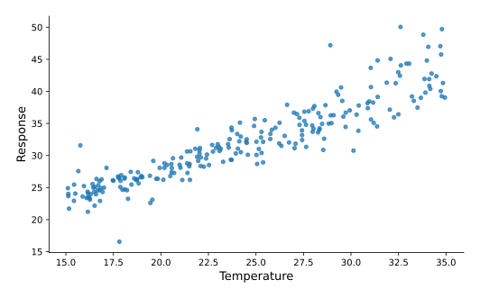{
  .plot
}

::::

:::::

::: {.takeaway}

The model receives the image with the cell result.

:::

::: {.notes}

**Say:** R plots from the managed default device come back as image
content. The model does not need a separate plot-capture tool or a
filesystem round trip merely to inspect what it plotted. Keep all
drawing operations for a managed plot in one cell; explicit user-owned
graphics devices have a different ownership contract.

**Show:** Let the plot occupy the right half of the frame. This preview
plot uses the supplied synthetic data and is marked as illustrative in
the notes; it is not presented as a capture from R or Codex. In the
final recording, replace it with the actual returned PNG.

**Sources:** [Built-in runtime](
  https://github.com/t-kalinowski/mcp-console/blob/main/docs/BUILTIN_RUNTIME.md
) · [Canonical tool schema snapshot](
  https://github.com/t-kalinowski/mcp-console/blob/main/tests/snapshots/client_server/server/test_tools/initializes_and_lists_tools.yaml
)

:::


## A wait timeout is not an execution deadline {#wait-timeout .deck-slide}

::: {.kicker}

Build the interface

:::

<div class="signature" aria-label="Fields introduced so far"><span class="sig-name">send(</span><span class="arg">r</span><span class="arg new-arg">timeout_ms</span><span class="sig-name">)</span></div>

::: {.code-panel}

::: {.panel-label}

send

:::

```python
send(r="source('bootstrap.R')", timeout_ms=200)
```

:::

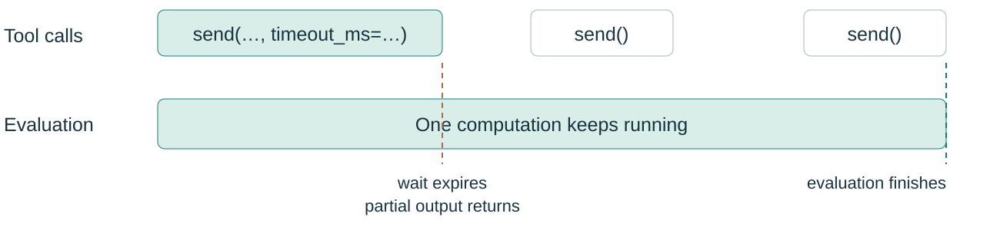{
  .diagram
}

::: {.notes}

**Say:** Now add timeout_ms. This bounds the evaluation wait, not the
lifetime of the computation. On expiry, Console returns whatever output
is available and a structured running notice; the computation continues.
Explicit dependency preparation has its own ordering relative to the
evaluation wait, so do not describe this as a universal wall-clock bound
on all send operations.

**Show:** Introduce the new field in the signature and use the two-track
timing diagram. Point to the tool call ending while the evaluation bar
continues. The example bootstrap.R script is included for a later live
recording.

**Sources:** [Send operation contract](
  https://github.com/t-kalinowski/mcp-console/blob/main/docs/SEND_OPERATIONS.md
) · [Built-in runtime](
  https://github.com/t-kalinowski/mcp-console/blob/main/docs/BUILTIN_RUNTIME.md
)

:::


## Polling is just an empty call {#poll .deck-slide}

::: {.kicker}

Build the interface

:::

<div class="signature" aria-label="Fields introduced so far"><span class="sig-name">send(</span><span class="arg">r</span><span class="arg">timeout_ms</span><span class="sig-name">)</span></div>

::::: {.two-col}

:::: {.left}

::: {.code-panel}

::: {.panel-label}

send

:::

```python
send()

# later, while it is still running
send(timeout_ms=200)
```

:::

::::

:::: {.right}

::: {.result-panel}

::: {.panel-label}

Illustrative sequence across responses

:::

```text
[running; poll with an empty send]

…new output…

[done]
```

:::

::::

:::::

::: {.takeaway}

Collect new output. Do not resubmit the cell.

:::

::: {.notes}

**Say:** There is no job handle or separate polling tool to introduce.
An empty send collects output from the one active evaluation. Each poll
returns newly collected output, not the previous result again. New code
waits until the running evaluation and its result have been collected.

**Show:** Keep the signature unchanged. Show two calls beside the
progression from running to completion. The right panel is an
illustrative sequence across responses, not one literal server response.

**Sources:** [Send operation contract](
  https://github.com/t-kalinowski/mcp-console/blob/main/docs/SEND_OPERATIONS.md
) · [Built-in runtime](
  https://github.com/t-kalinowski/mcp-console/blob/main/docs/BUILTIN_RUNTIME.md
)

:::


## Interrupt without replacing the runtime {#interrupt .deck-slide}

::: {.kicker}

Build the interface

:::

<div class="signature" aria-label="Fields introduced so far"><span class="sig-name">send(</span><span class="arg">r</span><span class="arg">timeout_ms</span><span class="arg new-arg">control</span><span class="sig-name">)</span></div>

::: {.code-panel}

::: {.panel-label}

send

:::

```python
send(control="interrupt")
```

:::

::: {.big-statement}

Stop the work.<br>Keep the workspace.

:::

::: {.small-note}

Cooperative interrupt; restart is the stronger operation.

:::

::: {.notes}

**Say:** Add control. Interrupt requests the runtime or active resolver
to stop its current work without deliberately replacing the worker. It
is cooperative: code can delay or catch interruption. Keeping this
distinct from restart makes state loss explicit rather than an
accidental side effect of a timeout.

**Show:** Highlight only control in the signature. The single-line call
is the main visual, followed by the two-line state-preservation message.
Do not imply every interrupt must succeed immediately.

**Sources:** [Send operation contract](
  https://github.com/t-kalinowski/mcp-console/blob/main/docs/SEND_OPERATIONS.md
) · [Built-in runtime](
  https://github.com/t-kalinowski/mcp-console/blob/main/docs/BUILTIN_RUNTIME.md
)

:::


## Restart resets objects, not prepared requirements {#restart .deck-slide}

::: {.kicker}

Build the interface

:::

<div class="signature" aria-label="Fields introduced so far"><span class="sig-name">send(</span><span class="arg">r</span><span class="arg">timeout_ms</span><span class="arg">control</span><span class="sig-name">)</span></div>

::: {.code-panel}

::: {.panel-label}

send

:::

```python
send(control="restart")
```

:::

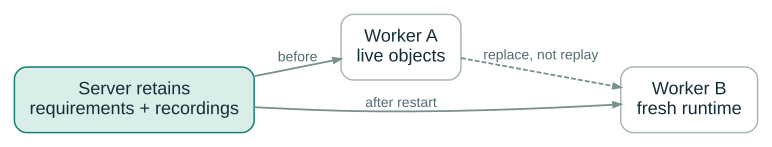{
  .diagram
}

::: {.notes}

**Say:** The other control value is restart. This replaces the worker
and discards R objects, Python objects, the in-memory DuckDB catalog,
debugger state, and unread input. The server retains successfully
prepared requirements and recordings. This is a deliberate fresh
runtime, not continuation disguised as recovery.

**Show:** Use the before/after worker diagram. The server box stays in
place; the worker changes. Avoid suggesting that the interrupted or
failed cell is replayed automatically.

**Sources:** [Send operation contract](
  https://github.com/t-kalinowski/mcp-console/blob/main/docs/SEND_OPERATIONS.md
) · [Built-in runtime](
  https://github.com/t-kalinowski/mcp-console/blob/main/docs/BUILTIN_RUNTIME.md
) · [Implemented architecture](
  https://github.com/t-kalinowski/mcp-console/blob/main/docs/ARCHITECTURE.md
)

:::


## Errors are outcomes, not transactions {#errors .deck-slide}

::: {.kicker}

Build the interface

:::

<div class="signature" aria-label="Fields introduced so far"><span class="sig-name">send(</span><span class="arg">r</span><span class="arg">timeout_ms</span><span class="arg">control</span><span class="sig-name">)</span></div>

::::: {.two-col}

:::: {.left}

::: {.code-panel}

::: {.panel-label}

send

:::

```python
send(
    r="""
 checkpoint <- 42
 stop("inspect me")
 """
)

send(r="checkpoint")
```

:::

::::

:::: {.right}

::: {.result-panel}

::: {.panel-label}

Illustrative outputs from two cells

:::

```text
Error: inspect me

[1] 42
```

:::

::::

:::::

::: {.takeaway}

An ordinary language error does not erase earlier state.

:::

::: {.notes}

**Say:** An ordinary R error or Python exception does not normally
destroy the worker. Also, cells are not transactions: assignments and
other effects before the error can remain. That is a useful, explicit
contract for an agent deciding whether to inspect, repair, retry, or
restart.

**Show:** Show a failed cell followed by a successful inspection of the
earlier assignment. No new argument appears. Keep the two responses
visibly distinct from one response block.

**Sources:** [Built-in runtime](
  https://github.com/t-kalinowski/mcp-console/blob/main/docs/BUILTIN_RUNTIME.md
) · [Canonical tool schema snapshot](
  https://github.com/t-kalinowski/mcp-console/blob/main/tests/snapshots/client_server/server/test_tools/initializes_and_lists_tools.yaml
)

:::


## Interactive input is a separate channel {#stdin .deck-slide}

::: {.kicker}

Build the interface

:::

<div class="signature" aria-label="Fields introduced so far"><span class="sig-name">send(</span><span class="arg">r</span><span class="arg">timeout_ms</span><span class="arg">control</span><span class="arg new-arg">stdin</span><span class="sig-name">)</span></div>

::::: {.two-col}

:::: {.left}

::: {.code-panel}

::: {.panel-label}

send

:::

```python
send(r='readline("Continue? ")')

send(stdin="yes\n")
```

:::

::::

:::: {.right}

::: {.result-panel}

::: {.panel-label}

Illustrative prompt / reply

:::

```text
[input requested: "Continue? "]
[waiting for stdin]

[1] "yes"
```

:::

::::

:::::

::: {.takeaway}

Complete code cells on one path; exact input bytes on another.

:::

::: {.notes}

**Say:** Add stdin when a running program asks for input. It is not
another code cell and it is not parser continuation. Console sends the
exact text supplied: line-oriented input usually needs an explicit
newline. The distinction between code and stdin is important both for
the model contract and the process topology later.

**Show:** Highlight stdin in the signature. Separate the
prompt-producing cell from the input-only reply. Preserve the literal
backslash-n in the example so the exact-byte contract is visible.

**Sources:** [Send operation contract](
  https://github.com/t-kalinowski/mcp-console/blob/main/docs/SEND_OPERATIONS.md
) · [Built-in runtime](
  https://github.com/t-kalinowski/mcp-console/blob/main/docs/BUILTIN_RUNTIME.md
)

:::


## The debugger uses the same field {#debugger .deck-slide}

::: {.kicker}

Build the interface

:::

<div class="signature" aria-label="Fields introduced so far"><span class="sig-name">send(</span><span class="arg">r</span><span class="arg">timeout_ms</span><span class="arg">control</span><span class="arg">stdin</span><span class="sig-name">)</span></div>

::: {.code-panel}

::: {.panel-label}

send

:::

```python
send(
    r="""
 inspect <- function(x) { browser(); mean(x) }
 inspect(c(1, 2, 3))
 """
)

send(stdin="x\n")
send(stdin="c\n")
```

:::

::: {.takeaway}

Inspect the live frame, then continue. No debugger tool family.

:::

::: {.notes}

**Say:** The same mechanism supports browser() and the supported Python
input/debugger bridge. The model can inspect local variables or the call
stack while stopped in a function, then continue or quit. The active
computation remains active until it finishes; a debugger command is not
a new top-level cell.

**Show:** Reuse the stdin highlight without adding another signature
field. One short function, one inspection, one continue command. This is
a fast feature reveal, not a tutorial on the R debugger.

**Sources:** [Built-in runtime](
  https://github.com/t-kalinowski/mcp-console/blob/main/docs/BUILTIN_RUNTIME.md
)

:::


## Keep model context bounded {#bounded-output .deck-slide}

::: {.kicker}

Build the interface

:::

<div class="signature" aria-label="Fields introduced so far"><span class="sig-name">send(</span><span class="arg">r</span><span class="arg">timeout_ms</span><span class="arg">control</span><span class="arg">stdin</span><span class="sig-name">)</span></div>

::::: {.two-col}

:::: {.left}

::: {.big-statement}

Beginning<br>…<br>Latest tail

:::

::::

:::: {.right}

::: {.result-panel}

::: {.panel-label}

Illustrative bounded response

:::

```text
useful opening output
… omitted middle …
latest diagnostic
[running; poll with an empty send]
```

:::

::::

:::::

::: {.takeaway}

8 KiB text budget per result; images have a separate allowance.

:::

::: {.notes}

**Say:** Token efficiency also lives in the result contract. Each
complete result has an 8 KiB rendered UTF-8 text budget, including
notices. Large output keeps its beginning and latest tail so a late
diagnostic can still be visible. Progress redraws are compacted. This is
a byte budget, not an exact token count or a guarantee about every
client’s additional processing.

**Show:** Use a simple head/gap/tail layout instead of a huge wall of
output. The omission line here is schematic, not the exact current
server wording. Do not add a read or pagination method to send.

**Sources:** [Built-in runtime](
  https://github.com/t-kalinowski/mcp-console/blob/main/docs/BUILTIN_RUNTIME.md
) · [Canonical tool schema snapshot](
  https://github.com/t-kalinowski/mcp-console/blob/main/tests/snapshots/client_server/server/test_tools/initializes_and_lists_tools.yaml
)

:::


## Retain more than you put in context {#retained-output .deck-slide}

::: {.kicker}

Build the interface

:::

<div class="signature" aria-label="Fields introduced so far"><span class="sig-name">send(</span><span class="arg">r</span><span class="arg">timeout_ms</span><span class="arg">control</span><span class="arg">stdin</span><span class="sig-name">)</span></div>

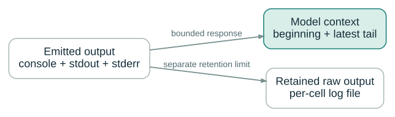{
  .diagram
}

::: {.takeaway}

Native code and subprocess output participate too.

:::

::: {.notes}

**Say:** Console captures console output and raw stdout/stderr,
including native and subprocess output. Longer emitted cell text is
retained separately in per-cell files up to a 1 GiB cap; previews
continue even if retention is partial. Retrieval requires a filesystem
tool that can access the controller recording directory. The records are
not unlimited or a lossless event chronology across independent streams.

**Show:** Split one output stream into two destinations: model context
and a log file. Put the retention-limit caveat in speech rather than
shrinking the diagram with implementation numbers. For remote execution,
the log path is on the controller, not necessarily on the worker’s
filesystem.

**Sources:** [Built-in runtime](
  https://github.com/t-kalinowski/mcp-console/blob/main/docs/BUILTIN_RUNTIME.md
)

:::


## Package loading is a runtime capability {#r-resolution .deck-slide}

::: {.kicker}

Build the interface

:::

<div class="signature" aria-label="Fields introduced so far"><span class="sig-name">send(</span><span class="arg">r</span><span class="arg">timeout_ms</span><span class="arg">control</span><span class="arg">stdin</span><span class="sig-name">)</span></div>

::: {.code-panel}

::: {.panel-label}

send

:::

```python
send(
    r="""
 library(data.table)
 as.data.table(d)[, .(n = .N), by = group]
 """
)
```

:::

::: {.takeaway}

Missing package → prepare → resume the original operation.

:::

::: {.small-note}

No source pre-scan. No whole-cell replay. No new argument.

:::

::: {.notes}

**Say:** Only now introduce package resolution, after wait timeouts and
the interactive contract. The simple model path is ordinary library() or
pkg::fun() use. When execution reaches a supported missing-package
operation, Console prepares the package and resumes that operation in
the live worker. Quoted or unreachable code does not trigger a
source-scanning installer.

**Show:** Keep the signature unchanged and show ordinary R. This is the
first example of pushing capability into the runtime rather than
expanding the tool schema. Resolver work may outlast the tool wait,
using the timeout and polling behavior already explained.

**Sources:** [Requirements and environments](
  https://github.com/t-kalinowski/mcp-console/blob/main/docs/REQUIREMENTS.md
) · [Built-in runtime](
  https://github.com/t-kalinowski/mcp-console/blob/main/docs/BUILTIN_RUNTIME.md
)

:::


## Make the requirements explicit when it matters {#requirements .deck-slide}

::: {.kicker}

Build the interface

:::

<div class="signature" aria-label="Fields introduced so far"><span class="sig-name">send(</span><span class="arg">r</span><span class="arg">timeout_ms</span><span class="arg">control</span><span class="arg">stdin</span><span class="arg new-arg">requirements</span><span class="sig-name">)</span></div>

::: {.code-panel}

::: {.panel-label}

send

:::

```python
send(
    r="library(data.table); as.data.table(d)",
    requirements={"r": ["data.table"]},
)
```

:::

::: {.takeaway}

Stage dependencies, select package sources, state intent before
evaluation.

:::

::: {.notes}

**Say:** Add requirements for the model that wants to be deliberate. The
same field can prepare a package before evaluation or carry supported
explicit R package references; Python constraints will follow.
Preparation makes packages available but does not itself attach, import,
or load them. If preparation fails, the accompanying cell is not run.

**Show:** Highlight requirements as the next new field. Use a plain
package name for the first concrete example rather than relying on
unverified version-reference syntax. The exact supported reference and
trust restrictions belong in the notes and linked contract.

**Sources:** [Requirements and environments](
  https://github.com/t-kalinowski/mcp-console/blob/main/docs/REQUIREMENTS.md
) · [Send operation contract](
  https://github.com/t-kalinowski/mcp-console/blob/main/docs/SEND_OPERATIONS.md
) · [Canonical tool schema snapshot](
  https://github.com/t-kalinowski/mcp-console/blob/main/tests/snapshots/client_server/server/test_tools/initializes_and_lists_tools.yaml
)

:::


## Prepare now; keep working in the same session {#live-requirements .deck-slide}

::: {.kicker}

Build the interface

:::

<div class="signature" aria-label="Fields introduced so far"><span class="sig-name">send(</span><span class="arg">r</span><span class="arg">timeout_ms</span><span class="arg">control</span><span class="arg">stdin</span><span class="arg">requirements</span><span class="sig-name">)</span></div>

::::: {.two-col}

:::: {.left}

::: {.code-panel}

::: {.panel-label}

send

:::

```python
send(
    requirements={
        "r": ["data.table"],
    }
)

send(r="coef(fit)")
```

:::

::::

:::: {.right}

::: {.big-statement}

New dependency.<br>Same objects.

:::

::::

:::::

::: {.takeaway}

Requirements-only calls work; compatible live additions preserve state.

:::

::: {.notes}

**Say:** Requirements can also be prepared without submitting a cell.
Supported compatible additions keep the existing worker state, and
accepted requirements remain retained for later calls and restart. This
is additive environment management, not arbitrary replacement or removal
of already loaded packages.

**Show:** Show a requirements-only call followed by inspection of the
same fit. The new field has gained another use without another tool.
Mention that some incompatible or failed activations require an explicit
restart; do not imply arbitrary upgrades can preserve every live object.

**Sources:** [Requirements and environments](
  https://github.com/t-kalinowski/mcp-console/blob/main/docs/REQUIREMENTS.md
)

:::


## Use the resolver, not another package manager {#ir .deck-slide}

::: {.kicker}

Build the interface

:::

<div class="signature" aria-label="Fields introduced so far"><span class="sig-name">send(</span><span class="arg">r</span><span class="arg">timeout_ms</span><span class="arg">control</span><span class="arg">stdin</span><span class="arg">requirements</span><span class="sig-name">)</span></div>

::: {.big-statement}

R requirements → `ir`

:::

::: {.takeaway}

Prepare and reuse the package environment; leave session ownership to
Console.

:::

::: {.small-note}

Installation and trust boundaries come later.

:::

::: {.notes}

**Say:** Console coordinates the environment but delegates R dependency
work to ir. This matters for reuse and for keeping package preparation
separate from the evaluator. We will return to concrete versus managed
environments and the sandbox boundary after the language sequence.

**Show:** Use one large dependency arrow, not an installation
walkthrough. It is a fast acknowledgement of the underlying tooling,
while the signature stays the same.

**Sources:** [Requirements and environments](
  https://github.com/t-kalinowski/mcp-console/blob/main/docs/REQUIREMENTS.md
)

:::


## And Python {#python .deck-slide}

::: {.kicker}

Build the interface

:::

<div class="signature" aria-label="Fields introduced so far"><span class="sig-name">send(</span><span class="arg">r</span><span class="arg">timeout_ms</span><span class="arg">control</span><span class="arg">stdin</span><span class="arg">requirements</span><span class="arg new-arg">python</span><span class="sig-name">)</span></div>

::: {.code-panel}

::: {.panel-label}

send

:::

```python
send(
    python="""
 frame = r.d
 frame.groupby("group").size()
 """
)
```

:::

::: {.takeaway}

One more code field. The same operation model.

:::

::: {.notes}

**Say:** Add python. The language changes, not the session-control
vocabulary. Python cells use persistent __main__ state and ordinary
final-expression display. In the combined runtime the r bridge makes the
existing R data available; the architecture of that bridge is the next
step, not a separate session setup.

**Show:** Reveal python as the only new signature field. Preserve the
exact layout of the R examples. State explicitly that a call contains at
most one of the r, python, or sql code fields.

**Sources:** [Built-in runtime](
  https://github.com/t-kalinowski/mcp-console/blob/main/docs/BUILTIN_RUNTIME.md
) · [Canonical tool schema snapshot](
  https://github.com/t-kalinowski/mcp-console/blob/main/tests/snapshots/client_server/server/test_tools/initializes_and_lists_tools.yaml
)

:::


## And Python plots {#python-plots .deck-slide}

::: {.kicker}

Build the interface

:::

<div class="signature" aria-label="Fields introduced so far"><span class="sig-name">send(</span><span class="arg">r</span><span class="arg">timeout_ms</span><span class="arg">control</span><span class="arg">stdin</span><span class="arg">requirements</span><span class="arg">python</span><span class="sig-name">)</span></div>

::::: {.two-col}

:::: {.left}

::: {.code-panel}

::: {.panel-label}

send

:::

```python
send(
    python="""
 import matplotlib.pyplot as plt
 plt.scatter(r.d["temperature"],
             r.d["response"])
 """
)
```

:::

::::

:::: {.right}

{
  .plot
}

::::

:::::

::: {.takeaway}

Open pyplot figures return as images at cell end.

:::

::: {.notes}

**Say:** The same image-result story applies to open Matplotlib pyplot
figures. Console renders and closes them at cell end, including after an
ordinary Python exception. show() is optional. These are specific
capture rules, not a claim that every graphics backend or client renders
every image format.

**Show:** Repeat the R plot slide’s composition almost exactly. The
repetition is intentional: this is the crescendo beginning, not a new
conceptual section. The supplied preview image is illustrative until
replaced by a real captured Python result.

**Sources:** [Built-in runtime](
  https://github.com/t-kalinowski/mcp-console/blob/main/docs/BUILTIN_RUNTIME.md
) · [Canonical tool schema snapshot](
  https://github.com/t-kalinowski/mcp-console/blob/main/tests/snapshots/client_server/server/test_tools/initializes_and_lists_tools.yaml
)

:::


## The controls come with it {#python-controls .deck-slide}

::: {.kicker}

Build the interface

:::

<div class="signature" aria-label="Fields introduced so far"><span class="sig-name">send(</span><span class="arg">r</span><span class="arg">timeout_ms</span><span class="arg">control</span><span class="arg">stdin</span><span class="arg">requirements</span><span class="arg">python</span><span class="sig-name">)</span></div>

::: {.code-panel}

::: {.panel-label}

Independent call shapes

:::

```python
send(python="run_experiment()", timeout_ms=200)
send()
send(control="interrupt")
send(stdin="continue\n")
send(control="restart")
```

:::

::: {.takeaway}

Waits. Polls. Interrupts. Input. Debuggers. Restart.

:::

::: {.notes}

**Say:** These are independent example call shapes, not a script to
execute consecutively. Python inherits the shared controls: bounded
waits, polling, interruption, interactive input, supported debugger
interaction, and explicit restart. There is no second Python-specific
tool family to learn.

**Show:** Use a compact list of familiar calls rather than another
control tutorial. Mark the panel as independent examples. The absence of
a new signature field is the point.

**Sources:** [Built-in runtime](
  https://github.com/t-kalinowski/mcp-console/blob/main/docs/BUILTIN_RUNTIME.md
) · [Send operation contract](
  https://github.com/t-kalinowski/mcp-console/blob/main/docs/SEND_OPERATIONS.md
)

:::


## Missing imports resolve in place {#python-resolution .deck-slide}

::: {.kicker}

Build the interface

:::

<div class="signature" aria-label="Fields introduced so far"><span class="sig-name">send(</span><span class="arg">r</span><span class="arg">timeout_ms</span><span class="arg">control</span><span class="arg">stdin</span><span class="arg">requirements</span><span class="arg">python</span><span class="sig-name">)</span></div>

::: {.code-panel}

::: {.panel-label}

send

:::

```python
send(
    python="""
 import polars as pl
 pl.from_pandas(r.d).group_by("group").len()
 """
)
```

:::

::: {.takeaway}

`uv` prepares the managed environment; the original import continues.

:::

::: {.notes}

**Say:** Managed Python resolves a missing import when normal import
machinery cannot satisfy it. A curated mapping handles known
import/distribution name differences, with conservative inference
otherwise. It does not scan the cell in advance or replay the cell.
Explicitly selected Python environments use their preinstalled packages
instead of this managed path.

**Show:** Show an ordinary import and useful work. Do not promise that
every arbitrary import name maps to the right distribution; that is what
the explicit path on the next slide addresses.

**Sources:** [Requirements and environments](
  https://github.com/t-kalinowski/mcp-console/blob/main/docs/REQUIREMENTS.md
) · [Built-in runtime](
  https://github.com/t-kalinowski/mcp-console/blob/main/docs/BUILTIN_RUNTIME.md
)

:::


## Versions and extras fit the existing field {#python-requirements .deck-slide}

::: {.kicker}

Build the interface

:::

<div class="signature" aria-label="Fields introduced so far"><span class="sig-name">send(</span><span class="arg">r</span><span class="arg">timeout_ms</span><span class="arg">control</span><span class="arg">stdin</span><span class="arg">requirements</span><span class="arg">python</span><span class="sig-name">)</span></div>

::: {.code-panel}

::: {.panel-label}

send

:::

```python
send(
    python="import polars as pl; pl.__version__",
    requirements={"python": ["polars>=1,<2"]},
)
```

:::

::: {.takeaway}

Precise package metadata, without a new tool or a new workflow.

:::

::: {.notes}

**Say:** Requirements now carries Python distribution metadata:
versions, extras, and markers within the accepted named-registry format.
It can also correct an import-name inference. The model that understands
the environment more precisely can use that precision through the same
interface.

**Show:** Highlight the python entry inside requirements, not a new
top-level field. This visually reinforces the difference between adding
a capability to an existing contract and adding another tool.

**Sources:** [Requirements and environments](
  https://github.com/t-kalinowski/mcp-console/blob/main/docs/REQUIREMENTS.md
) · [Canonical tool schema snapshot](
  https://github.com/t-kalinowski/mcp-console/blob/main/tests/snapshots/client_server/server/test_tools/initializes_and_lists_tools.yaml
)

:::


## Both languages share one worker process {#shared-process .deck-slide}

::: {.kicker}

Build the interface

:::

<div class="signature" aria-label="Fields introduced so far"><span class="sig-name">send(</span><span class="arg">r</span><span class="arg">timeout_ms</span><span class="arg">control</span><span class="arg">stdin</span><span class="arg">requirements</span><span class="arg">python</span><span class="sig-name">)</span></div>

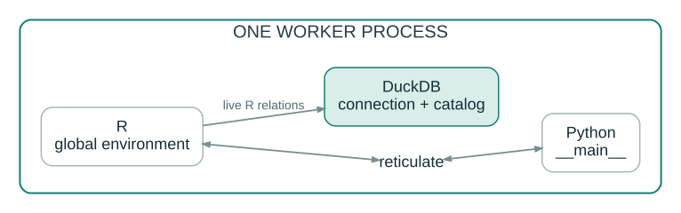{
  .diagram
}

::: {.takeaway}

Shared lifetime; explicit object bridges; no intermediate files
required.

:::

::: {.notes}

**Say:** In the combined runtime, R hosts Python through reticulate and
DuckDB is in the same worker process. R globals are available through r
in Python; Python globals through py in R. Conversions follow
reticulate’s rules. Do not claim arbitrary zero-copy conversion or that
the host R chat session is this worker.

**Show:** Use a single visible process boundary. The R/Python bridge is
inside it. This is an overview of the current combined-runtime topology,
not a claim that the planned Python-only mode is already this same
implementation.

**Sources:** [Built-in runtime](
  https://github.com/t-kalinowski/mcp-console/blob/main/docs/BUILTIN_RUNTIME.md
) · [Implemented architecture](
  https://github.com/t-kalinowski/mcp-console/blob/main/docs/ARCHITECTURE.md
)

:::


## Switch languages; reuse the objects {#object-bridge .deck-slide}

::: {.kicker}

Build the interface

:::

<div class="signature" aria-label="Fields introduced so far"><span class="sig-name">send(</span><span class="arg">r</span><span class="arg">timeout_ms</span><span class="arg">control</span><span class="arg">stdin</span><span class="arg">requirements</span><span class="arg">python</span><span class="sig-name">)</span></div>

::: {.code-panel}

::: {.panel-label}

send

:::

```python
send(
    python="""
 frame = r.d
 group_counts = frame.groupby("group").size()
 """
)

send(r="py$group_counts")
```

:::

::: {.takeaway}

Choose the language for the step, not for the whole session.

:::

::: {.notes}

**Say:** Now make the object bridge concrete. A Python cell works on the
R data frame and stores a Python result; the next R cell reads that
Python object through py. The session stays live throughout. File
export/import is not part of the normal handoff, though conversions can
still allocate.

**Show:** Show the two calls stacked in one panel. Reuse variable names
from the preceding slides so the audience can follow state without
rereading a new scenario.

**Sources:** [Built-in runtime](
  https://github.com/t-kalinowski/mcp-console/blob/main/docs/BUILTIN_RUNTIME.md
) · [Project README](
  https://github.com/t-kalinowski/mcp-console/blob/main/README.md
)

:::


## And SQL {#sql .deck-slide}

::: {.kicker}

Build the interface

:::

<div class="signature" aria-label="Fields introduced so far"><span class="sig-name">send(</span><span class="arg">r</span><span class="arg">timeout_ms</span><span class="arg">control</span><span class="arg">stdin</span><span class="arg">requirements</span><span class="arg">python</span><span class="arg new-arg">sql</span><span class="sig-name">)</span></div>

::: {.code-panel}

::: {.panel-label}

send

:::

```python
send(
    sql="""
 SELECT "group", COUNT(*) AS n
 FROM d
 GROUP BY "group"
 """
)
```

:::

::: {.takeaway}

DuckDB by default. Persistent connection and catalog.

:::

::: {.notes}

**Say:** Add sql, the last code-language field. SQL has its own cell
input and a persistent managed DuckDB backend by default. The d relation
here is the live R data frame already created; an unqualified relation
name can discover it. A DuckDB table or view of the same name takes
precedence.

**Show:** Reveal sql in the signature. The rest of the call/result
composition remains unchanged. Again, r, python, and sql are
alternatives per call, not three simultaneous code payloads.

**Sources:** [Built-in runtime](
  https://github.com/t-kalinowski/mcp-console/blob/main/docs/BUILTIN_RUNTIME.md
) · [Canonical tool schema snapshot](
  https://github.com/t-kalinowski/mcp-console/blob/main/tests/snapshots/client_server/server/test_tools/initializes_and_lists_tools.yaml
)

:::


## SQL can operate on live R data {#sql-r-data .deck-slide}

::: {.kicker}

Build the interface

:::

<div class="signature" aria-label="Fields introduced so far"><span class="sig-name">send(</span><span class="arg">r</span><span class="arg">timeout_ms</span><span class="arg">control</span><span class="arg">stdin</span><span class="arg">requirements</span><span class="arg">python</span><span class="arg">sql</span><span class="sig-name">)</span></div>

::: {.code-panel}

::: {.panel-label}

send

:::

```python
send(r="d$.residual <- residuals(fit)")

send(
    sql="""
 SELECT "group", AVG(ABS(".residual")) AS error
 FROM d
 GROUP BY "group"
 """
)
```

:::

::: {.takeaway}

No staging database. No CSV round trip.

:::

::: {.notes}

**Say:** An R model result becomes a column, and SQL immediately
summarizes it through managed DuckDB relation discovery. This is the
point of one interactive workspace: each language builds on live work
already done. The default managed backend discovers R frames; Python
visibility is connection-dependent and needs the explicit setup shown
next.

**Show:** Show a one-line R update followed by the SQL query. Keep the
claim precise: this is live R relation discovery on the managed backend,
not universal implicit visibility into every object in every runtime.

**Sources:** [Built-in runtime](
  https://github.com/t-kalinowski/mcp-console/blob/main/docs/BUILTIN_RUNTIME.md
) · [Canonical tool schema snapshot](
  https://github.com/t-kalinowski/mcp-console/blob/main/tests/snapshots/client_server/server/test_tools/initializes_and_lists_tools.yaml
)

:::


## Python relations use their connection {#sql-python-data .deck-slide .code-dense}

::: {.kicker}

Build the interface

:::

<div class="signature" aria-label="Fields introduced so far"><span class="sig-name">send(</span><span class="arg">r</span><span class="arg">timeout_ms</span><span class="arg">control</span><span class="arg">stdin</span><span class="arg">requirements</span><span class="arg">python</span><span class="arg">sql</span><span class="sig-name">)</span></div>

::: {.code-panel}

::: {.panel-label}

send

:::

```python
send(
    python="""
 import duckdb
 con = duckdb.connect()
 con.register("measurements", r.d)
 console_sql_connection(con)
 """
)

send(sql="SELECT COUNT(*) FROM measurements")
```

:::

::: {.takeaway}

Connection-local registrations stay with the Python connection.

:::

::: {.notes}

**Say:** For Python-side relations, select a Python DuckDB connection
and register the frame there. Later SQL cells use that exact connection.
This avoids the inaccurate implication that managed R-backed DuckDB
automatically sees Python globals. Another route is to bind a Python
frame to an R name before querying it through the managed backend.

**Show:** Keep registration visible: it is useful explicit runtime
capability, not a new Console tool. The example uses the existing R
frame via Python only to preserve the narrative; the frame could just as
well have been created in Python.

**Sources:** [Built-in runtime](
  https://github.com/t-kalinowski/mcp-console/blob/main/docs/BUILTIN_RUNTIME.md
) · [Canonical tool schema snapshot](
  https://github.com/t-kalinowski/mcp-console/blob/main/tests/snapshots/client_server/server/test_tools/initializes_and_lists_tools.yaml
)

:::


## Select the database from either language {#sql-connections .deck-slide}

::: {.kicker}

Build the interface

:::

<div class="signature" aria-label="Fields introduced so far"><span class="sig-name">send(</span><span class="arg">r</span><span class="arg">timeout_ms</span><span class="arg">control</span><span class="arg">stdin</span><span class="arg">requirements</span><span class="arg">python</span><span class="arg">sql</span><span class="sig-name">)</span></div>

::::: {.two-col}

:::: {.left}

::: {.code-panel}

::: {.panel-label}

R cell · DBI

:::

```r
connection <- DBI::dbConnect(
  RSQLite::SQLite(),
  ":memory:"
)
console_sql_connection(connection)
```

:::

::::

:::: {.right}

::: {.code-panel}

::: {.panel-label}

Python cell · DB-API

:::

```python
import sqlite3

connection = sqlite3.connect(":memory:")
console_sql_connection(connection)
```

:::

::::

:::::

::: {.takeaway}

The selected driver owns dialect, transactions, and relation visibility.

:::

::: {.notes}

**Say:** DuckDB is the default, not a limitation of the SQL cell
interface. R can select a DBI connection and Python can select a DB-API
connection. The connection remains owned by its runtime. SQL semantics,
transactions, and supported statements belong to the selected driver;
these examples are alternatives, not shared cross-runtime connection
objects.

**Show:** Use parallel code panels and one shared takeaway. The function
console_sql_connection() belongs to runtime code, demonstrating how much
functionality can be exposed without changing send.

**Sources:** [Built-in runtime](
  https://github.com/t-kalinowski/mcp-console/blob/main/docs/BUILTIN_RUNTIME.md
) · [Canonical tool schema snapshot](
  https://github.com/t-kalinowski/mcp-console/blob/main/tests/snapshots/client_server/server/test_tools/initializes_and_lists_tools.yaml
)

:::


## And DuckDB extensions {#duckdb-requirements .deck-slide}

::: {.kicker}

Build the interface

:::

<div class="signature" aria-label="Fields introduced so far"><span class="sig-name">send(</span><span class="arg">r</span><span class="arg">timeout_ms</span><span class="arg">control</span><span class="arg">stdin</span><span class="arg">requirements</span><span class="arg">python</span><span class="arg">sql</span><span class="sig-name">)</span></div>

::: {.code-panel}

::: {.panel-label}

send

:::

```python
send(
    sql="LOAD spatial; SELECT ST_Point(1, 2)",
    requirements={"duckdb": ["spatial"]},
)
```

:::

::: {.takeaway}

Prepare explicitly—or resolve on demand—then load inside the worker.

:::

::: {.notes}

**Say:** Dependency preparation also covers DuckDB extensions. The
explicit example is supported for the managed backend; preparation uses
DuckDB’s install path outside the worker sandbox, while loading happens
inside the runtime. For presentation day, include the intended on-demand
extension path as well, without inventing a new top-level field.

**Show:** Show one extension requirement beside a query. Reset to the
managed DuckDB connection before actually running this example after
custom-connection slides. The automatic on-demand claim is a target-day
assumption and must be verified before a live capture.

**Author check before presenting:** Target-day assumption: automatic
DuckDB extension discovery is not documented as implemented; current SQL
does not trigger package discovery. Explicit requirements.duckdb is
implemented.

**Sources:** [Requirements and environments](
  https://github.com/t-kalinowski/mcp-console/blob/main/docs/REQUIREMENTS.md
) · [Canonical tool schema snapshot](
  https://github.com/t-kalinowski/mcp-console/blob/main/tests/snapshots/client_server/server/test_tools/initializes_and_lists_tools.yaml
)

:::


## That is the surface {#full-signature .deck-slide .signature-slide}

::: {.kicker}

The complete contract

:::

::: {.full-contract}

<pre class="signature-display">send(
  <span class="syntax-accent">r</span>=…, <span class="syntax-accent">python</span>=…, <span class="syntax-accent">sql</span>=…,   <span class="syntax-comment"># at most one code field</span>
  timeout_ms=…,
  control=…,
  stdin=…,
  requirements=…,
)</pre>

:::

::: {.takeaway}

Seven top-level fields. All optional. One tool.

:::

::: {.small-note}

Poll, input, control, and prepare-only calls omit code.

:::

::: {.notes}

**Say:** Now reveal the complete top-level surface. All fields are
optional, with compatibility rules on combinations; at most one
code-language field is supplied. The fields are not seven separate
tools. Much of the capability just demonstrated lives in native runtime
operations, so the schema does not need a method for every package,
plot, connection, or debugger action.

**Show:** Drop the incremental signature rail and replace it with a
single large schematic signature. Be explicit that this is
named-argument shorthand for the MCP object schema, not a literal
positional API declaration. Let the size contrast with the capabilities
already demonstrated.

**Sources:** [Canonical tool schema snapshot](
  https://github.com/t-kalinowski/mcp-console/blob/main/tests/snapshots/client_server/server/test_tools/initializes_and_lists_tools.yaml
) · [Send operation contract](
  https://github.com/t-kalinowski/mcp-console/blob/main/docs/SEND_OPERATIONS.md
)

:::


## Capture the model-facing interaction {#demo .deck-slide .demo-slide}

::: {.kicker}

Optional recorded demo

:::

::: {.recording-label}

RECORDING SLOT · NOT A CAPTURED RUN

:::

::: {.prompt-card}

Use `measurements.csv` to investigate the temperature effect. Check
whether it differs by group, inspect the residuals, and summarize the
evidence. Use Console as your workbench.

:::

::: {.takeaway}

Expanded tool calls → wait / poll → plot → language handoff → transcript

:::

::: {.notes}

**Say:** Record one real session in the client you actually use. Prefer
the Codex TUI for legible expanded tool arguments; use the desktop
client if it better exposes returned plots in the capture. The audience
does not need a tour of the surrounding application. Crop tightly around
tool requests and results and annotate the particular contract being
exercised. Installation appears later.

**Show:** This is a designed recording slot, not a fabricated Codex
screenshot. The package includes the synthetic data, a capture prompt, a
fallback sequence, and a video replacement location. Once a real
recording exists, replace this body with the video or a short sequence
of authentic cropped stills. Do not narrate synthetic draft examples as
recorded model behavior.

**Sources:** [Canonical tool schema snapshot](
  https://github.com/t-kalinowski/mcp-console/blob/main/tests/snapshots/client_server/server/test_tools/initializes_and_lists_tools.yaml
) · [Official Codex MCP documentation](
  https://developers.openai.com/codex/mcp/
)

:::


## It scales with what the model can use {#model-capability .deck-slide}

::: {.kicker}

The complete contract

:::

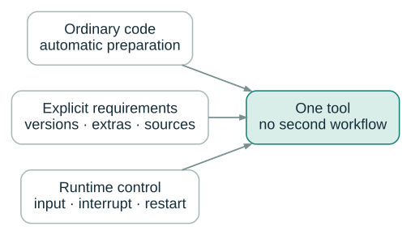{
  .diagram
}

::: {.takeaway}

A simple model can write code. A deliberate model can plan the
environment and control execution.

:::

::: {.notes}

**Say:** Summarize the design claim without a benchmark claim. Models
that only write ordinary code benefit from native behavior and automatic
resolution. Models that understand requirements, runtime state, and
controls can be more deliberate. Both use the same interface. The
benefit should be demonstrated in the interaction, not asserted as
universal better results for every model.

**Show:** Use the converging three-path diagram. This closes the
capability crescendo before switching from what the model can do to what
the user configures and what the implementation owns.

**Sources:** [Requirements and environments](
  https://github.com/t-kalinowski/mcp-console/blob/main/docs/REQUIREMENTS.md
) · [Canonical tool schema snapshot](
  https://github.com/t-kalinowski/mcp-console/blob/main/tests/snapshots/client_server/server/test_tools/initializes_and_lists_tools.yaml
) · [Vision / intended design](
  https://github.com/t-kalinowski/mcp-console/blob/main/design-sketches/VISION.md
)

:::


## Keep the record outside model context {#recording .deck-slide}

::: {.kicker}

Records and artifacts

:::

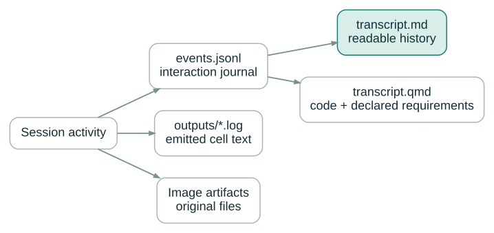{
  .diagram
}

::: {.notes}

**Say:** There are several different records, not one overloaded log.
The JSONL journal records the interaction; raw per-cell files retain
emitted text; Markdown is the readable history; Quarto is the source
projection; images are durable files. Their purpose and retention
boundaries differ. Session records are not automatically redacted.

**Show:** Use the file-flow diagram and name the files. Distinguish raw
output retention from the model-visible results in the journal. Do not
imply every byte or server notice is duplicated into every artifact.

**Sources:** [Project README](
  https://github.com/t-kalinowski/mcp-console/blob/main/README.md
) · [Built-in runtime](
  https://github.com/t-kalinowski/mcp-console/blob/main/docs/BUILTIN_RUNTIME.md
) · [Implemented architecture](
  https://github.com/t-kalinowski/mcp-console/blob/main/docs/ARCHITECTURE.md
)

:::


## Markdown for following the work {#markdown-transcript .deck-slide}

::: {.kicker}

Records and artifacts

:::

::: {.document-card}

### `transcript.md`

```r
fit <- lm(response ~ temperature + group, d)
```

Code. Results. Errors. Plots. A readable sequence.

:::

::: {.takeaway}

Review the session without decoding protocol messages.

:::

::: {.notes}

**Say:** The human-facing transcript is Markdown. It accumulates the
submitted work and returned results so someone can follow what happened
without reading the raw protocol. It also gives ordinary file tools a
durable record to inspect when conversation context is no longer enough.

**Show:** Show a clean excerpt rather than a full-screen editor
screenshot. This is an illustrative transcript layout; the production
capture should use the actual generated document, including its real
image paths and output formatting.

**Sources:** [Project README](
  https://github.com/t-kalinowski/mcp-console/blob/main/README.md
) · [Built-in runtime](
  https://github.com/t-kalinowski/mcp-console/blob/main/docs/BUILTIN_RUNTIME.md
) · [Implemented architecture](
  https://github.com/t-kalinowski/mcp-console/blob/main/docs/ARCHITECTURE.md
)

:::


## Quarto for the next iteration {#quarto-transcript .deck-slide}

::: {.kicker}

Records and artifacts

:::

::: {.big-statement}

`transcript.qmd`

:::

::: {.takeaway}

Code + declared dependencies → an executable starting point.

:::

::: {.small-note}

Not a live-memory checkpoint or an automatic replay of interactive
control.

:::

::: {.notes}

**Say:** Quarto source carries submitted code and declared requirements
forward into something that can be rerun and refined. Be precise about
reproducibility: rejected or failed submissions can appear, external
data still matters, and rendering does not recreate all control flow,
stdin interactions, or in-memory state. Remote and container projections
default to non-executing.

**Show:** Use one file name and one arrow to a refined analysis
document. Avoid a promise that the raw session is already a polished,
universally reproducible report. Mention that executing the generated
source is a separate trust decision, outside the worker sandbox unless
explicitly arranged otherwise.

**Sources:** [Project README](
  https://github.com/t-kalinowski/mcp-console/blob/main/README.md
) · [Implemented architecture](
  https://github.com/t-kalinowski/mcp-console/blob/main/docs/ARCHITECTURE.md
) · [Built-in runtime](
  https://github.com/t-kalinowski/mcp-console/blob/main/docs/BUILTIN_RUNTIME.md
)

:::


## The user chooses the operating conditions {#config .deck-slide}

::: {.kicker}

User control

:::

::: {.code-panel}

::: {.panel-label}

Project configuration

:::

```yaml
# .agents/console/config.yaml
extends: :workspace
```

:::

::: {.code-panel}

::: {.panel-label}

One launch, without editing the file

:::

```bash
mcp-console serve -c extends=:read-only
```

:::

::: {.takeaway}

Configuration first; the model operates within it.

:::

::: {.notes}

**Say:** The tool is only the model-facing part of the product. The user
supplies trusted project configuration, and launch-time overrides can
change a setting without editing that file. Configuration is captured
for the session rather than rediscovered from model-modified files on
every operation.

**Show:** Show the real minimal configuration and a real override. Keep
broader proposed profile syntax out of the runnable examples. Initial
requirements, environment choices, and richer profiles are
presentation-day scope but are identified separately in the author
checklist.

**Sources:** [Configuration layering](
  https://github.com/t-kalinowski/mcp-console/blob/main/docs/CONFIGURATION.md
) · [Sandbox configuration](
  https://github.com/t-kalinowski/mcp-console/blob/main/docs/SANDBOX_CONFIGURATION.md
) · [Proposed configuration](
  https://github.com/t-kalinowski/mcp-console/blob/main/design-sketches/CONFIGURATION.md
)

:::


## Existing installations or managed environments {#environment-choice .deck-slide}

::: {.kicker}

User control

:::

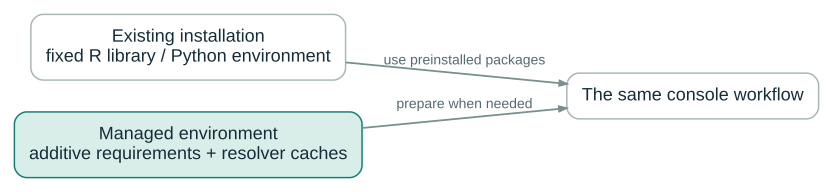{
  .diagram
}

::: {.takeaway}

Concrete when required. Ephemeral and cached when useful.

:::

::: {.notes}

**Say:** Some projects need a specific R installation and library or a
fixed Python interpreter and environment. Others benefit from managed,
cached environments that grow with additive requirements. Make that a
user choice. Ephemeral here concerns package environments, not an
unsupported promise to install arbitrary R runtimes or safely swap every
loaded library.

**Show:** Show two paths into the same worker. Explain the distinction
between the Python used to install or launch Console and the language
environment on the execution host. Configuration of richer named
profiles is target-day material; the fundamental concrete and managed
paths exist today.

**Sources:** [Requirements and environments](
  https://github.com/t-kalinowski/mcp-console/blob/main/docs/REQUIREMENTS.md
) · [Proposed configuration](
  https://github.com/t-kalinowski/mcp-console/blob/main/design-sketches/CONFIGURATION.md
)

:::


## Only the runtimes you need {#runtime-combinations .deck-slide}

::: {.kicker}

User control

:::

::::: {.two-col}

:::: {.left}

::: {.big-statement}

R + Python + SQL

:::

::::

:::: {.right}

::: {.big-statement}

Python + SQL<br>R only · Python only

:::

::::

:::::

::: {.takeaway}

The chosen language set should not drag in unrelated runtimes.

:::

::: {.notes}

**Say:** For the intended presentation-day implementation, users can
choose independent runtime combinations, including Python without an R
installation. This is a planned architecture capability, not something
established by merely hiding a language field in today’s schema. Keep it
in the talk only if the corresponding runtime work has landed by
presentation day.

**Show:** Show the combinations as choices, without drawing separate
invented topologies. The notes and author checklist mark this as future
scope; the current combined-runtime diagram remains R-hosted through
reticulate.

**Author check before presenting:** Target-day assumption: Python-only /
R-independent execution is a future direction. Current default worker
requires R on the execution host.

**Sources:** [Vision / intended design](
  https://github.com/t-kalinowski/mcp-console/blob/main/design-sketches/VISION.md
) · [Project README](
  https://github.com/t-kalinowski/mcp-console/blob/main/README.md
)

:::


## Sandboxed by default {#default-sandbox .deck-slide}

::: {.kicker}

User control

:::

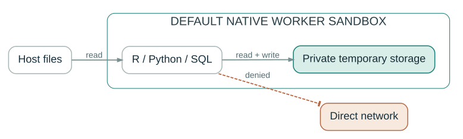{
  .diagram
}

::: {.takeaway}

Host reads. Private scratch writes. No direct worker network.

:::

::: {.notes}

**Say:** On supported macOS and Linux hosts, native sandboxing is
enabled by default. The default permits host reads and private temporary
writes, while ordinary writes elsewhere and direct networking are
denied. Read-only is not a confidentiality boundary: code that can read
sensitive files can inspect their contents.

**Show:** Use the boundary diagram rather than a generic lock icon.
Point separately at reads, writes, and network. Avoid claiming Windows
support, universal Linux compatibility, or unrestricted confidentiality
protection.

**Sources:** [Project README](
  https://github.com/t-kalinowski/mcp-console/blob/main/README.md
) · [Sandbox configuration](
  https://github.com/t-kalinowski/mcp-console/blob/main/docs/SANDBOX_CONFIGURATION.md
) · [Implemented architecture](
  https://github.com/t-kalinowski/mcp-console/blob/main/docs/ARCHITECTURE.md
)

:::


## Grant what the task needs {#permission-grants .deck-slide}

::: {.kicker}

User control

:::

::::: {.two-col}

:::: {.left}

::: {.big-statement}

Workspace edits

:::

::::

:::: {.right}

::: {.big-statement}

Selected network access

:::

::::

:::::

::: {.takeaway}

Protect Git and agent metadata by default; make additional grants
deliberate.

:::

::: {.small-note}

Native policy and an outer provider’s policy are different enforcement
paths.

:::

::: {.notes}

**Say:** The workspace profile allows project editing while protecting
Git and agent metadata from writes by default. Explicit policy can add
writable paths or configured proxy-mediated network access. These are
user-authorized changes, not decisions the model makes by inventing new
permissions. Native policy and provider-managed policy are not
interchangeable.

**Show:** Show two large permission choices with the protected directory
names as a small annotation. Avoid a sprawling unverified YAML schema.
The exact supported policy lives in the project documentation and the
author’s configuration.

**Sources:** [Project README](
  https://github.com/t-kalinowski/mcp-console/blob/main/README.md
) · [Sandbox configuration](
  https://github.com/t-kalinowski/mcp-console/blob/main/docs/SANDBOX_CONFIGURATION.md
) · [Proposed configuration](
  https://github.com/t-kalinowski/mcp-console/blob/main/design-sketches/CONFIGURATION.md
)

:::


## Resolution crosses a different trust boundary {#resolver-boundary .deck-slide}

::: {.kicker}

Architecture

:::

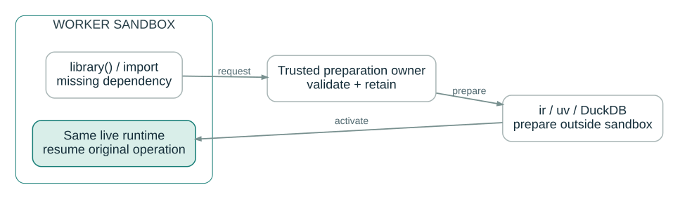{
  .diagram
}

::: {.takeaway}

No worker network is required for managed package preparation.

:::

::: {.notes}

**Say:** This explains how automatic package resolution coexists with
denied worker networking. A validated dependency request crosses to
trusted preparation outside the worker sandbox. The runtime activates
the result and continues in place. Installation may download content and
run build or installation code, so its trust boundary remains explicit.

**Show:** Use the request/prepare/activate diagram and identify where
network access actually occurs. Explain that Docker and Docker Sandbox
image environments currently disable this dynamic preparation path
rather than silently falling back to host installation.

**Sources:** [Requirements and environments](
  https://github.com/t-kalinowski/mcp-console/blob/main/docs/REQUIREMENTS.md
) · [Implemented architecture](
  https://github.com/t-kalinowski/mcp-console/blob/main/docs/ARCHITECTURE.md
) · [Project README](
  https://github.com/t-kalinowski/mcp-console/blob/main/README.md
)

:::


## The process topology {#process-topology .deck-slide}

::: {.kicker}

Architecture

:::

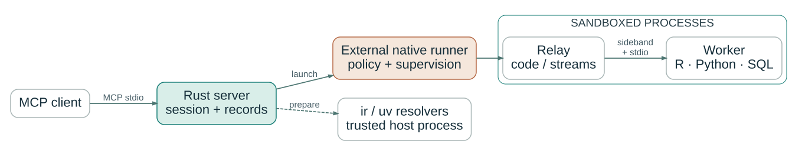{
  .diagram
}

::: {.takeaway}

Separate protocol ownership, execution, and enforcement.

:::

::: {.notes}

**Say:** Show the whole architecture after its consequences are
familiar. The MCP client talks to the Rust server. The execution
launcher establishes the selected target and boundary; the relay owns
worker communication and direct supervision; the worker owns language
state. Dependency preparation is outside the worker sandbox. Native
helper details differ by platform.

**Show:** This is the main architecture diagram. Keep the process
boundary visible and distinguish the client, controller, and worker. The
launcher node is an abstraction: native execution uses the sandbox
runner, while compute targets have their own owners and provider
behavior.

**Sources:** [Implemented architecture](
  https://github.com/t-kalinowski/mcp-console/blob/main/docs/ARCHITECTURE.md
)

:::


## State has an owner {#state-ownership .deck-slide}

::: {.kicker}

Architecture

:::

::::: {.two-col}

:::: {.left}

::: {.ownership-card}

### Server

Session contract Retained requirements Output and recordings Replacement
coordination

:::

::::

:::: {.right}

::: {.ownership-card}

### Worker

R and Python objects Database state Debugger and input state Language
evaluation

:::

::::

:::::

::: {.takeaway}

Restart replaces computation, not the entire session coordinator.

:::

::: {.notes}

**Say:** The architecture becomes easier to reason about when state
ownership is explicit. The server owns logical-session and delivery
state; the worker owns live computational state. That separation
explains why prepared requirements and recordings survive worker restart
while objects and debugger state do not.

**Show:** Use a two-column owner table without method names or
module-level details. Tie it directly back to the restart behavior
already demonstrated. Do not introduce a new peer-runtime coordinator as
implemented unless that refactor has landed.

**Sources:** [Implemented architecture](
  https://github.com/t-kalinowski/mcp-console/blob/main/docs/ARCHITECTURE.md
) · [Built-in runtime](
  https://github.com/t-kalinowski/mcp-console/blob/main/docs/BUILTIN_RUNTIME.md
)

:::


## Three worker paths, not prompt scraping {#worker-streams .deck-slide}

::: {.kicker}

Architecture

:::

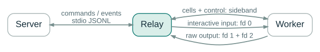{
  .diagram
}

::: {.takeaway}

Runtime state is explicit; a printed prompt is not the protocol.

:::

::: {.notes}

**Say:** Code/control messages, interactive input, and raw output have
distinct channels. The relay keeps these concerns separate. Console does
not have to guess whether a program is ready by matching a printed
greater-than sign. Structured runtime state is part of why timeout,
debugger, and failure behavior can have precise contracts.

**Show:** Use the stream diagram. It should make the distinction
introduced by stdin visually concrete. This is not a deep dive into
JSONL framing or file-descriptor bootstrap details.

**Sources:** [Implemented architecture](
  https://github.com/t-kalinowski/mcp-console/blob/main/docs/ARCHITECTURE.md
) · [Built-in runtime](
  https://github.com/t-kalinowski/mcp-console/blob/main/docs/BUILTIN_RUNTIME.md
) · [Vision / intended design](
  https://github.com/t-kalinowski/mcp-console/blob/main/design-sketches/VISION.md
)

:::


## Move the worker to an SSH host {#ssh .deck-slide}

::: {.kicker}

Execution targets

:::

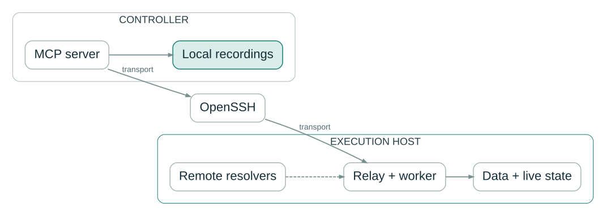{
  .diagram
}

::: {.takeaway}

Remote data and runtime. Local MCP connection and records.

:::

::: {.notes}

**Say:** SSH moves execution to an existing host with its own workspace
and runtime. Dependency preparation runs there as well, outside that
worker sandbox. The local server continues to own the model-facing
connection, recordings, and output. This does not automatically upload
the project or recreate arbitrary remote files locally.

**Show:** Use the same controller/worker vocabulary as the main
architecture diagram. Put the data and resolver on the remote side, and
the record directory on the controller side. The launch host needs the
prerequisites; the controller does not need a local analysis runtime.

**Sources:** [Implemented architecture](
  https://github.com/t-kalinowski/mcp-console/blob/main/docs/ARCHITECTURE.md
) · [Requirements and environments](
  https://github.com/t-kalinowski/mcp-console/blob/main/docs/REQUIREMENTS.md
) · [Project README](
  https://github.com/t-kalinowski/mcp-console/blob/main/README.md
)

:::


## Or use a Docker image {#docker .deck-slide}

::: {.kicker}

Execution targets

:::

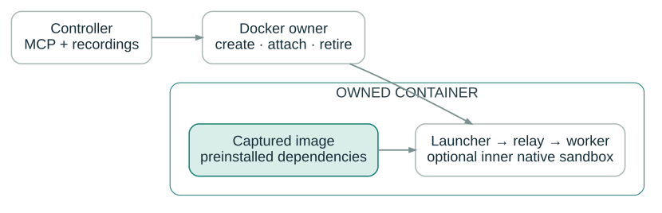{
  .diagram
}

::: {.takeaway}

Captured image. Preinstalled dependencies. Owned container lifetime.

:::

::: {.notes}

**Say:** A Docker target runs a fresh owned container for a worker
generation, using a captured image and preinstalled environment. Dynamic
dependency preparation is disabled on this path. Binds persist as
configured; the container writable layer is discarded on retirement. The
outer container boundary remains even when the optional inner native
sandbox is disabled.

**Show:** Show the image inside the owned container, and the controller
outside. State the prepared-environment constraint positively and
precisely; do not promise dynamic resolution in every target just
because it works locally and over SSH.

**Sources:** [Docker execution](
  https://github.com/t-kalinowski/mcp-console/blob/main/docs/DOCKER.md
) · [Implemented architecture](
  https://github.com/t-kalinowski/mcp-console/blob/main/docs/ARCHITECTURE.md
) · [Requirements and environments](
  https://github.com/t-kalinowski/mcp-console/blob/main/docs/REQUIREMENTS.md
)

:::


## Or a Docker Sandbox microVM {#docker-sandbox .deck-slide}

::: {.kicker}

Execution targets

:::

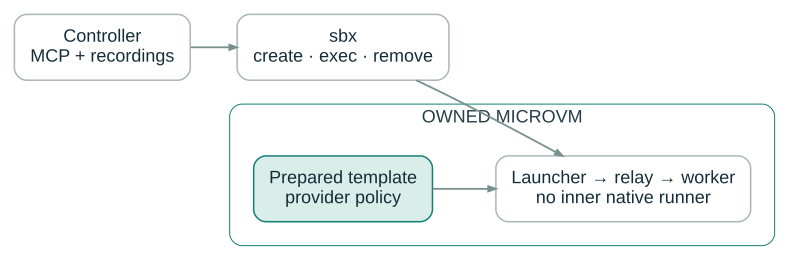{
  .diagram
}

::: {.takeaway}

`sbx` is a separate provider path, not another name for Docker
containers.

:::

::: {.notes}

**Say:** Docker Sandbox support invokes standalone sbx and uses a
prepared microVM template with provider-managed policy. It is distinct
from a normal Docker container. Console owns the created VM’s lifecycle,
while the provider owns its isolation and policy. This path does not
invoke the native sandbox companion or dynamically install dependencies.

**Show:** Mirror the Docker composition but change the outer boundary to
a microVM. The audience should recognize the shared ownership pattern
while seeing that the provider and isolation model are different.

**Sources:** [Docker Sandbox execution](
  https://github.com/t-kalinowski/mcp-console/blob/main/docs/DOCKER_SANDBOX.md
) · [Implemented architecture](
  https://github.com/t-kalinowski/mcp-console/blob/main/docs/ARCHITECTURE.md
) · [Requirements and environments](
  https://github.com/t-kalinowski/mcp-console/blob/main/docs/REQUIREMENTS.md
)

:::


## The call stays the same {#target-invariance .deck-slide}

::: {.kicker}

Execution targets

:::

::: {.code-panel}

::: {.panel-label}

send

:::

```python
send(r="coef(fit)")
```

:::

::: {.target-line}

Local host &nbsp; / &nbsp; SSH &nbsp; / &nbsp; Docker &nbsp; / &nbsp;
Docker Sandbox

:::

::: {.takeaway}

Execution policy changes. The model-facing operation does not.

:::

::: {.notes}

**Say:** Across targets, the model still submits cells, receives bounded
results, and uses the same controls. Available environments and
preparation capabilities can differ and the live schema reflects that.
The claim is a stable interaction model, not identical permissions or
package-management behavior everywhere.

**Show:** Return to one familiar call with four destinations beneath it.
This is the bridge into client integrations: both the client above and
execution target below can vary without changing the central idea.

**Sources:** [Implemented architecture](
  https://github.com/t-kalinowski/mcp-console/blob/main/docs/ARCHITECTURE.md
) · [Canonical tool schema snapshot](
  https://github.com/t-kalinowski/mcp-console/blob/main/tests/snapshots/client_server/server/test_tools/initializes_and_lists_tools.yaml
) · [Python clients and integrations](
  https://github.com/t-kalinowski/mcp-console/blob/main/docs/PYTHON.md
)

:::


## ellmer {#ellmer .deck-slide .integration}

::: {.kicker}

Use your existing client

:::

::: {.code-panel}

::: {.panel-label}

R · register one tool

:::

```r
library(ellmer)
library(mcp.console)

chat <- chat_openai()
chat$register_tool(console_tool())
chat$chat("Analyze measurements.csv with Console.")
```

:::

::: {.takeaway}

Your chat and provider. A separate persistent Console worker.

:::

::: {.notes}

**Say:** Give ellmer one slide. The R wrapper starts Console, reads its
live tool schema, and presents it as an ellmer tool. It does not execute
agent code in the R process running the chat. Provider choice remains
with ellmer and the application. Keep the tool alive across the
conversation so its session persists.

**Show:** Show only the registration example, with the registration line
emphasized. No installation explanation here; that is the next section.
The author notes include the asynchronous sequential-tool caveat from
the R README.

**Sources:** [R package interface](
  https://github.com/t-kalinowski/mcp-console/blob/main/r/README.md
) · [R tool wrapper implementation](
  https://github.com/t-kalinowski/mcp-console/blob/main/r/R/console-tool.R
)

:::


## chatlas {#chatlas .deck-slide .integration}

::: {.kicker}

Use your existing client

:::

::: {.code-panel}

::: {.panel-label}

Python · preserve the server-provided schema

:::

```python
from chatlas import ChatOpenAI
from mcp_console import MCPConsole, chatlas

chat = ChatOpenAI()
with MCPConsole() as console:
    chat.set_tools([*chat.get_tools(), chatlas.tool(console)])
    chat.chat("Analyze measurements.csv with Console.")
```

:::

::: {.takeaway}

The same registration pattern in Python.

:::

::: {.notes}

**Say:** The chatlas adapter adds the same tool to an existing chat. Use
the adapter and set_tools so the explicit server schema is preserved
rather than inferred from a generic Python function annotation. The
application still owns the chat loop and the Console connection
lifetime.

**Show:** Keep the visual design identical to the ellmer slide. For a
visual demo, verify image preservation on the chosen adapter path; the
native MCP registration variant is included in the examples file.

**Sources:** [Python clients and integrations](
  https://github.com/t-kalinowski/mcp-console/blob/main/docs/PYTHON.md
)

:::


## Codex {#codex .deck-slide .integration}

::: {.kicker}

Use your existing client

:::

::: {.code-panel}

::: {.panel-label}

CLI registration

:::

```bash
codex mcp add console -- uvx mcp-console serve
```

:::

::: {.code-panel}

::: {.panel-label}

Equivalent stdio configuration

:::

```toml
[mcp_servers.console]
command = "uvx"
args = ["mcp-console", "serve"]
```

:::

::: {.takeaway}

Use a real expanded tool exchange in the recording, not a UI tour.

:::

::: {.notes}

**Say:** Codex can launch Console through its MCP stdio configuration.
The CLI command and configuration table are two alternatives, not two
required steps. In the recording use the client surface you normally
use, but make the model’s arguments and tool results legible rather than
focusing on the application chrome. Client-side timeouts are separate
from Console’s wait contract.

**Show:** Show the registration line and its equivalent configuration.
Do not fabricate a Codex screenshot or imply that this local stdio
configuration automatically applies to unrelated hosted web clients.
Verify image visibility and client deadlines when capturing the final
run.

**Sources:** [Official Codex MCP documentation](
  https://developers.openai.com/codex/mcp/
) · [Project README](
  https://github.com/t-kalinowski/mcp-console/blob/main/README.md
)

:::


## Anthropic Python SDK {#anthropic .deck-slide .integration .code-dense}

::: {.kicker}

Use your existing client

:::

::: {.code-panel}

::: {.panel-label}

Native MCP tools · inside your async application

:::

```python
from anthropic import AsyncAnthropic
from mcp_console import anthropic as console_anthropic

client = AsyncAnthropic()
async with console_anthropic.tools() as tools:
    runner = client.beta.messages.tool_runner(
        model=model_id,
        max_tokens=4096,
        tools=tools,
        messages=[{"role": "user", "content": prompt}],
    )
    async for message in runner:
        print(message)
```

:::

::: {.takeaway}

Use the native MCP tool path when the workflow includes images.

:::

::: {.notes}

**Say:** The Anthropic integration has native MCP and function-tool
paths. Show the native async tools context here because visual workflows
need image preservation. The SDK owns the model loop; Console owns
execution. model_id and prompt are application inputs, not hard-coded
recommendations.

**Show:** This is an async application excerpt, with the full runnable
wrapper in examples/anthropic_client.py. Keep the connection open for
the run and let the context close it. The concrete API follows the
repository’s documented integration and should be rechecked before
presentation.

**Sources:** [Python clients and integrations](
  https://github.com/t-kalinowski/mcp-console/blob/main/docs/PYTHON.md
)

:::


## The direct Python client {#python-client .deck-slide .integration}

::: {.kicker}

Use your existing client

:::

::: {.code-panel}

::: {.panel-label}

Synchronous client

:::

```python
from mcp_console import MCPConsole

with MCPConsole() as console:
    result = console.send(r="sum(1:10)")
    print(result)

    result = console.send(python="sum(range(11))")
    print(result)
```

:::

::: {.takeaway}

No model is required to drive the same console contract.

:::

::: {.notes}

**Say:** The direct client is useful for scripts, application
integration, and deterministic checks. Both calls reuse one Console
connection. The convenience return is text and uses placeholders for
image content; native MCP or image-preserving adapters are the
appropriate interface for a visual agent workflow. AsyncMCPConsole
offers the parallel asynchronous API.

**Show:** Show a complete minimal synchronous example. Do not imply that
printing the direct client result displays a plot. Keep the async
counterpart in the accompanying example file and the compatibility list.

**Sources:** [Python clients and integrations](
  https://github.com/t-kalinowski/mcp-console/blob/main/docs/PYTHON.md
)

:::


## OpenAI Responses {#openai-responses .deck-slide .integration .code-dense}

::: {.kicker}

Use your existing client

:::

::: {.code-panel}

::: {.panel-label}

Registration excerpt · the application owns the tool loop

:::

```python
from openai import OpenAI
from mcp_console import MCPConsole, openai as console_openai

client = OpenAI()
with MCPConsole() as console:
    tool = console_openai.responses_tool(console)
    response = client.responses.create(
        model=model_id,
        input=prompt,
        tools=[tool.definition],
    )
    # Route function calls through tool(call).
    # Full continuation loop: examples/openai_responses.py
```

:::

::: {.takeaway}

Live server schema in; text and image results out.

:::

::: {.notes}

**Say:** The Responses adapter reads the connected server schema and
supplies the function definition and function-call output conversion.
The application still owns the continuation loop. This excerpt
deliberately focuses on registration; the complete loop is provided as a
companion example rather than squeezed onto the slide.

**Show:** Show the adapter line as the focus. model_id and prompt are
supplied by the host application. The full example includes continuation
and a turn limit; do not present this excerpt alone as a complete
autonomous agent run.

**Sources:** [Python clients and integrations](
  https://github.com/t-kalinowski/mcp-console/blob/main/docs/PYTHON.md
)

:::


## Other supported entry points {#other-clients .deck-slide .compatibility}

::: {.kicker}

Use your existing client

:::

::: {.compat-list}

- `AsyncMCPConsole`
- OpenAI Agents SDK
- Codex Python thread SDK
- Native MCP registration in chatlas
- Compatible MCP stdio clients

:::

::: {.takeaway}

Use the live schema; keep the session connection alive.

:::

::: {.small-note}

Image handling and client deadlines are integration-specific.

:::

::: {.notes}

**Say:** Finish the client sequence with one list, not another
onboarding section. These are the additional entry points documented by
the project. Avoid the unqualified phrase works with everything:
compatibility depends on the client’s transport, tool-schema handling,
image support, and timeout behavior.

**Show:** Use a plain list of exact interface names. The source package
contains a concise example for each documented integration family; there
is no need to display every tool loop in the main talk.

**Sources:** [Python clients and integrations](
  https://github.com/t-kalinowski/mcp-console/blob/main/docs/PYTHON.md
) · [Canonical tool schema snapshot](
  https://github.com/t-kalinowski/mcp-console/blob/main/tests/snapshots/client_server/server/test_tools/initializes_and_lists_tools.yaml
)

:::


## Now, installation from R {#install-r .deck-slide}

::: {.kicker}

Installation

:::

::: {.code-panel}

::: {.panel-label}

R package entry point

:::

```r
install.packages("mcp.console")
```

:::

::: {.takeaway}

Install the R interface. The application is obtained automatically when
needed.

:::

::: {.notes}

**Say:** Only after the value and client examples are clear, show the R
installation story. For presentation day, assume mcp.console is
published to the intended R package repository. Installing the R package
gives the interface; creating the tool resolves the Console executable
when necessary. Do not say the PyPI download occurs during
install.packages itself.

**Show:** Show one large line. This is explicitly an intended
publication pathway: the currently inspected R README uses a GitHub
installation command. Keep the present-day command in the author
checklist, not as competing text on this slide.

**Author check before presenting:** Target-day assumption: mcp.console
is published to an R repository usable by install.packages(). Current
README documents pak::pak("github::t-kalinowski/mcp-console/r").

**Sources:** [R package interface](
  https://github.com/t-kalinowski/mcp-console/blob/main/r/README.md
)

:::


## The R wrapper obtains the native application {#install-chain .deck-slide}

::: {.kicker}

Installation

:::

{
  .diagram
}

::: {.small-note}

Explicit `path=` or `version=` takes precedence; an existing PATH
executable can be reused.

:::

::: {.notes}

**Say:** With no explicit selection, console_tool() first uses an
mcp-console executable on PATH. If none is found, it resolves the
published application with reticulate::uv_run_tool(). A named path or
version gives explicit control. PyPI is the distribution channel for a
native Rust application bundle, not a requirement for the R user to
manually manage an analysis venv.

**Show:** Use the first-use chain. The installation trigger belongs on
the arrow from wrapper to resolver. Keep executable selection separate
from analysis runtime environment selection, which was covered earlier.

**Sources:** [R package interface](
  https://github.com/t-kalinowski/mcp-console/blob/main/r/README.md
) · [R tool wrapper implementation](
  https://github.com/t-kalinowski/mcp-console/blob/main/r/R/console-tool.R
) · [Release and installed bundle](
  https://github.com/t-kalinowski/mcp-console/blob/main/RELEASE.md
)

:::


## Python or a standalone MCP launch {#install-python .deck-slide .integration}

::: {.kicker}

Installation

:::

::: {.code-panel}

::: {.panel-label}

Python client

:::

```bash
pip install "mcp-console[client]"
```

:::

::: {.code-panel}

::: {.panel-label}

One-shot tool launch

:::

```bash
uvx mcp-console serve
```

:::

::: {.code-panel}

::: {.panel-label}

Persistent command installation

:::

```bash
uv tool install mcp-console
```

:::

::: {.notes}

**Say:** Python users choose the base package or the extra for their
integration. MCP clients can launch through uvx, or use a persistent uv
tool installation. These are alternative routes into the same
distribution, not three installation steps. Framework extras avoid
installing every SDK when only the executable is needed.

**Show:** Show three short alternatives with explicit labels. Mention
prerequisites only as needed: Python packaging and supported native
wheels are not the same thing as the language runtime installed on a
selected execution host.

**Sources:** [Project README](
  https://github.com/t-kalinowski/mcp-console/blob/main/README.md
) · [Python clients and integrations](
  https://github.com/t-kalinowski/mcp-console/blob/main/docs/PYTHON.md
)

:::


## One distribution; separate execution environments {#native-bundle .deck-slide}

::: {.kicker}

Installation

:::

::::: {.two-col}

:::: {.left}

::: {.big-statement}

PyPI wheel<br>Native application + companions

:::

::::

:::: {.right}

::: {.big-statement}

Execution host<br>Selected runtimes + packages

:::

::::

:::::

::: {.takeaway}

Supported wheels ship native binaries; execution hosts supply the
runtimes.

:::

::: {.notes}

**Say:** A supported platform wheel carries the application and sandbox
companions as an installed bundle. Language runtimes and analysis
packages belong to the execution environment. Current support is macOS
and Linux, with specific Linux glibc and sandbox prerequisites; Windows
is not currently supported. Source builds still need the toolchain. An
SSH or compute controller does not require its own local analysis
environment.

**Show:** Use the two responsibility boxes. Do not put a green
all-platforms checkmark on the slide. Keep exact release/platform
requirements in the installation documentation, because those can change
before presentation day.

**Sources:** [Project README](
  https://github.com/t-kalinowski/mcp-console/blob/main/README.md
) · [Release and installed bundle](
  https://github.com/t-kalinowski/mcp-console/blob/main/RELEASE.md
) · [Implemented architecture](
  https://github.com/t-kalinowski/mcp-console/blob/main/docs/ARCHITECTURE.md
)

:::


## Interactive work, without a sprawling tool surface {#closing .deck-slide .hero}

::: {.kicker}

Closing

:::

::: {.big-statement}

One `send()`.<br>A full interactive runtime.

:::

::: {.takeaway}

Small routine calls. Explicit controls. Reusable state. A record of the
work.

:::

::: {.language-line}

R · Python · SQL &nbsp; / &nbsp; Local · Remote · Container · MicroVM

:::

::: {.notes}

**Say:** Close on the design, not on installation commands. The
contribution is a compact model-facing interface with enough runtime
capability and explicit control to remain useful as the model’s ability
grows. The interaction carries across languages, clients, and execution
targets while keeping ownership and trust boundaries visible.

**Show:** Return to the opening typography, now with the expanded
capability set condensed into one line. Stop the main presentation here;
the development-practices slides follow as an addendum.

**Sources:** [Canonical tool schema snapshot](
  https://github.com/t-kalinowski/mcp-console/blob/main/tests/snapshots/client_server/server/test_tools/initializes_and_lists_tools.yaml
) · [Built-in runtime](
  https://github.com/t-kalinowski/mcp-console/blob/main/docs/BUILTIN_RUNTIME.md
) · [Implemented architecture](
  https://github.com/t-kalinowski/mcp-console/blob/main/docs/ARCHITECTURE.md
)

:::


## Rust implementation. Python integration tests. {#tests-python .deck-slide}

::: {.kicker}

Addendum · Development practices

:::

::::: {.two-col}

:::: {.left}

::: {.big-statement}

Implement in Rust

:::

::::

:::: {.right}

::: {.big-statement}

Exercise from Python

:::

::::

:::::

::: {.takeaway}

The main acceptance surface is the built process, not its private
modules.

:::

::: {.notes}

**Say:** The main integration suite is Python even though the
application is Rust. It drives the built executable and observes the
real process boundary. Small unit tests can still own pure parsing or
validation policy; the claim is not that absolutely no Rust tests exist.

**Show:** Use two simple implementation/test boxes. Lead with why this
matters: the test language can stay independent of implementation
refactors while validating the product contract users and clients
actually see.

**Sources:** [Boundary test guide](
  https://github.com/t-kalinowski/mcp-console/blob/main/tests/boundaries/README.md
) · [Project README](
  https://github.com/t-kalinowski/mcp-console/blob/main/README.md
)

:::


## Test the boundaries you intend to preserve {#test-boundaries .deck-slide}

::: {.kicker}

Addendum · Development practices

:::

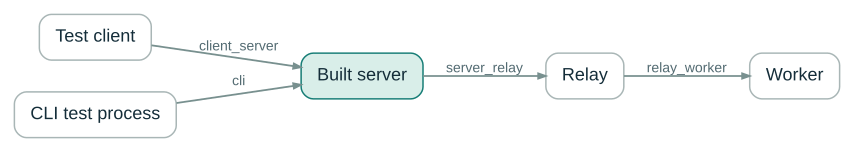{
  .diagram
}

::: {.takeaway}

One primary owner per behavior; lower layers test their own contracts.

:::

::: {.notes}

**Say:** The tests mirror architectural boundaries: client_server,
server_relay, relay_worker, and cli. Public behavior belongs at the
outermost boundary that can usefully observe it. Private-boundary cases
cover their own protocol seams rather than replicating every public
message at every layer.

**Show:** Reuse the process topology with test-boundary names on the
arrows. This ties the development method to the earlier architecture
rather than presenting a directory tree with no explanation.

**Sources:** [Boundary test guide](
  https://github.com/t-kalinowski/mcp-console/blob/main/tests/boundaries/README.md
)

:::


## YAML is what the reviewer reads {#yaml-transcripts .deck-slide .snapshot-slide}

::: {.kicker}

Addendum · Development practices

:::

::::: {.two-col}

:::: {.left}

::: {.code-panel}

::: {.panel-label}

Checked-in YAML · request

:::

```yaml
send:
  r: |
    cores <- parallel::detectCores()
    stopifnot(
      length(cores) == 1L,
      !is.na(cores),
      cores >= 1L
    )
    writeLines("R core detection available")
```

:::

::::

:::: {.right}

::: {.result-panel}

::: {.panel-label}

Checked-in YAML · result

:::

```yaml
result:
  content:
    - type: text
      text: |
        R core detection available
  isError: false
```

:::

::::

:::::

::: {.takeaway}

Readable code, arguments, output, and errors. Not escaped JSON strings.

:::

::: {.small-note}

Source excerpt: `detects_cpu_cores.yaml` · initialization document
omitted.

:::

::: {.notes}

**Say:** The wire protocols are JSON-based, but the reviewable test
transcripts are YAML. This is an actual checked-in snapshot excerpt: the
test executes R, asserts that CPU detection returns a valid result, and
prints a stable message. Humans can review the code and result without
reading escaped JSON strings or snapshotting a machine-specific core
count. YAML is the human review surface, not the production transport.

**Show:** Display the request and result from
`tests/snapshots/client_server/r/test_runtime/detects_cpu_cores.yaml`
side by side. The initial shared-handshake document is omitted, but the
displayed request and result content come from the fetched source. This
fixture was not rerun in the slide-build environment; do not present it
as a new test execution.

**Sources:** [Boundary test guide](
  https://github.com/t-kalinowski/mcp-console/blob/main/tests/boundaries/README.md
) · [Checked-in CPU detection snapshot](
  https://github.com/t-kalinowski/mcp-console/blob/main/tests/snapshots/client_server/r/test_runtime/detects_cpu_cores.yaml
)

:::

## Normalize noise, not behavior {#test-normalization .deck-slide}

::: {.kicker}

Addendum · Development practices

:::

::::: {.two-col}

:::: {.left}

::: {.code-panel}

::: {.panel-label}

Unstable details

:::

```text
/tmp/run-8fd31/work.csv
worker pid: 27186
[waiting for stdin]
```

:::

::::

:::: {.right}

::: {.code-panel}

::: {.panel-label}

Schematic normalization

:::

```text
<WORKSPACE>/work.csv
worker pid: <PID>
[waiting for stdin]
```

:::

::::

:::::

::: {.takeaway}

Keep meaningful wording, ordering, and failure distinctions visible.

:::

::: {.notes}

**Say:** Temporary paths, process identities, and similar unstable
details should not obscure behavioral review. Normalize explicitly and
narrowly. Preserve the fields, output, ordering, and failure
distinctions the contract is meant to protect. The actual project
normalizers and snapshot metadata are more specific than this schematic
example.

**Show:** Use before/after panels with only incidental details changed.
Call out that normalization is not a license to delete inconvenient
evidence from a test.

**Sources:** [Boundary test guide](
  https://github.com/t-kalinowski/mcp-console/blob/main/tests/boundaries/README.md
)

:::


## Synchronize; do not sleep and hope {#test-determinism .deck-slide}

::: {.kicker}

Addendum · Development practices

:::

::: {.big-statement}

Start → checkpoint → release → assert

:::

::: {.takeaway}

Explicit gates for output, cancellation, restart, and cleanup.

:::

::: {.notes}

**Say:** Concurrency and liveness tests need causal synchronization.
Fixtures use gates and checkpoints so the test knows when the relevant
state has actually been reached. Arbitrary sleeps are not proof that
output was drained, an interrupt was delivered, or an owned resource was
retired.

**Show:** Show one deterministic sequence and connect it to the timing
and shutdown contracts from the talk. This is a development-practice
slide, not an implementation recipe for every fixture.

**Sources:** [Boundary test guide](
  https://github.com/t-kalinowski/mcp-console/blob/main/tests/boundaries/README.md
)

:::


## Portable behavior; real capability checks {#test-capabilities .deck-slide}

::: {.kicker}

Addendum · Development practices

:::

::::: {.two-col}

:::: {.left}

::: {.big-statement}

Shared cases<br>direct + sandboxed

:::

::::

:::: {.right}

::: {.big-statement}

Capability fixtures<br>SSH · Docker · SBX

:::

::::

:::::

::: {.takeaway}

Fake peers establish protocol contracts; real targets establish target
behavior.

:::

::: {.notes}

**Say:** Reuse portable cases across execution modes and centralize
capability discovery. A skipped target fixture is not target validation.
Deterministic peers can establish orchestration behavior, but they
cannot establish real container or microVM cleanup. Keep real-target
evidence distinct from simulated protocol coverage.

**Show:** Use the two testing levels rather than an all-green platform
matrix. Include lifecycle and security assertions where a textual
snapshot alone cannot represent the guarantee.

**Sources:** [Boundary test guide](
  https://github.com/t-kalinowski/mcp-console/blob/main/tests/boundaries/README.md
)

:::


## Snapshots are generated evidence {#snapshot-review .deck-slide}

::: {.kicker}

Addendum · Development practices

:::

::: {.code-panel}

::: {.panel-label}

Run, regenerate, review

:::

```bash
scripts/test --update BOUNDARY/SUITE::CASE

git diff -- tests/snapshots/
```

:::

::: {.takeaway}

A changed expectation requires review; regeneration is not approval.

:::

::: {.notes}

**Say:** Generate transcripts from running tests, then review the
resulting diff. Do not hand-edit the expectation to make a test pass.
The value of readable YAML is that review can focus on the actual
changed behavior, while assertions still enforce facts that a snapshot
cannot show.

**Show:** Show the update command and a diff review, not a large wall of
green tests. The selector is schematic; replace BOUNDARY/SUITE::CASE
with a real selected fixture for a live development demonstration.

**Sources:** [Boundary test guide](
  https://github.com/t-kalinowski/mcp-console/blob/main/tests/boundaries/README.md
)

:::


## Test the installed product {#installed-product-tests .deck-slide}

::: {.kicker}

Addendum · Development practices

:::

::::: {.two-col}

:::: {.left}

::: {.big-statement}

Source build<br>and wheels

:::

::::

:::: {.right}

::: {.big-statement}

R / Python clients<br>and native bundle

:::

::::

:::::

::: {.takeaway}

Packaging, launch, schemas, images, shutdown, and cleanup are part of
the contract.

:::

::: {.notes}

**Say:** The delivered product includes the executable, companion
binaries, Python interfaces, the R wrapper, and launch/lifetime
behavior. Running a development binary alone does not establish that the
installed bundle or each adapter works. Integration examples and
packaging checks should be part of the release evidence, with actual
target validation reported separately.

**Show:** Finish the addendum by connecting the install story to the
test strategy. Avoid claiming every proposed integration test already
exists: distinguish observed project coverage from the release checklist
in the companion author notes.

**Sources:** [Boundary test guide](
  https://github.com/t-kalinowski/mcp-console/blob/main/tests/boundaries/README.md
) · [Release and installed bundle](
  https://github.com/t-kalinowski/mcp-console/blob/main/RELEASE.md
) · [Python clients and integrations](
  https://github.com/t-kalinowski/mcp-console/blob/main/docs/PYTHON.md
) · [R package interface](
  https://github.com/t-kalinowski/mcp-console/blob/main/r/README.md
)

:::
