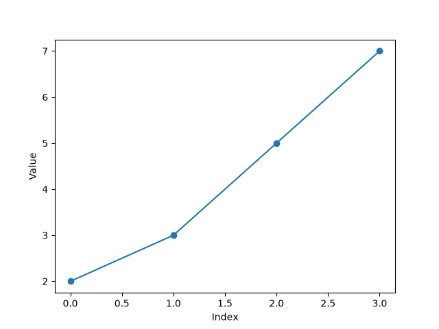
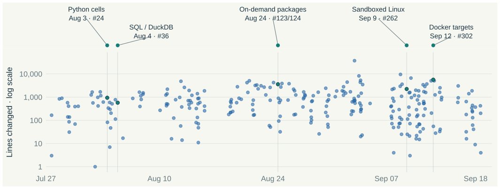
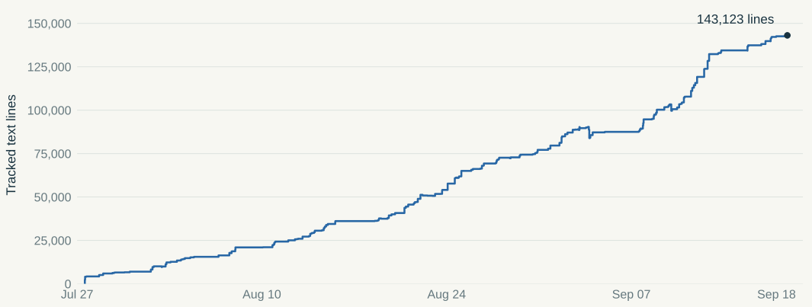
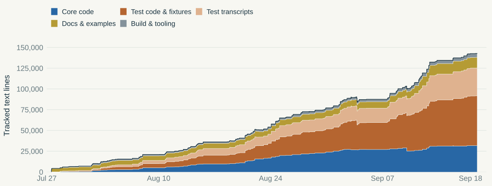
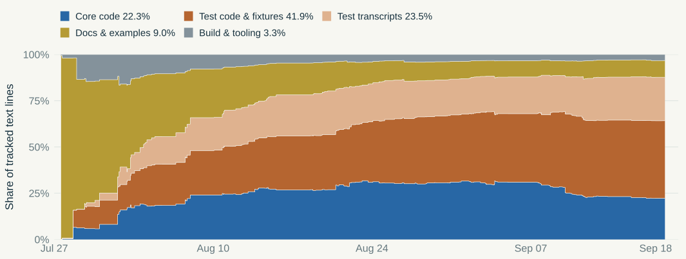
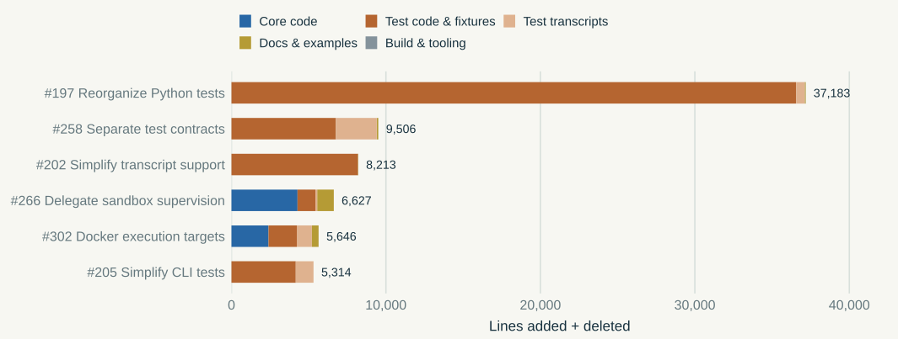

---
# Canonical presentation. Notes use Quarto/reveal.js Speaker View (S).
# No automatic title slide: the first explicit ## heading is slide 1.
# Default: native R output/plots. Optional: captured MCP output via output_source:mcp.
title: ""
pagetitle: "MCP Console · R, Python, and SQL together"
engine: knitr
params:
  output_source: r
format:
  revealjs:
    slide-level: 2
    output-file: index.html
    show-notes: false
    width: 1600
    height: 900
    margin: 0
    center: false
    transition: none
    slide-number: c/t
    embed-resources: true
    code-copy: false
    code-line-numbers: false
    controls: true
    progress: true
    css: assets/styles.css
execute:
  eval: false
  echo: false
  warning: false
  message: false
---

```{r}
#| label: render-setup
#| eval: true
#| include: false
source("examples/render-helpers.R", local = knitr::knit_global())
```
## MCP Console {#interactive-work .deck-slide .hero .story-slide}
::: {.kicker}

Why Console exists

:::

::: {.big-statement}

R, Python, and SQL.<br>One execution system.

:::

::: {.takeaway}

Shared state, session controls, and configurable permissions.

:::

::: {.notes}

Hello everyone. I'd like to talk about a project I've been working on called MCP Console. It's a ground-up rewrite of MCP REPL. MCP REPL is really two products: an R REPL and a Python REPL, with different code paths and different semantics for the model. It also forces the user to choose R or Python, and I don't think that's where the choice belongs. It should be R and Python.

That was the original seed for MCP Console: a single product, a single binary, that handles R, Python, and SQL.

:::

## Equip the model with R, Python, and SQL {#small-surface .deck-slide .story-slide}
::: {.kicker}

Languages available to the model

:::

:::: {.three-col}

::: {.story-card}

**R**

Statistical methods, analysis packages, and data visualization.

:::

::: {.story-card}

**Python**

Machine learning libraries and the broader Python ecosystem.

:::

::: {.story-card}

**SQL**

Local or remote database connections. Optimized queries.

:::

::::
::: {.takeaway}

The model can choose the language and syntax it works best with.

:::

::: {.notes}

The choice I want to give the model is which language fits the task it's doing right now. If R has the methods or plotting tools it wants, use R. If the Python ecosystem is a better fit, use Python. And SQL gives it another way to query data, locally or through a database connection.

The user can steer that choice, of course. But they shouldn't have to pick an R-only or Python-only product before the work begins. I'd like the model to choose the best tool for the job.

For that to work, we need to give it the full capabilities of those runtimes, with a sandbox that controls what resources it can access.

:::

## Full runtimes with explicit permissions {#sandbox-motivation .deck-slide .story-slide .capabilities-safety}
::: {.kicker}

A shared foundation for R, Python, and SQL

:::

:::: {.three-col}

::: {.story-card}

**Use full runtimes**

Libraries and native code.<br>Subprocesses and forks.<br>Text and plots.

:::

::: {.story-card}

**Drive a real session**

Persistent objects.<br>Input, waits, and controls.<br>Explicit runtime state.

:::

::: {.story-card}

**Enforce permissions**

Filesystem and network policy.<br>Subprocesses covered.<br>Shutdown and cleanup.

:::

::::

::: {.takeaway}

Persistent state, input, output, and controls across languages.

:::

::: {.notes}

The goal is full capabilities and full safety. I don't want to restrict the language to a small subset just to make execution manageable. The model should be able to use libraries, native code, and subprocesses, within the permissions the user allows.

That means handling the less obvious cases too. Output can come from a forked child or directly from a file descriptor. A computation can take a long time, need an interrupt, or produce enough output to flood the model's context. A script can ask for input over stdin. We want the model to be able to drive a real interactive session through all of that.

We run the languages embedded, so the runtime reports when it is evaluating, waiting for managed input, or finished. We don't have to parse printed output to guess that state. Output from background activity can still be collected while the session is idle, and Console tracks the controls it sends, including shutdown and escalation.

Around that session, we handle plots as images, compact progress updates, oversized responses with files the model can inspect, and logs with readable transcripts and Quarto source. Package resolution and environment management are built in too.

And the sandbox is central: filesystem permissions, network restrictions, and a configurable proxy, applying to the worker and its subprocesses. The session can run locally, over SSH, or in Docker. The rest of the talk goes through these three columns in order. After that, I'll cover where the session can run, what it records, and what's still pending.

:::

## Send a cell of code {#send-r .deck-slide .literal-slide}
::: {.kicker}

Use full runtimes · one simple call

:::

:::::: {.two-col}

::::: {.left}

:::: {.code-panel}

::: {.panel-label}

LLM client → Console

:::

<!-- cells:fit -->
```python
console.send(r="""
  d <- read.csv("examples/measurements.csv")
  fit <- lm(response ~ temperature + group,
            data = d)
  fit
""")
```

::::

:::::

::::: {.right}

:::: {.result-panel}

::: {.panel-label}

R output

:::

```{r}
#| label: fit-output
#| eval: true
#| echo: false
#| comment: ""
console_text("fit")
```

::::

:::::

::::::
::: {.takeaway}

Define objects, see printed output, and continue in the same session.

:::

::: {.notes}

Despite that long tail of capabilities, we've optimized for the simplest use case: evaluating a chunk of code. The model sends a string of R code, it gets evaluated, and the model gets back output.

This is the only tool exposed: a single send tool. Here the code defines d, a data frame, then fits a linear model and prints the fitted object. The objects stay in the session, ready for the next turn.

:::

## Python uses the same call {#python-simple .deck-slide .literal-slide}
::: {.kicker}

Use full runtimes · Python

:::

:::::: {.two-col}
::::: {.left}
:::: {.code-panel}
::: {.panel-label}

Python cell

:::

<!-- reveal-cell:python-simple -->
```python
console.send(python="""
values = [2, 3, 5, 7]
print(sum(values))
""")
```

::::
:::::
::::: {.right}
:::: {.result-panel}
::: {.panel-label}

Console response

:::

```{r}
#| eval: true
#| comment: ""
console_protocol("language-reveal/python-simple")
```

::::
:::::
::::::

::: {.takeaway}

Supply `python=` to evaluate a Python cell.

:::

::: {.notes}

If the model wants to send Python, it changes the keyword argument. The previous call used r; this one uses python.

Now the string is evaluated as a Python cell, and the model gets its printed output. The usage pattern is the same.

:::

## Plots return as images {#plots .deck-slide .literal-slide}
::: {.kicker}

Use full runtimes · plots

:::

:::::: {.two-col}
::::: {.left}
:::: {.code-panel}
::: {.panel-label}

R cell

:::

<!-- cells:r-plot -->
```python
console.send(r="""
  plot(d$temperature, d$response,
       xlab = "Temperature",
       ylab = "Response")
""")
```

::::
:::: {.result-panel}
::: {.panel-label}

R graphics output

:::

```{r}
#| label: r-plot-output
#| eval: true
#| echo: false
#| comment: ""
#| fig-width: 7
#| fig-height: 5.2
#| dpi: 144
#| dev: png
#| out-width: "100%"
console_plot("r-plot")
```

::::
:::::
::::: {.right}
:::: {.code-panel}
::: {.panel-label}

Python cell

:::

<!-- reveal-cell:python-simple-plot -->
```python
console.send(python="""
import matplotlib.pyplot as plt

plt.plot(values, marker="o")
plt.xlabel("Index")
plt.ylabel("Value")
""")
```

::::
:::: {.result-panel}
::: {.panel-label}

Matplotlib output

:::

```{r}
#| eval: true
#| out-width: "100%"

```

::::
:::::
::::::

::: {.takeaway}

The response carries the image produced by the cell.

:::

::: {.notes}

On the next turn, maybe the model wants to generate a graphic. It sends plotting code using the objects already in the session, and the graphic comes back as an image.

On the left, base R plots the data frame from the first cell. On the right, Matplotlib plots the values from the preceding Python cell. It works as you'd expect in both languages.

:::

## R and Python share the same process {#python-first .deck-slide .literal-slide}
::: {.kicker}

Use full runtimes · shared objects

:::

:::::: {.two-col}
::::: {.left}
:::: {.code-panel}
::: {.panel-label}

Python reads the R data frame

:::

<!-- reveal-cell:python-read-r -->
```python
console.send(python='len(r.d)')
```

::::
:::: {.result-panel}
::: {.panel-label}

Console response

:::

```{r}
#| eval: true
#| comment: ""
console_protocol("language-reveal/python-read-r")
```

::::
:::::
::::: {.right}
:::: {.code-panel}
::: {.panel-label}

R reads the Python list

:::

<!-- reveal-cell:r-read-python -->
```python
console.send(r='length(py$values)')
```

::::
:::: {.result-panel}
::: {.panel-label}

Console response

:::

```{r}
#| eval: true
#| comment: ""
console_protocol("language-reveal/r-read-python")
```

::::
:::::
::::::

::: {.takeaway}

`r.d` exposes the R object to Python. `py$values` exposes the Python object to R.

:::

::: {.notes}

And the R and Python runtimes are embedded in the same process. You can access values defined in R from Python, and vice versa. Reticulate provides that bridge.

On the left, Python accesses d, the data frame in R's global environment. On the right, R accesses values from Python's main dictionary. The model can work with the same data across the two languages.

:::

## Query the same data with SQL {#sql .deck-slide .literal-slide}
::: {.kicker}

Use full runtimes · SQL in the same session

:::

:::::: {.two-col}

::::: {.left}

:::: {.code-panel}

::: {.panel-label}

SQL cell

:::

<!-- cells:sql -->
```python
console.send(sql="""
SELECT "group", COUNT(*) AS n
FROM d
GROUP BY "group"
ORDER BY "group"
""")
```

::::

:::::

::::: {.right}

:::: {.result-panel}

::: {.panel-label}

Captured result

:::

```{r}
#| eval: true
#| echo: false
#| comment: ""
console_protocol("sql")
```

::::

:::::

::::::

::: {.notes}

SQL works the same way: the model sends code with the sql argument. Notice that the query refers to d, the data frame defined in the R namespace.

The default DuckDB connection can find R data frames by name. If we replace that data frame in R, a later query sees the updated binding. We don't need to export it to a separate database first.

It's one runtime, with different ways for the model to interact with it.

:::

## SQL uses the connection you choose {#sql-connections .deck-slide .literal-slide}
::: {.kicker}

Use full runtimes · choose the database connection

:::

:::::: {.two-col}

::::: {.left}

:::: {.code-panel}

::: {.panel-label}

R · a DBI connection

:::

```python
console.send(r="""
  con <- DBI::dbConnect(
    RSQLite::SQLite(), ":memory:")
  console_sql_connection(con)
""")
```

::::

:::::

::::: {.right}

:::: {.code-panel}

::: {.panel-label}

Python · a DB-API connection

:::

```python
console.send(python="""
import sqlite3
con = sqlite3.connect(":memory:")
console_sql_connection(con)
""")
```

::::

:::::

::::::

:::: {.code-panel}

::: {.panel-label}

Subsequent SQL cells use the selected connection

:::

```python
console.send(sql="SELECT CURRENT_TIMESTAMP AS now")
```

::::

::: {.takeaway}

Use a local database or an existing remote connection through its driver.

:::

::: {.notes}

SQL doesn't have to use the built-in DuckDB connection. The model can select a different connection from either the R or Python runtime.

From R, that can be a DBI connection. From Python, it can be a DB-API connection. These examples use SQLite, but the same pattern works with a remote database, given the driver, credentials, and network access.

After selecting the connection, the model keeps sending SQL through the same tool. The queries go to that connection and use its tables and state.

:::

## Make CRAN and PyPI available to the session {#package-opportunity .deck-slide .story-slide}
::: {.kicker}

Use full runtimes · packages

:::

::: {.story-lead}

A model may avoid a useful package to avoid changing the user’s environment.

:::

:::::: {.two-col}

::::: {.left}

::: {.story-card}

**Let the task choose the library**

The model can use a trusted package when the analysis calls for it.

:::

:::::

::::: {.right}

::: {.story-card}

**Manage the environment for the session**

Console retains requirements and prepares compatible package environments.

:::

:::::

::::::
::: {.takeaway}

Ordinary package use can request the dependency it needs.

:::

::: {.notes}

In my experience, models often hesitate to install packages because installation sounds like a change to the user’s global setup. They may settle for a simpler approach using only what is already there. I want using the right library to be an ordinary part of the analysis.

Here the requirement belongs to the Console session and is resolved into a managed environment. That puts the breadth of trusted CRAN and PyPI packages in reach.

:::

## Use the package; let the runtime prepare it {#r-resolution .deck-slide .story-slide .literal-slide}
::: {.kicker}

Use full runtimes · packages

:::

:::::: {.two-col}

::::: {.left}

:::: {.code-panel}

::: {.panel-label}

R

:::

```python
console.send(r="library(data.table)")
```

::::

:::::

::::: {.right}

:::: {.code-panel}

::: {.panel-label}

Python

:::

```python
console.send(python="import polars")
```

::::

:::::

::::::
::: {.sequence-strip}

Reach a missing package → resolve → activate → continue

:::

::: {.takeaway}

The live workspace stays available during supported additions.

:::

::: {.notes}

The model writes ordinary R or Python. When execution reaches a supported missing-package operation, the runtime requests preparation, activates the result, and continues the original operation. It keeps the live workspace.

For R this uses ir; managed Python uses uv. We react to package use during execution rather than pre-scanning the source or replaying the whole cell. Explicit requirements remain available when the model needs a version pin or a distribution name that cannot be inferred from an import.

:::

## Separate session control from code execution {#process-topology .deck-slide .story-slide}
::: {.kicker}

How the processes fit together · local execution

:::

<!-- inline-svg:assets/process-topology.svg -->
```{=html}
<div class="embedded-diagram">
<svg xmlns="http://www.w3.org/2000/svg" viewBox="0 0 1400 455" role="img" aria-label="The LLM client talks to the Console server. The server uses trusted resolver processes outside the sandbox and exchanges cells and results with the sandboxed relay and worker. The sandbox enforces permissions and cleanup.">
<g font-family="Arial, sans-serif" fill="#18323f">
<rect x="865" y="8" width="520" height="435" rx="18" fill="#edf5ef" stroke="#167d76" stroke-width="2" stroke-dasharray="8 6"/>
<text x="1125" y="43" text-anchor="middle" font-size="24" fill="#167d76">Sandboxed processes</text>
<rect x="10" y="83" width="245" height="100" rx="10" fill="white" stroke="#a9b6b6"/>
<text x="132" y="142" text-anchor="middle" font-size="29">LLM client</text>
<rect x="390" y="83" width="305" height="100" rx="10" fill="white" stroke="#a9b6b6"/>
<text x="542" y="125" text-anchor="middle" font-size="29">Console server</text>
<text x="542" y="158" text-anchor="middle" font-size="23">Session and records</text>
<path d="M265 133 H380" fill="none" stroke="#537b79" stroke-width="2"/>
<text x="320" y="108" text-anchor="middle" font-size="23">MCP</text>
<rect x="930" y="83" width="390" height="100" rx="10" fill="white" stroke="#a9b6b6"/>
<text x="1125" y="125" text-anchor="middle" font-size="29">Worker relay</text>
<text x="1125" y="158" text-anchor="middle" font-size="23">Transport and supervision</text>
<path d="M705 133 H920" fill="none" stroke="#537b79" stroke-width="2"/>
<text x="780" y="108" text-anchor="middle" font-size="22">Cells / results</text>
<rect x="930" y="290" width="390" height="105" rx="10" fill="#d9eee9" stroke="#167d76"/>
<text x="1125" y="330" text-anchor="middle" font-size="29">Session worker</text>
<text x="1125" y="367" text-anchor="middle" font-size="25">R · Python · SQL</text>
<path d="M1125 194 V278" fill="none" stroke="#537b79" stroke-width="2"/>
<text x="1144" y="239" font-size="23">Cells and I/O</text>
<rect x="390" y="290" width="305" height="105" rx="10" fill="#fff" stroke="#a9b6b6"/>
<text x="542" y="330" text-anchor="middle" font-size="29">Trusted resolvers</text>
<text x="542" y="367" text-anchor="middle" font-size="25">ir · uv</text>
<path d="M542 194 V278" fill="none" stroke="#537b79" stroke-width="2"/>
<text x="560" y="239" font-size="23">Prepare packages</text>
<text x="1125" y="428" text-anchor="middle" font-size="21" fill="#167d76">Sandbox: permissions and cleanup</text>
</g>
<g fill="#537b79"><path d="M265 133 l10 -5 v10 Z M380 133 l-10 -5 v10 Z M705 133 l10 -5 v10 Z M920 133 l-10 -5 v10 Z M1125 194 l-5 10 h10 Z M1125 278 l-5 -10 h10 Z M542 194 l-5 10 h10 Z M542 278 l-5 -10 h10 Z"/></g>
</svg>
</div>
```
<!-- /inline-svg -->

::: {.takeaway}

The server manages the session. The worker executes code inside the sandbox.

:::

::: {.notes}

This is how package resolution fits into the process layout. The LLM client talks to the Console server. The server owns the session and its records, and a relay carries code, input, controls, and results to and from the worker.

R, Python, and SQL run in that worker, inside the sandbox. The package resolvers are separate trusted processes outside it. When the runtime reaches a missing package, it can make a structured request for preparation. The resolver prepares the package, makes the result available, and the worker continues inside the sandbox.

That separation is what lets us prepare dependencies without giving the evaluated code the same access as the resolver.

:::

## Declare package requirements explicitly {#requirements .deck-slide .literal-slide}
::: {.kicker}

Use full runtimes · packages

:::

:::::: {.two-col}
::::: {.left}
:::: {.code-panel}
::: {.panel-label}

Prepare dependencies

:::

```python
console.send(
  requirements={
    "r": ["dtplyr"],
    "python": ["scikit-learn==1.9.1"],
  },
)
```

::::
:::::
::::: {.right}

::: {.ownership-card}

Name a package without a version.

Pin a specific version when needed.

Prepare it before evaluating code.

:::

:::::
::::::

::: {.takeaway}

Requirements can also accompany a code cell in the same call.

:::

::: {.notes}

So far we've let the runtime discover packages as the code uses them. The model can also declare requirements explicitly.

Here it asks for an R package and a particular version of a Python package. It can prepare those dependencies on their own, as shown here, or include them with a code cell. Preparation happens before that cell runs.

This is useful when the model wants a specific version or when a distribution name can't be inferred from the import.

:::

## Use a Python library on the same data {#python .deck-slide .code-dense}
::: {.kicker}

Use full runtimes · R and Python together

:::

:::: {.code-panel}

::: {.panel-label}

LLM client → Console · Python cell

:::

<!-- cells:python-ml -->
```python
console.send(python="""
from sklearn.ensemble import RandomForestRegressor
from sklearn.model_selection import cross_val_score
import pandas as pd

frame = r.d
X = pd.get_dummies(frame[["temperature", "group"]])
model = RandomForestRegressor(random_state=42)
scores = cross_val_score(model, X, frame["response"],
                         cv=5, scoring="neg_mean_absolute_error")
print(f"CV MAE: {-scores.mean():.3f}")
""")
```

::::


:::: {.result-panel}

::: {.panel-label}

Captured Python result

:::

```{r}
#| eval: true
#| echo: false
#| comment: ""
console_protocol("python-ml")
```

::::

::: {.notes}

Now the model can use the scikit-learn it just prepared. We already have the data in R. Python reads it through r.d and uses scikit-learn for cross-validation. This shows why both languages belong in one session: the choice follows the library we want to use. The numerical result is a real capture; comparing the statistical merits of the two models is outside this example.

We have seen the ordinary analysis loop: write code, inspect the result, and continue. A session also has to handle work that takes time, asks for input, or produces more output than the model can use at once. The next examples show how the same tool handles those situations.

:::

## Collect progress while the code keeps running {#wait-timeout .deck-slide .literal-slide .code-dense}
::: {.kicker}

Drive a real session · waits and polls

:::

:::::: {.two-col}

::::: {.left}

:::: {.code-panel}

::: {.panel-label}

LLM client → Console · running cell

:::

<!-- cells:progress -->
```python
console.send(r="""
  pb <- txtProgressBar(
    max = 20, style = 3, width = 20)
  for (i in 1:20) {
    Sys.sleep(0.15)
    setTxtProgressBar(pb, i)
  }
  close(pb)
""", timeout_ms=450)
```

::::

:::: {.code-panel}

::: {.panel-label}

LLM client → Console · collect new output

:::

<!-- cells:poll-next,poll-final -->
```python
console.send(timeout_ms=600)

console.send(timeout_ms=5000)
```

::::

:::::

::::: {.right}

:::: {.result-panel}

::: {.panel-label}

Console → text · after 450 ms

:::

```{r}
#| label: progress-first
#| eval: true
#| echo: false
#| comment: ""
console_protocol("progress")
```

::::

:::: {.result-panel}

::: {.panel-label}

Console → text · after 600 ms

:::

```{r}
#| label: poll-first
#| eval: true
#| echo: false
#| comment: ""
console_protocol("poll-next")
```

::::

:::: {.result-panel}

::: {.panel-label}

Console → text · after 5000 ms

:::

```{r}
#| label: poll-last
#| eval: true
#| echo: false
#| comment: ""
console_protocol("poll-final")
```

::::

::: {.small-note}

The percentages depend on when each wait expires.

:::

:::::

::::::

::: {.takeaway}

The computation keeps running. An empty `send()` collects new output.

:::

::: {.notes}

A calculation can take longer than a tool call should hold the client. This uses R’s built-in txtProgressBar, and Sys.sleep stands in for each unit of work. Here the client waits 450 milliseconds and receives the progress so far. The computation is still running in the same worker. The timeout describes how long to wait for output.

We can poll for more without submitting the calculation again. An empty send is a poll. These are separate responses to later polls, not a transcript dumped into one response, and the redrawn progress bar comes back as one current line.

:::

## Protect the model’s context from oversized output {#bounded-output .deck-slide .literal-slide .code-dense}
::: {.kicker}

Drive a real session · bounded output

:::


:::::: {.two-col}

::::: {.left}

:::: {.code-panel}

::: {.panel-label}

Call

:::

<!-- cells:flood -->
```python
console.send(r=r"""
  for (i in seq_len(10000)) {
    cat(sprintf("row %05d\n", i))
  }
  cat("fit complete\n")
""")
```

::::

:::::

::::: {.right}

:::: {.result-panel}

::: {.panel-label}

One tool response · shortened for display

:::

```text
row 00001
row 00002
row 00003

[output preview: middle omitted;
 raw output retained at
 .agents/console/sessions/<run>/
 outputs/call-000008.log]

row 09999
row 10000
fit complete
```

::::

:::::

::::::

::: {.notes}

When a response comes back from send, Console also puts a guardrail around its size. We want to prevent the model from accidentally flooding its own context by running code that produces too much output.

For an oversized response, we keep the beginning and the end, cut out the middle, and give the model a path to the fuller output. If it needs more detail, it can inspect that file with a filesystem tool.

:::

## Capture output below the language hooks {#retained-output .deck-slide .literal-slide}
::: {.kicker}

Drive a real session · native output

:::

:::::: {.two-col}

::::: {.left}

:::: {.code-panel}

::: {.panel-label}

R · forked child writes through a pipe

:::

<!-- cells:r-fork-cat -->
```python
console.send(r=r"""
  job <- parallel::mcparallel({
    out <- pipe("cat", "w")
    cat("hello from fork\n", file = out)
    close(out)
  })
  invisible(parallel::mccollect(job))
""")
```

::::

:::: {.result-panel}

::: {.panel-label}

Console response

:::

```{r}
#| eval: true
#| echo: false
#| comment: ""
console_protocol("r-fork-cat")
```

::::

:::::

::::: {.right}

:::: {.code-panel}

::: {.panel-label}

Python · write directly to stdout

:::

<!-- cells:python-fd -->
```python
console.send(python=r"""
import os
os.write(1, b"hello directly on fd 1\n")
""")
```

::::

:::: {.result-panel}

::: {.panel-label}

Console response

:::

```{r}
#| eval: true
#| echo: false
#| comment: ""
console_protocol("python-fd")
```

::::

:::::

::::::

::: {.takeaway}

Capture native output from the worker and its children.

:::

::: {.notes}

If you've built one of these before, another detail that may be interesting is where we capture output. We capture below the language-level hooks, so we can see output from a forked child or a direct write to a file descriptor.

On the left, an R child process sends text through a pipe to the native cat command. On the right, Python writes directly to file descriptor 1, bypassing sys.stdout. Both outputs come back through Console. That is the kind of detail we want the shared execution system to handle.

:::

## Interrupt or restart the session {#session-controls .deck-slide .literal-slide}
::: {.kicker}

Drive a real session · interrupt and restart

:::

:::::: {.two-col}

::::: {.left}

:::: {.code-panel}

::: {.panel-label}

Interrupt

:::

```python
console.send(control="interrupt")
```

::::

Interrupt a long-running computation. Keep the workspace.

:::::

::::: {.right}

:::: {.code-panel}

::: {.panel-label}

Restart

:::

```python
console.send(control="restart")
```

::::

Replace the worker. Start with fresh in-memory state.

:::::

::::::

Combine a control and a code cell in one call.

:::: {.code-panel}

::: {.panel-label}

R package development

:::

```python
# Run the package tests in a fresh session
console.send(control="restart", r="devtools::test()")

# Load the package, then evaluate more code
console.send(control="restart", r="devtools::load_all(); ...")
```

::::

::: {.takeaway}

Restart keeps prepared dependencies and starts the supplied cell in the new session.

:::

::: {.notes}

Interrupt a long-running computation while keeping the workspace, like pressing Escape in the RStudio console. Restart retires the worker and starts a replacement with fresh in-memory state. Prepared dependencies remain available.

A control and a code cell can be combined in one send call. A common package-development pattern is to restart and then call devtools::load_all() or devtools::test() in the same send. The package files remain on disk, while the operation runs in a fresh R session.

:::

## Send input to an R prompt {#stdin .deck-slide .literal-slide}
::: {.kicker}

Drive a real session · standard input

:::

:::::: {.two-col}
::::: {.left}

:::: {.code-panel}
::: {.panel-label}

Run code that asks for input

:::

<!-- cells:prompt -->
```python
console.send(r="""
  name <- readline("name> ")
  name
""")
```

::::

:::: {.result-panel}
::: {.panel-label}

Response · waiting for input

:::

```{r}
#| label: stdin-prompt
#| eval: true
#| echo: false
#| comment: ""
console_protocol("prompt")
```

::::

:::::
::::: {.right}

:::: {.code-panel}
::: {.panel-label}

Supply a line of standard input

:::

<!-- cells:prompt-answer -->
```python
console.send(stdin='Ada\n')
```

::::

:::: {.result-panel}
::: {.panel-label}

Response · the same cell resumes

:::

```{r}
#| label: stdin-prompt-answer
#| eval: true
#| echo: false
#| comment: ""
console_protocol("prompt-answer")
```

::::

:::::
::::::

::: {.takeaway}

Send the answer through `stdin`, including the newline.

:::

::: {.notes}

Some R code needs to consume standard input. Here readline asks for a name, and the cell pauses while it waits for an answer. Console returns the prompt and tells the model that the runtime is waiting for input.

The model sends Ada followed by a newline through the stdin argument. That supplies the bytes to the running session. The same cell resumes, assigns the answer to name, and prints it. We don't need to submit the R code again.

That is the input mechanism for an ordinary interactive prompt. It also lets the model drive a debugger, which is the next example.

:::

## Send input to a paused debugger {#debugger .deck-slide .literal-slide}
::: {.kicker}

Drive a real session · debugger

:::

:::::: {.two-col}
::::: {.left}

:::: {.code-panel}
::: {.panel-label}

Pause inside an R function

:::

<!-- cells:browser-start -->
```python
console.send(r="""
  inspect_mean <- function(x) {
    browser()
    mean(x)
  }

  inspect_mean(c(1, 2, 3))
""")
```

::::

:::: {.result-panel}
::: {.panel-label}

Response

:::

```{r}
#| label: debugger-browser-start
#| eval: true
#| echo: false
#| comment: ""
console_protocol("browser-start")
```

::::

:::::
::::: {.right}

:::: {.code-panel}
::: {.panel-label}

Inspect x

:::

<!-- cells:browser-x -->
```python
console.send(stdin='x\n')
```

::::

:::: {.result-panel}
::: {.panel-label}

Response

:::

```{r}
#| label: debugger-browser-x
#| eval: true
#| echo: false
#| comment: ""
console_protocol("browser-x")
```

::::

:::: {.code-panel}
::: {.panel-label}

Continue

:::

<!-- cells:browser-continue -->
```python
console.send(stdin='c\n')
```

::::

:::: {.result-panel}
::: {.panel-label}

Response

:::

```{r}
#| label: debugger-browser-continue
#| eval: true
#| echo: false
#| comment: ""
console_protocol("browser-continue")
```

::::

:::::
::::::

::: {.notes}

The same stdin argument also lets the model drive a debugger. Here a function calls browser(), and execution pauses at the debugger prompt.

The model sends x and a newline through stdin to inspect the argument. It gets the value back, along with another prompt. Then it sends c and a newline to continue, and the function returns its result.

This uses the same input mechanism as readline. The session stays alive while the model inspects values and decides how to continue.

:::

## Run an interactive script in a fresh session {#restart-input .deck-slide .literal-slide}
::: {.kicker}

Drive a real session · combined operations

:::

:::::: {.two-col}

::::: {.left}

:::: {.code-panel}

::: {.panel-label .path-label}

./summarize.R

:::

```r
group <- readline("Group to summarize: ")
d <- readr::read_csv("./measurements.csv",
                     show_col_types = FALSE)
values <- d$response[d$group == group]
print(summary(values))
```

::::

:::: {.code-panel}

::: {.panel-label}

Four arguments · one send call

:::

<!-- combined-cell:restart-script -->
```python
console.send(
  control="restart",
  requirements={"r": ["readr"]},
  stdin="A\n",
  r='source("./summarize.R")'
)
```

::::

:::::

::::: {.right}

:::: {.result-panel}

::: {.panel-label}

One response · captured from Console

:::

```{r}
#| label: restart-input-output
#| eval: true
#| echo: false
#| comment: ""
console_protocol("combined-input/restart-script")
```

::::

:::::

::::::

::: {.takeaway}

Prepare readr → restart → queue input → source the script.

:::

::: {.notes}

Now we can combine four things in one call: a restart, package requirements, standard input, and an R cell. This script asks which group to summarize, reads the data with readr, and prints a summary.

Console prepares the declared dependency first, then replaces the worker. Once the fresh session is ready, it queues A and a newline and sources the script. When readline asks for the group, the answer is already there. The replacement notices and the script's output come back in one response.

:::

## The current send() interface {#full-signature .deck-slide .signature-slide}
::: {.kicker}

Drive a real session · the model-facing API today

:::

::: {.full-contract}

<pre class="signature-display">console.send(
  <span class="syntax-accent">r</span>=…, <span class="syntax-accent">python</span>=…, <span class="syntax-accent">sql</span>=…,    <span class="syntax-comment"># at most one language</span>
  control=…,               <span class="syntax-comment"># interrupt or restart</span>
  stdin=…,                 <span class="syntax-comment"># input for a read or prompt</span>
  requirements={r: …, python: …, duckdb: …},
  timeout_ms=…,            <span class="syntax-comment"># how long this call waits</span>
)</pre>

:::

::: {.takeaway}

Omit code to poll, supply input, control the session, or prepare dependencies.

:::

::: {.notes}

This is the current model-facing interface: one tool with a set of optional arguments. It accepts one language cell at a time, in R, Python, or SQL.

We can combine that with a session control operation or standard input. We can declare package requirements, including specific versions, and set how long the call waits for output.

And we can leave out the code: poll for more output, answer a prompt, interrupt or restart the session, or prepare dependencies. The model can start with the simple call we saw earlier and use these other arguments when it needs them.

:::

## Choose between two built-in sandbox policies {#builtin-policies .deck-slide .literal-slide .policy-comparison}
::: {.kicker}

Enforce permissions · built-in policies

:::

:::::: {.two-col}

::::: {.left}

<h3>:read-only · default</h3>

- Read all host files your account can access.
- Write only in private temporary storage.
- Project files stay protected from writes.

:::: {.code-panel}

```bash
mcp-console serve \
  -c extends=:read-only
```

::::

:::::

::::: {.right}

<h3>:workspace</h3>

Adds writes in the **workspace**: the directory where you launch Console.

Write access stays denied for `.git`, `.agents`, `.codex`, and `.claude`. These subdirectories remain readable.

:::: {.code-panel}

```bash
mcp-console serve \
  -c extends=:workspace
```

::::

:::::

::::::

::: {.takeaway}

Both restrict networking, cover subprocesses, and clean up on restart. Deny sensitive paths explicitly.

:::

::: {.notes}

Now let's look more closely at the sandbox. There are two built-in policies. The default is called read-only. The model has read access to the host files available to the account, but it can write only in its own private temporary storage. Direct network access is restricted. If there are sensitive files the model shouldn't read, the user can deny those paths explicitly.

Workspace adds write access under the working directory where Console is launched. It still protects the .git, .agents, .codex, and .claude directories from writes.

Both policies apply to the worker and its subprocesses. On an explicit restart or server shutdown, Console stops the worker and cleans up its child processes and temporary storage. The user can select either policy at the command line.

:::

## Extend a built-in policy for the project {#private-inputs .deck-slide .config-slide .code-dense}
::: {.kicker}

Enforce permissions · project configuration

:::

:::::: {.two-col}

::::: {.left}

::: {.ownership-card}

./data: read-only.

./secrets and ./.env: reads and writes denied.

Other workspace paths: writable, with protected project metadata.

:::

:::::

::::: {.right}

:::: {.code-panel}

::: {.panel-label .path-label}

.agents/console/config.yaml

:::

```yaml
extends: ":workspace"
sandbox:
  filesystem:
    entries:
      - path: {type: path, path: ./data}
        access: read
      - path: {type: path, path: ./secrets}
        access: deny
      - path: {type: path, path: ./.env}
        access: deny
```

::::

:::::

::::::
::: {.takeaway}

Set project permissions in .agents/console/config.yaml.

:::

::: {.notes}

If the user wants to customize a built-in policy, Console also reads .agents/console/config.yaml from the launch directory.

Here we start with workspace and adjust the filesystem permissions: keep the data directory read-only, and deny access to the secrets directory and .env. This is the user's configuration. It sets the permissions the model gets for that session.

:::

## Example: connect to a corporate data warehouse {#network-proxy .deck-slide .config-slide .code-dense}
::: {.kicker}

Enforce permissions · network exceptions

:::

:::::: {.two-col}

::::: {.left}

::: {.ownership-card}

Route worker traffic through the managed proxy.

Allow the corporate warehouse host.

Use its HTTPS database API, or a SOCKS-aware database connection.

:::

:::::

::::: {.right}

:::: {.code-panel}

::: {.panel-label .path-label}

.agents/console/config.yaml · excerpt

:::

```yaml
sandbox:
  proxy:
    enabled: true
    domains:
      warehouse.example.com: allow
```

::::

:::::

::::::
::: {.takeaway}

The client still supplies its usual database credentials.

:::

::: {.notes}

The same configuration lets us make a specific exception to the network restrictions. For example, suppose we want the model to query a corporate data warehouse through an HTTPS API.

We enable the managed proxy and allow that warehouse host. The model still needs the usual database credentials, but we can give it that connection without opening general network access.

This excerpt shows the part of the policy that selects the destination. The complete proxy configuration is in the appendix.

:::

## Example: develop a local Shiny app {#network-listener .deck-slide .config-slide .code-dense}
::: {.kicker}

Enforce permissions · network exceptions

:::

:::::: {.two-col}

::::: {.left}

::: {.ownership-card}

allowLocalBinding: true

Run Shiny on the loopback interface.

Open `http://127.0.0.1:8000` in your browser.

:::

:::::

::::: {.right}

:::: {.code-panel}

::: {.panel-label .path-label}

.agents/console/config.yaml · excerpt

:::

```yaml
sandbox:
  proxy:
    enabled: true
    allowLocalBinding: true
```

::::

:::::

::::::
::: {.takeaway}

`shiny::runApp("app", host = "127.0.0.1", port = 8000)`

:::

::: {.notes}

Here's another example: local Shiny development. We can enable local binding so the model can launch the app on a loopback port, and then open it in a browser.

The app can keep running while the model polls for output, and the model can interrupt it when it's finished. This is another permission we can configure for the work we want the agent to do.

:::

## Run any command through the sandbox {#sandbox-command .deck-slide .story-slide .literal-slide}
::: {.kicker}

Enforce permissions · reuse the sandbox in your own application

:::

:::: {.code-panel}
::: {.panel-label}

Public command-line interface

:::

```bash
mcp-console sandbox -- Rscript examples/sandbox-analysis.R
```

::::

:::: {.three-col}
::: {.story-card}

**Choose the policy**

Use the same project config and command-line overrides.

:::
::: {.story-card}

**Run the command**

Console hands execution to the native sandbox runner. Its restrictions apply to the command and its children.

:::
::: {.story-card}

**Connect your application**

Use ordinary stdin, stdout, stderr, and exit status.

:::
::::

::: {.takeaway}

Reuse the sandbox from your own tools and agent harnesses.

:::

::: {.notes}

And by the way, this sandbox is also available as a public command-line interface. This was one of the major things people asked for with MCP REPL: a sandbox they could build on themselves.

Here I'm running an ordinary R script. The command could just as easily be Python, a compiler, or an executable from your own application. Console reads the same project configuration and command-line overrides we just saw, then hands execution to the native sandbox runner. That runner executes the command and applies the filesystem and network policy to it and its child processes.

Your application launches this as a subprocess and uses ordinary standard input, standard output, standard error, and exit status. You don't need to start an MCP server or a persistent Console session. You can use the sandbox directly in another tool or agent harness.

:::

## Configure where the session runs {#execution-choice .deck-slide .story-slide}
::: {.kicker}

Where it runs · choose the execution host

:::

:::: {.three-col}

::: {.story-card}

**Local host**

Beside your project, using this machine’s files and compute.

:::

::: {.story-card}

**SSH host**

On an existing remote machine, beside its data and compute.

:::

::: {.story-card}

**Docker container**

Inside a prepared image, with the mounts you select.

:::

::::

::: {.takeaway}

Execution targets plug into the same session interface.

:::

::: {.notes}

The session also doesn't have to run locally. Local is the default: the worker runs on the same host as the Console server.

We can also configure an SSH host or a Docker container. The architecture separates the session interface from the execution environment, so where the worker runs is a user choice.

:::

## Move execution to the remote host {#remote-topology .deck-slide .story-slide}
::: {.kicker}

Where it runs · SSH

:::

<!-- inline-svg:assets/remote-topology.svg -->
```{=html}
<div class="embedded-diagram">
<svg xmlns="http://www.w3.org/2000/svg" viewBox="0 0 1400 600" role="img" aria-label="The LLM client and Console server stay on the local host. SSH carries cells and results to the relay and session worker inside the remote sandbox. A separate SSH connection reaches trusted package resolvers on the remote host outside that sandbox.">
<g font-family="Arial, sans-serif" fill="#18323f">
<rect x="8" y="8" width="727" height="580" rx="18" fill="#fff" stroke="#a9b6b6" stroke-width="2"/>
<text x="371" y="45" text-anchor="middle" font-size="27">Your machine</text>
<rect x="865" y="8" width="527" height="580" rx="18" fill="#f5e7dc" stroke="#b56844" stroke-width="2"/>
<text x="1128" y="45" text-anchor="middle" font-size="27">Remote host</text>
<rect x="880" y="66" width="497" height="367" rx="14" fill="#edf5ef" stroke="#167d76" stroke-width="2" stroke-dasharray="8 6"/>
<text x="1128" y="99" text-anchor="middle" font-size="23" fill="#167d76">Sandboxed processes</text>
<rect x="30" y="125" width="230" height="100" rx="10" fill="#fff" stroke="#a9b6b6"/>
<text x="145" y="184" text-anchor="middle" font-size="28">LLM client</text>
<rect x="390" y="125" width="310" height="100" rx="10" fill="#fff" stroke="#a9b6b6"/>
<text x="545" y="167" text-anchor="middle" font-size="28">Console server</text>
<text x="545" y="200" text-anchor="middle" font-size="23">Session and records</text>
<path d="M270 175 H380" fill="none" stroke="#537b79" stroke-width="2"/>
<text x="325" y="150" text-anchor="middle" font-size="23">MCP</text>
<rect x="930" y="125" width="397" height="100" rx="10" fill="#fff" stroke="#a9b6b6"/>
<text x="1128" y="167" text-anchor="middle" font-size="28">Worker relay</text>
<text x="1128" y="200" text-anchor="middle" font-size="23">Transport and supervision</text>
<path d="M710 175 H920" fill="none" stroke="#537b79" stroke-width="2"/>
<text x="802" y="145" text-anchor="middle" font-size="23">SSH</text>
<text x="802" y="260" text-anchor="middle" font-size="20">Cells / results</text>
<rect x="930" y="305" width="397" height="92" rx="10" fill="#d9eee9" stroke="#167d76"/>
<text x="1128" y="343" text-anchor="middle" font-size="28">Session worker</text>
<text x="1128" y="377" text-anchor="middle" font-size="25">R · Python · SQL</text>
<path d="M1128 236 V293" fill="none" stroke="#537b79" stroke-width="2"/>
<text x="1145" y="272" font-size="22">Cells and I/O</text>
<text x="1128" y="424" text-anchor="middle" font-size="20" fill="#167d76">Sandbox: permissions and cleanup</text>
<rect x="930" y="470" width="397" height="92" rx="10" fill="#fff" stroke="#a9b6b6"/>
<text x="1128" y="508" text-anchor="middle" font-size="28">Trusted resolvers</text>
<text x="1128" y="542" text-anchor="middle" font-size="24">ir · uv · remote package caches</text>
<path d="M545 236 V516 H920" fill="none" stroke="#537b79" stroke-width="2"/>
<text x="525" y="438" text-anchor="end" font-size="23">Package preparation</text>
<text x="525" y="469" text-anchor="end" font-size="23">Separate SSH connection</text>
</g>
<g fill="#537b79"><path d="M270 175 l10 -5 v10 Z M380 175 l-10 -5 v10 Z M710 175 l10 -5 v10 Z M920 175 l-10 -5 v10 Z M1128 236 l-5 10 h10 Z M1128 293 l-5 -10 h10 Z M545 236 l-5 10 h10 Z M920 516 l-10 -5 v10 Z"/></g>
</svg>
</div>
```
<!-- /inline-svg -->

::: {.takeaway}

Code runs beside the remote data. The client and session records stay local.

:::

::: {.notes}

This is the earlier diagram with execution moved to a remote host. On your machine, the LLM client talks to the Console server over MCP stdio. The server launches a worker relay on the SSH host, and the worker runs there.

The trusted package resolvers run on that host too, outside the worker sandbox. The sandbox policy can still apply to the worker and its subprocesses. The placement has changed, but the relationship between the parts is the same.

So if the project and data already live on that machine, we can work with them there without first staging the dataset locally. Results come back over SSH, and the session records stay on your machine.

:::

## Point Console at the remote workspace {#ssh .deck-slide .config-slide .code-dense}
::: {.kicker}

Where it runs · SSH

:::

:::::: {.two-col}

::::: {.left}

::: {.ownership-card}

Remote workspace and relative paths.

Remote runner and resolver.

Local MCP server and recordings.

:::

:::::

::::: {.right}

:::: {.code-panel}

::: {.panel-label .path-label}

.agents/console/config.yaml

:::

```yaml
extends: ":workspace"
target:
  transport:
    kind: ssh
    host: analysis-host
  workspace: /srv/projects/analysis
sandbox:
  filesystem:
    entries:
      - path: {type: path, path: ./data}
        access: read
```

::::

:::::

::::::


::: {.notes}

To configure an SSH host, the user names the host and the working directory where the worker should start. That directory and the runtime prerequisites need to exist on the remote machine.

Then we can layer sandbox permissions on top. Here, the workspace policy and the data directory rule apply on the remote host. The client still launches the Console server in the usual way.

:::

## Run a prepared Docker image {#docker .deck-slide .config-slide .code-dense}
::: {.kicker}

Where it runs · Docker

:::

:::::: {.two-col}
::::: {.left}

Install Console, its runtimes, and analysis packages in the image.

:::: {.code-panel}
::: {.panel-label .path-label}

From the mcp-console repository

:::

```sh
docker build \
  -f examples/docker/Dockerfile \
  -t my-console:analysis .
```

::::

:::::
::::: {.right}
:::: {.code-panel}
::: {.panel-label .path-label}

.agents/console/config.yaml

:::

```yaml
target:
  workspace: /workspace
  compute:
    kind: docker
    image: my-console:analysis
    pull: if_missing
    mounts:
      - source: .
        target: /workspace
        access: read_write
sandbox:
  filesystem: {kind: external-sandbox}
  network: enabled
```

::::
:::::
::::::

::: {.takeaway}

Docker sessions use preinstalled packages. Build the dependencies into the image.

:::

::: {.notes}

Besides SSH hosts, users can configure a Docker container. The Console repository includes a Dockerfile that builds the Linux executable and its native companion, and installs R, Python, and analysis dependencies. We build that image, then give Console its name and the project mount.

Package preparation happens when we build the image. Console does not resolve new dependencies inside a running Docker session. In this example, enforcement is delegated to Docker, and the launch uses its bridge network. That does not give us the destination restrictions from the earlier proxy example.

:::

## The agent uses the same interface on every host {#target-invariance .deck-slide}
::: {.kicker}

Where it runs · local, SSH, Docker

:::

::: {.code-panel}

::: {.panel-label}

send

:::

```python
console.send(r="coef(fit)")
```

:::

::: {.target-line}

Local host &nbsp; / &nbsp; SSH &nbsp; / &nbsp; Docker

:::


::: {.notes}

Regardless of where the worker runs, the model gets the same interface. It sends a cell, receives results, and uses the same input, wait, and control operations.

The user configures the execution environment, and the model can keep working through the send tool.

:::

## Keep session logs and readable transcripts {#recording .deck-slide .literal-slide}
::: {.kicker}

After the session · records

:::

:::: {.code-panel}

::: {.panel-label}

Files under one session directory

:::

```text
.agents/console/sessions/<session-id>/
├── internal/
│   └── events.jsonl     # Calls, results, request metadata
├── outputs/
│   └── call-000003.log  # Raw cell output
├── artifacts/
│   └── *.png           # Captured plots
├── transcript.md       # Readable session history
└── transcript.qmd      # Executable code cells
```

::::
::: {.takeaway}

Full logs and a readable presentation of the session.

:::

::: {.notes}

Wherever the worker runs, the Console server keeps the session records. Each recorded session gets a directory under .agents/console/sessions, relative to the Console server's working directory. Recording starts on the first send call.

The events.jsonl file records the tool calls and responses, including metadata attached by the client. For example, a client can attach a thread ID and other information that helps reconstruct the session.

The outputs directory preserves the fuller output that the model can inspect when a response is too large. The artifacts directory holds captured images. These are files on the server side, so other tools with access to that directory can use them. The server can save a plot there even when the worker has read-only permissions on the project.

Then we maintain human-readable transcripts. You can think of these as projections of the session record. The Markdown shows what was submitted and what came back. The Quarto file gives us the submitted code as a starting point for another analysis.

:::

## Read the session as Markdown {#markdown-transcript .deck-slide .literal-slide .code-dense}
::: {.kicker}

After the session · records

:::

:::: {.code-panel}
::: {.panel-label .path-label}

transcript.md · recorded call and result

:::

```{r}
#| label: markdown-document
#| eval: true
#| echo: false
#| comment: ""
#| results: asis
console_source("markdown", "markdown")
```

::::

::: {.takeaway}

Code and captured results stay together in the session history.

:::

::: {.notes}

Here's the Markdown version. If the model sends some R code, we get a fenced code block, followed by the captured output in a text block.

It's a readable presentation of the session. A reader can follow the calls and results in order, and links point to captured images or fuller retained output.

:::

## Turn the session into an editable starting point {#quarto-transcript .deck-slide .literal-slide .code-dense}
::: {.kicker}

After the session · records

:::

:::: {.code-panel}

::: {.panel-label .path-label}

report.qmd · edited copy of the session transcript

:::

```{r}
#| label: quarto-document
#| eval: true
#| echo: false
#| comment: ""
#| results: asis
header <- console_capture_text("excerpts/quarto-header")
header <- sub(
  "# Generated by MCP Console. Do not edit.\n",
  "",
  header,
  fixed = TRUE
)
header <- sub(
  "ir:\n",
  'ir:\n  exclude-newer: "2026-09-17"\n',
  header,
  fixed = TRUE
)
header <- sub("root.dir: [^\n]+", "root.dir: <project>", header)
header <- sub(
  "(?s)  packages:.*\n---",
  "  packages: [tidyverse, reticulate]\n---",
  header,
  perl = TRUE
)
cat(
  "````markdown\n",
  header,
  "\n",
  console_capture_text("excerpts/quarto-cell"),
  "\n````\n",
  sep = ""
)
```

::::

::: {.takeaway}

`ir render report.qmd` uses the recorded package snapshot date.

:::

::: {.notes}

We also maintain a QMD file. The submitted R code becomes an R chunk; Python and SQL code become chunks in those languages. The earlier output isn't copied into this source document. The idea is to evaluate the code again when we render it.

The front matter includes an ir section with the managed defaults and declared package requirements recorded during the session. That gives us a starting point for preparing the environment as well as the analysis itself.

On this slide, I've copied the generated transcript into report.qmd, shortened the package list, and added a package snapshot date. We can edit that copy and run ir render report.qmd. With the data and connections in place, it's a starting point for a reproducible artifact from an interactive session the model had.

:::

## Possible extension: multiple sessions {#future-sessions .deck-slide .signature-slide .api-proposal}
::: {.kicker}

What’s next · API ideas, not implemented

:::

::: {.full-contract}

<pre class="signature-display">console.send(
  r=…, python=…, sql=…,    <span class="syntax-comment"># at most one language</span>
  <span class="proposed-arg">session=…</span>,               <span class="syntax-comment"># which session to address</span>
  control=…,               <span class="syntax-comment"># interrupt or restart</span>
  stdin=…,                 <span class="syntax-comment"># input for a read or prompt</span>
  requirements={r: …, python: …, duckdb: …},
  timeout_ms=…,            <span class="syntax-comment"># how long this call waits</span>
)</pre>

:::

::: {.takeaway}

Let the model manage several sessions and keep work running concurrently.

:::

::: {.notes}

There are also a couple of possible extensions I'm thinking about. These are ideas, rather than part of the current API.

One would be a session argument. That would let the model manage multiple sessions concurrently through the same send tool. It could keep separate workspaces for different parts of a task and return to one session while work continues in another.

The argument would identify which session a call belongs to. I still need to work through how the model creates and manages those sessions, but this is the shape of the interface I have in mind.

:::

## Possible extension: a session notebook {#future-notes .deck-slide .signature-slide .api-proposal}
::: {.kicker}

What’s next · API ideas, not implemented

:::

::: {.full-contract}

<pre class="signature-display">console.send(
  r=…, python=…, sql=…,    <span class="syntax-comment"># at most one language</span>
  session=…,               <span class="syntax-comment"># which session to address</span>
  <span class="proposed-arg">note=…</span>,                  <span class="syntax-comment"># append prose to the record</span>
  control=…,               <span class="syntax-comment"># interrupt or restart</span>
  stdin=…,                 <span class="syntax-comment"># input for a read or prompt</span>
  requirements={r: …, python: …, duckdb: …},
  timeout_ms=…,            <span class="syntax-comment"># how long this call waits</span>
)</pre>

:::

::: {.small-note}

`note` is a working name; it could also be `comment`.

:::

::: {.takeaway}

Append intentions, observations, and conclusions alongside the code and results.

:::

::: {.notes}

Another idea is a note argument, or perhaps comment. The name isn't settled. The model could send prose and use the transcript as an append-only lab notebook.

Before running code, it might record what it wants to check: for example, whether the residual pattern differs between groups. After seeing the result, it could add an observation or conclusion, including a note on its own without another code cell.

That would leave a record of the purpose of the analysis and what the model learned, alongside the code and its output. Someone coming back later could follow how the work developed. And when we export a curated document, we'd already have prose to draw on.

The session and note arguments are both still ideas. The current API is the one we saw earlier. Beyond the API, there are a few things I want to finish before a release.

:::

## Before an official release {#before-release .deck-slide .policy-slide}
::: {.kicker}

What’s next · platform status checked October 2, 2026

:::

- **Platforms:** macOS and Linux supported; Windows unsupported.
- **Python and SQL without R:** available.
- **Human-facing configuration:** readable YAML, discovery, and storage defaults.
- **Tool descriptions and evals:** convey capabilities clearly and use fewer tokens.
- **Curated session exports:** Quarto documents and timestamped lab notebooks.
- **Artifact handoff:** persistent output locations for other authorized tools.

::: {.takeaway}

The agent-facing API is largely complete. The human-facing experience needs another pass.

:::

::: {.notes}

The agent-facing API has had a lot of thought put into it, and I think it's largely feature complete. The human-facing experience needs another solid pass.

As of October 2, macOS and Linux are supported, and Windows is not. Python and SQL can already run without R.

The configuration format is currently a fairly raw pass-through of the Rust structs that drive the sandbox. I'd like it to be an API designed for people to read and write. That includes deciding where config is discovered, whether there's a default location in the home directory, and where session files should live so we don't clutter project directories.

The tool descriptions also need work. They should convey the capabilities clearly without spending unnecessary tokens. We need evals to see whether the descriptions actually help models discover and use those capabilities.

For session exports, I'd like an R or Python function the model can call to turn selected parts of the session into a curated Quarto document. Together with the note idea, that's a workflow we still need to design beyond the automatic transcripts shown here.

Finally, we need to think through artifact handoff. The model might create a graphic inside Console, then use another tool to copy it to its destination. We need to expose the write-only output locations and make the files persist so that handoff works. Console can keep its restrictive permissions while another tool uses the permissions it already has.

:::

## Launch or install Console {#install-python .deck-slide .integration .code-dense}
::: {.kicker}

Get started · installation

:::

::: {.code-panel}

::: {.panel-label}

Recommended · launch an MCP server

:::


```bash
uv tool install mcp-console
```

```bash
uvx mcp-console
```

:::

::: {.code-panel}

::: {.panel-label}

Persistent Python installation · choose the integrations you need

:::

```bash
uv pip install "mcp-console[client,chatlas,openai,openai-agents,anthropic,codex]"
```

:::

::: {.code-panel}

::: {.panel-label}

R package · planned CRAN installation

:::

```r
install.packages("mcp.console")
```

:::

::: {.code-panel}

::: {.panel-label}

Register with Codex or Claude Code

:::

```bash
codex mcp add console -- uvx mcp-console serve
claude mcp add console -- uvx mcp-console serve
```

:::

::: {.takeaway}

Let `uvx` manage resolution and automatically pick up updates.

:::

::: {.notes}

If you'd like to try it, the most common way to launch Console will be uvx mcp-console serve. uvx manages resolution and installation for you, and picks up updates as its cache refreshes. You don't have to manage a separate installation and remember to update it yourself.

If you want a persistent installation in your Python environment, use uv pip install. The base package gives you the executable, and the optional extras add the Python integrations. This command lists all the supported extras; pick the ones you need.

For R, the intended installation is install.packages("mcp.console"). It isn't on CRAN yet, but that's the plan. The current source installation is available from GitHub. The R package provides the interface and connects it to the core executable. It doesn't ship the Rust binary itself: when a download is needed, it uses reticulate's uv integration to resolve the binary from PyPI.

To use Console with Codex or Claude Code, register that launch command with the client. When the client needs Console, it starts the server through uvx.

:::

## Connect Console to your agent harness {#interfaces .deck-slide .integration}
::: {.kicker}

Get started · clients

:::

:::::: {.two-col}
::::: {.left}
:::: {.code-panel}

::: {.panel-label}

R · ellmer

:::

```r
library(ellmer)
library(mcp.console)

chat <- chat_openai()
chat$register_tool(console_tool())
chat$chat("Analyze measurements.csv with Console.")
```

::::
:::::
::::: {.right}
:::: {.code-panel}

::: {.panel-label}

Python · chatlas

:::

```{.python code-line-numbers="2,5-6"}
from chatlas import ChatOpenAI
import mcp_console

chat = ChatOpenAI()
with mcp_console.MCPConsole() as console:
    chat.register_tool(mcp_console.chatlas.tool(console))
    chat.chat("Analyze measurements.csv with Console.")
```

::::
:::::
::::::

::: {.story-lead}

Also: OpenAI Responses and Agents SDK · Anthropic · Codex thread SDK · sync and async clients.

:::

::: {.takeaway}

Your chat and provider. A separate persistent Console worker.

:::

::: {.notes}

You can also register Console as a tool with a chat library. In ellmer, create your chat object as usual and register console_tool as another tool. For chatlas, import mcp_console and register its chatlas tool with the chat.

There are also adapters for the Anthropic SDK, the Codex thread SDK, OpenAI Responses, and the Agents SDK, plus SDK-agnostic synchronous and asynchronous clients. You can use those from another harness or just drive the session manually.

In every case, the application keeps control of the conversation, and the model's code runs in the Console worker, separate from the process running the chat.

:::

## R, Python, and SQL, available for the work {#closing .deck-slide .hero .story-slide}
::: {.kicker}

Why Console exists

:::

::: {.big-statement}

Let the model choose the language.<br>You choose the execution host.<br>Give the agent an interactive workbench.

:::

::: {.takeaway}

Full language capabilities, with a sandbox that enforces the access you allow.

:::

::: {.closing-links}

`uvx mcp-console serve` · [github.com/t-kalinowski/mcp-console](https://github.com/t-kalinowski/mcp-console)

:::

::: {.notes}

So those are the core ideas behind Console. Let the model choose the language. Users configure the execution host and the permissions for the work. It's all in service of giving the agent an interactive workbench, with full capabilities and a sandbox.

My hope is that we can share this execution system and keep solving the difficult parts in one place. If you're building an agent that needs to run code, I'd like to hear whether Console would work for it. And if you're interested in one of the open items, like the Docker sandbox integration, I'd welcome the help.

I have some appendix material on the internals and testing if you're curious, but I'll stop here for now.

:::

## Appendix {#appendix .deck-slide .hero .story-slide}
::: {.kicker}

Backup material

:::

::: {.big-statement}

Configuration, project history, and development practices.

:::

::: {.takeaway}

How the capabilities evolved, and how their behavior is checked.

:::

::: {.notes}

The main talk ends here. These slides are available for questions about package configuration, how the project evolved, and how its behavior is checked. The development history leads into the instructions given to coding agents and some examples from the test suite.

:::

## Example: use approved package repositories {#package-sources .deck-slide .config-slide .code-dense}
::: {.kicker}

Appendix · package sources

:::

:::::: {.two-col}
::::: {.left}

::: {.ownership-card}

Use a corporate mirror or a Posit Package Manager repository.

A curated repository exposes an approved set of packages and versions.

Restrict the resolver host's network access to enforce approved sources.

:::

:::::
::::: {.right}

:::: {.code-panel}
::: {.panel-label}

MCP client launch settings · YAML view

:::

```yaml
mcpServers:
  console:
    command: uvx
    args: [mcp-console, serve]
    env:
      PKG_CRAN_MIRROR: >-
        https://ppm.example.com/r/latest
      UV_DEFAULT_INDEX: >-
        https://ppm.example.com/python/simple
```

::::
:::::
::::::

::: {.takeaway}

Choose which packages are available for resolution.

:::

::: {.notes}

Making packages available doesn't mean we have to expose all of CRAN or PyPI. We can point the resolvers at a corporate mirror or a Posit Package Manager instance. Those repositories can contain an approved set of packages and versions.

Here the user sets the R repository and Python index in the environment used to launch Console. The organization manages the approved set, and the model can still request a package when the task needs it.

These are client launch settings. The config.yaml examples in the main talk control the worker sandbox. The resolver runs outside that sandbox, so exclusive access to approved sources also needs network policy on the resolver host. A preinstalled, administrator-managed environment is another option when dynamic additions aren't wanted.

:::

## Proposed: declare requirements in config.yaml {#config-requirements .deck-slide .literal-slide}
::: {.kicker}

Appendix · session requirements

:::

:::::: {.two-col}
::::: {.left}
:::: {.code-panel}
::: {.panel-label}

Prepare dependencies through send()

:::

```python
console.send(
  requirements={
    "r": ["dtplyr"],
    "python": ["scikit-learn==1.9.1"],
  },
)
```

::::
:::::
::::: {.right}

:::: {.code-panel}
::: {.panel-label .path-label}

.agents/console/config.yaml · proposed

:::

```yaml
requirements:
  r:
    - dtplyr
  python:
    - scikit-learn==1.9.1
```

::::

Config form is not implemented yet.

:::::
::::::

::: {.takeaway}

Name packages or pin versions for the session.

:::

::: {.notes}

The model can declare session dependencies through send, as we saw in the main talk. On the right is a proposed way for the user to supply the same requirements in config.yaml.

It uses YAML sequences of package names or version specifications, matching the requirements supplied through send. This configuration form is not implemented yet.

:::

## The complete proxy configuration {#proxy-options .deck-slide .config-slide .code-dense}
::: {.kicker}

Appendix · network proxy

:::

:::::: {.two-col}
::::: {.left}

::: {.ownership-card}

Enable the proxy explicitly.

Set allowed destinations in `domains`.

Opt into local binding for Shiny.

Keep UDP, upstream proxies, and broad Unix-socket access off unless needed.

:::

::: {.small-note}

Empty rule maps grant no destinations. The default policy has no proxy.

:::

:::::
::::: {.right}
:::: {.code-panel}
::: {.panel-label .path-label}

.agents/console/config.yaml

:::

```yaml
extends: ":workspace"
sandbox:
  network: restricted
  proxy:
    enabled: true
    enableSocks5: true
    enableSocks5Udp: false
    allowUpstreamProxy: false
    dangerouslyAllowAllUnixSockets: false
    allowLocalBinding: false
    mode: full
    domains: {}
    unixSockets: {}
```

::::
:::::
::::::

::: {.notes}

Here is the complete proxy configuration behind the warehouse and Shiny examples. Enabling the proxy is an explicit choice; it isn't part of the default read-only policy.

These are all the fields on the proxy object. We can set destination rules, choose whether to allow local binding, and control SOCKS, UDP, upstream proxies, and Unix sockets. The empty maps here grant no destinations. Add the warehouse rule or change the local-binding flag for the examples we just saw.

:::

## Follow a package-resolution request {#resolver-boundary .deck-slide .story-slide .literal-slide}
::: {.kicker}

Private worker protocol · illustrative paths

:::

:::::: {.two-col}

::::: {.left}

::: {.resolution-steps}

1. R reaches a missing package and the worker requests resolution.
2. The server prepares a library with `ir`, outside the worker sandbox.
3. The worker activates the library and continues the original load.

:::

:::::

::::: {.right}

:::: {.code-panel}

::: {.panel-label}

Worker → server

:::

```json
{"kind": "resolve_r",
 "packages": ["data.table"]}
```

::::

:::: {.code-panel}

::: {.panel-label}

Server → worker

:::

```json
{"kind": "r_resolved",
 "library": "/cache/r/library"}
```

::::

:::: {.code-panel}

::: {.panel-label}

Worker → server

:::

```json
{"kind": "r_activated",
 "library": "/cache/r/library"}
```

::::

:::::

::::::

::: {.takeaway}

Trusted preparation can use the network while the worker remains restricted.

:::

::: {.notes}

The request comes from the runtime inside the worker, through the relay to the server. The server validates it and uses a trusted resolver outside the sandbox to prepare the library. The result is a library path, which the worker adds to its live library search path. It acknowledges activation before continuing the package load. The server commits the retained environment only for a matching activation from the current worker generation.

These are private worker-protocol messages, not MCP tool calls the model has to make. The field names match the documented protocol; /cache/r/library is an illustrative path. Python follows the analogous resolve_python exchange and activates a prepared interpreter environment.

Installation and build code run with the preparation account’s permissions, so requirements and resolver configuration must be trusted. Caches can persist. The worker’s filesystem and network policy continues to apply. On SSH, preparation runs on the remote execution host.

:::

## Capabilities arriving on main {#development-timeline .deck-slide .history-chart}
::: {.kicker}

Appendix · repository development · July–September 2026

:::

```{=html}

```

::: {.small-note}

279 PRs merged directly into main · July 27–September 18 · height is lines added + deleted.

:::

::: {.takeaway}

Language support came first; package management and execution targets followed.

:::

::: {.notes}

This is a little under eight weeks of development. Each dot is a PR merged directly into main. The vertical axis is logarithmic so that small and large changes are both visible. Python cells arrived on August 3 and SQL on August 4. On-demand R and Python packages landed on August 24, sandboxed Linux on September 9, and Docker targets on September 12.

:::

## How much is in the repository? {#repository-total .deck-slide .history-chart}
::: {.kicker}

Appendix · repository development · absolute size

:::

```{=html}

```

::: {.small-note}

Complete file contents at 307 commits on main · includes comments, blank lines, tests, docs, and tooling.

:::

::: {.takeaway}

143,123 tracked text lines by September 18, including the test suite and its evidence.

:::

::: {.notes}

This counts the files actually present in the repository at each point in time. Deleted lines come out of the total. It starts with a 21-line initial commit and reaches about 143,000 lines across 1,086 tracked text files. This includes comments, blank lines, tests, transcripts, documentation, and build files.

:::

## What grew alongside the core code? {#repository-categories .deck-slide .history-chart}
::: {.kicker}

Appendix · repository development · contents by category

:::

```{=html}

```

::: {.small-note}

Same total, split by file category · YAML test transcripts are tracked across directory reorganizations.

:::

::: {.takeaway}

About 32k lines of core code, 60k of test code and fixtures, and 34k of test transcripts.

:::

::: {.notes}

The blue area is core code. The darker orange is test code, harnesses, and other fixtures. The lighter orange is YAML test transcripts: the requests and expected responses that a reviewer can read. Documentation and examples are yellow, and build tooling is gray.

:::

## How the proportions changed {#repository-proportions .deck-slide .history-chart}
::: {.kicker}

Appendix · repository development · share of repository contents

:::

```{=html}

```

::: {.small-note}

Each date sums to 100% of tracked text lines · legend values are the September 18 shares.

:::

::: {.takeaway}

Test code and transcripts grow to about 65% of the repository’s text.

:::

::: {.notes}

Here the total height is always 100 percent. Early on, documentation occupies most of a small repository. As implementation and tests accumulate, that mix changes. At the latest snapshot, test code and fixtures account for about 42 percent, and YAML transcripts another 24 percent. Together they are about 65 percent of the tracked lines.

:::

## Why some PRs look so large {#development-large-prs .deck-slide .history-chart}
::: {.kicker}

Appendix · repository development · review volume

:::

```{=html}

```

::: {.small-note}

Six largest PRs merged directly into main · lines added + deleted · same category colors as the repository charts.

:::

::: {.takeaway}

The largest PR reorganized tests: 37,183 lines changed, but only 1,705 net lines added.

:::

::: {.notes}

The largest diffs deserve a closer look. The three largest PRs here changed no core-code files under this classification. They reorganized tests or simplified test support. The largest changed about 37,000 lines but added only about 1,700 net lines. File moves and rewritten snapshots can create substantial review volume without adding the same amount of repository content.

:::

## AGENTS.md gives the model project context {#development-agent-guidance .deck-slide .story-slide}
::: {.kicker}

Appendix · development practices · instructions in the repository

:::

::: {.development-intro}

A Markdown file of project instructions that a coding agent reads before making changes.

:::

:::: {.development-cards}
::: {.development-card}

**Where to look**

Architecture and module owners. Public interfaces. Development and validation commands.

:::
::: {.development-card}

**What to preserve**

Observable behavior. Readable errors and transcripts. Clear process and sandbox boundaries.

:::
::: {.development-card}

**How to change it**

A focused PR. A public regression test. Deterministic checks. Review of generated evidence.

:::
::::

::: {.takeaway}

The instructions connect a requested change to the project’s contracts and checks.

:::

::: {.notes}

AGENTS.md is a checked-in Markdown file that gives a coding agent context about the repository. In this project it provides a map to the architecture, the public contracts, and the development guide, along with rules for making changes. The detailed behavior lives in source, protocol documents, and public tests.

The instructions ask for coherent PRs, readable code, tests through public interfaces, and deliberate review of generated snapshots. They also explain which process owns which responsibility, so a change does not accidentally move behavior across a boundary.

:::

## The development loop starts with behavior {#development-loop .deck-slide .story-slide}
::: {.kicker}

Appendix · development practices · the prescribed workflow

:::

:::: {.development-steps}
::: {.development-step}

**1 · Describe**

Choose one observable behavior and the public interface that exercises it.

:::
::: {.development-step}

**2 · Reproduce**

Add a public test and see it fail before changing the implementation.

:::
::: {.development-step}

**3 · Implement**

Make the change, rerun the test, and inspect any updated transcripts.

:::
::: {.development-step}

**4 · Validate**

Format and run the full checks. Require CI and review on the current PR revision.

:::
::::

::: {.takeaway}

The test suite gives the agent and the reviewer a shared description of expected behavior.

:::

::: {.notes}

For a behavior change, the project instructions start with a public acceptance or regression test and ask the agent to confirm that it fails. Then comes the implementation, a focused rerun, and review of any changed snapshots. After that, formatting and the full check suite precede the PR, and passing CI and approval from the configured reviewer are required on the current revision before merging.

For an internal refactor, the existing public suite is the contract; the instructions do not ask for a new test of a private helper. Tests should use observable checkpoints instead of timing guesses. Generated transcripts should preserve the behavior a user sees, with only incidental noise normalized.

:::

## Rust implementation. Python integration tests. {#tests-python .deck-slide}
::: {.kicker}

Appendix · Development practices

:::

::::: {.two-col}

:::: {.left}

::: {.big-statement}

Implement in Rust

:::

::::

:::: {.right}

::: {.big-statement}

Exercise from Python

:::

::::

:::::


::: {.notes}

The main integration suite is Python even though the application is Rust. It drives the built executable and observes the real process boundary. Small unit tests can still own pure parsing or validation policy; the claim is not that absolutely no Rust tests exist.

:::

## Test the boundaries you intend to preserve {#test-boundaries .deck-slide}
::: {.kicker}

Appendix · Development practices

:::

<!-- inline-svg:assets/boundaries.svg -->
```{=html}
<div class="embedded-diagram">
<svg role="img" aria-label="Tests observe client-server, server-relay, relay-worker, and CLI boundaries." width="855pt" height="153pt"
 viewBox="0.00 0.00 854.80 152.80" xmlns="http://www.w3.org/2000/svg" xmlns:xlink="http://www.w3.org/1999/xlink">
<g id="diagram-11-graph0" class="graph" transform="scale(1 1) rotate(0) translate(14.4 138.4)">
<title>G</title>
<!-- client -->
<g id="diagram-11-node1" class="node">
<title>client</title>
<path fill="#ffffff" stroke="#a9b6b6" stroke-width="1.5" d="M125,-124C125,-124 37,-124 37,-124 31,-124 25,-118 25,-112 25,-112 25,-90 25,-90 25,-84 31,-78 37,-78 37,-78 125,-78 125,-78 131,-78 137,-84 137,-90 137,-90 137,-112 137,-112 137,-118 131,-124 125,-124"/>
<text text-anchor="middle" x="81" y="-96.6" font-family="Arial" font-size="18.00" fill="#142d39">Test client</text>
</g>
<!-- server -->
<g id="diagram-11-node2" class="node">
<title>server</title>
<path fill="#d9eee9" stroke="#167d76" stroke-width="1.5" d="M397,-85C397,-85 299,-85 299,-85 293,-85 287,-79 287,-73 287,-73 287,-51 287,-51 287,-45 293,-39 299,-39 299,-39 397,-39 397,-39 403,-39 409,-45 409,-51 409,-51 409,-73 409,-73 409,-79 403,-85 397,-85"/>
<text text-anchor="middle" x="348" y="-57.6" font-family="Arial" font-size="18.00" fill="#142d39">Built server</text>
</g>
<!-- client&#45;&gt;server -->
<g id="diagram-11-edge1" class="edge">
<title>client&#45;&gt;server</title>
<path fill="none" stroke="#78908f" stroke-width="1.8" d="M137.23,-92.87C178.53,-86.79 235.22,-78.45 279.25,-71.97"/>
<polygon fill="#78908f" stroke="#78908f" stroke-width="1.8" points="279.73,-74.55 286.76,-70.86 278.96,-69.36 279.73,-74.55"/>
<text text-anchor="middle" x="224.5" y="-87.8" font-family="Arial" font-size="14.00" fill="#536b72">client_server</text>
</g>
<!-- relay -->
<g id="diagram-11-node3" class="node">
<title>relay</title>
<path fill="#ffffff" stroke="#a9b6b6" stroke-width="1.5" d="M598,-85C598,-85 544,-85 544,-85 538,-85 532,-79 532,-73 532,-73 532,-51 532,-51 532,-45 538,-39 544,-39 544,-39 598,-39 598,-39 604,-39 610,-45 610,-51 610,-51 610,-73 610,-73 610,-79 604,-85 598,-85"/>
<text text-anchor="middle" x="571" y="-57.6" font-family="Arial" font-size="18.00" fill="#142d39">Relay</text>
</g>
<!-- server&#45;&gt;relay -->
<g id="diagram-11-edge2" class="edge">
<title>server&#45;&gt;relay</title>
<path fill="none" stroke="#78908f" stroke-width="1.8" d="M409.1,-62C445.31,-62 490.71,-62 524.04,-62"/>
<polygon fill="#78908f" stroke="#78908f" stroke-width="1.8" points="524.31,-64.63 531.81,-62 524.31,-59.38 524.31,-64.63"/>
<text text-anchor="middle" x="470.5" y="-65.8" font-family="Arial" font-size="14.00" fill="#536b72">server_relay</text>
</g>
<!-- worker -->
<g id="diagram-11-node4" class="node">
<title>worker</title>
<path fill="#ffffff" stroke="#a9b6b6" stroke-width="1.5" d="M814,-85C814,-85 748,-85 748,-85 742,-85 736,-79 736,-73 736,-73 736,-51 736,-51 736,-45 742,-39 748,-39 748,-39 814,-39 814,-39 820,-39 826,-45 826,-51 826,-51 826,-73 826,-73 826,-79 820,-85 814,-85"/>
<text text-anchor="middle" x="781" y="-57.6" font-family="Arial" font-size="18.00" fill="#142d39">Worker</text>
</g>
<!-- relay&#45;&gt;worker -->
<g id="diagram-11-edge3" class="edge">
<title>relay&#45;&gt;worker</title>
<path fill="none" stroke="#78908f" stroke-width="1.8" d="M610.15,-62C643.33,-62 691.69,-62 728.33,-62"/>
<polygon fill="#78908f" stroke="#78908f" stroke-width="1.8" points="728.46,-64.63 735.96,-62 728.46,-59.38 728.46,-64.63"/>
<text text-anchor="middle" x="673" y="-65.8" font-family="Arial" font-size="14.00" fill="#536b72">relay_worker</text>
</g>
<!-- cli -->
<g id="diagram-11-node5" class="node">
<title>cli</title>
<path fill="#ffffff" stroke="#a9b6b6" stroke-width="1.5" d="M150,-46C150,-46 12,-46 12,-46 6,-46 0,-40 0,-34 0,-34 0,-12 0,-12 0,-6 6,0 12,0 12,0 150,0 150,0 156,0 162,-6 162,-12 162,-12 162,-34 162,-34 162,-40 156,-46 150,-46"/>
<text text-anchor="middle" x="81" y="-18.6" font-family="Arial" font-size="18.00" fill="#142d39">CLI test process</text>
</g>
<!-- cli&#45;&gt;server -->
<g id="diagram-11-edge4" class="edge">
<title>cli&#45;&gt;server</title>
<path fill="none" stroke="#78908f" stroke-width="1.8" d="M162.23,-34.81C199.63,-40.31 243.65,-46.79 279.35,-52.04"/>
<polygon fill="#78908f" stroke="#78908f" stroke-width="1.8" points="279.03,-54.65 286.83,-53.14 279.79,-49.46 279.03,-54.65"/>
<text text-anchor="middle" x="224.5" y="-52.8" font-family="Arial" font-size="14.00" fill="#536b72">cli</text>
</g>
</g>
</svg>
</div>
```
<!-- /inline-svg -->

::: {.takeaway}

One primary owner per behavior; lower layers test their own contracts.

:::

::: {.notes}

The tests mirror architectural boundaries: client_server, server_relay, relay_worker, and cli. Public behavior belongs at the outermost boundary that can usefully observe it. Private-boundary cases cover their own protocol seams rather than replicating every public message at every layer.

:::

## YAML is what the reviewer reads {#yaml-transcripts .deck-slide .snapshot-slide}
::: {.kicker}

Appendix · Development practices

:::

::::: {.two-col}

:::: {.left}

::: {.code-panel}

::: {.panel-label}

Checked-in YAML · request

:::

```yaml
send:
  r: |
    cores <- parallel::detectCores()
    stopifnot(
      length(cores) == 1L,
      !is.na(cores),
      cores >= 1L
    )
    writeLines("R core detection available")
```

:::

::::

:::: {.right}

::: {.result-panel}

::: {.panel-label}

Checked-in YAML · result

:::

```yaml
result:
  content:
    - type: text
      text: |
        R core detection available
  isError: false
```

:::

::::

:::::

::: {.takeaway}

Readable code, arguments, output, and errors. Not escaped JSON strings.

:::

::: {.small-note}

Source excerpt: `detects_cpu_cores.yaml` · initialization document omitted.

:::

::: {.notes}

The wire protocols are JSON-based, but the reviewable test transcripts are YAML. This is an actual checked-in snapshot excerpt: the test executes R, asserts that CPU detection returns a valid result, and prints a stable message. Humans can review the code and result without reading escaped JSON strings or snapshotting a machine-specific core count. YAML is the human review surface, not the production transport.

:::

## Normalize noise, not behavior {#test-normalization .deck-slide}
::: {.kicker}

Appendix · Development practices

:::

::::: {.two-col}

:::: {.left}

::: {.code-panel}

::: {.panel-label}

Unstable details

:::

```text
/tmp/run-8fd31/work.csv
worker pid: 27186
[waiting for stdin]
```

:::

::::

:::: {.right}

::: {.code-panel}

::: {.panel-label}

Schematic normalization

:::

```text
<WORKSPACE>/work.csv
worker pid: <PID>
[waiting for stdin]
```

:::

::::

:::::

::: {.takeaway}

Keep meaningful wording, ordering, and failure distinctions visible.

:::

::: {.notes}

Temporary paths, process identities, and similar unstable details should not obscure behavioral review. Normalize explicitly and narrowly. Preserve the fields, output, ordering, and failure distinctions the contract is meant to protect. The actual project normalizers and snapshot metadata are more specific than this schematic example.

:::

## Synchronize; do not sleep and hope {#test-determinism .deck-slide}
::: {.kicker}

Appendix · Development practices

:::

::: {.big-statement}

Start → checkpoint → release → assert

:::

::: {.takeaway}

Explicit gates for output, cancellation, restart, and cleanup.

:::

::: {.notes}

Concurrency and liveness tests need causal synchronization. Fixtures use gates and checkpoints so the test knows when the relevant state has actually been reached. Arbitrary sleeps are not proof that output was drained, an interrupt was delivered, or an owned resource was retired.

:::

## Portable behavior; real capability checks {#test-capabilities .deck-slide}
::: {.kicker}

Appendix · Development practices

:::

::::: {.two-col}

:::: {.left}

::: {.big-statement}

Shared cases<br>direct + sandboxed

:::

::::

:::: {.right}

::: {.big-statement}

Capability fixtures<br>SSH · Docker · SBX

:::

::::

:::::

::: {.takeaway}

Fake peers establish protocol contracts; real targets establish target behavior.

:::

::: {.notes}

Reuse portable cases across execution modes and centralize capability discovery. A skipped target fixture is not target validation. Deterministic peers can establish orchestration behavior, but they cannot establish real container or microVM cleanup. Keep real-target evidence distinct from simulated protocol coverage.

:::

## Snapshots are generated evidence {#snapshot-review .deck-slide}
::: {.kicker}

Appendix · Development practices

:::

::: {.code-panel}

::: {.panel-label}

Run, regenerate, review

:::

```bash
scripts/test --update BOUNDARY/SUITE::CASE

git diff -- tests/snapshots/
```

:::


::: {.notes}

Generate transcripts from running tests, then review the resulting diff. Do not hand-edit the expectation to make a test pass. The value of readable YAML is that review can focus on the actual changed behavior, while assertions still enforce facts that a snapshot cannot show.

:::

## Test the installed product {#installed-product-tests .deck-slide}
::: {.kicker}

Appendix · Development practices

:::

::::: {.two-col}

:::: {.left}

::: {.big-statement}

Source build<br>and wheels

:::

::::

:::: {.right}

::: {.big-statement}

R / Python clients<br>and native bundle

:::

::::

:::::

::: {.takeaway}

Packaging, launch, schemas, images, shutdown, and cleanup are part of the contract.

:::

::: {.notes}

The delivered product includes the executable, companion binaries, Python interfaces, the R wrapper, and launch/lifetime behavior. Running a development binary alone does not establish that the installed bundle or each adapter works. Integration examples and packaging checks should be part of the release evidence, with actual target validation reported separately.

:::
